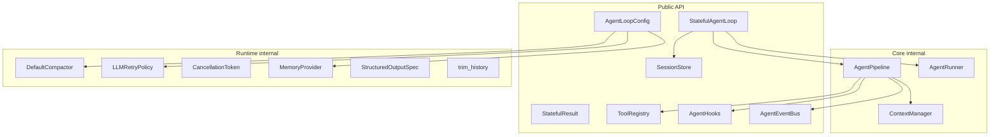
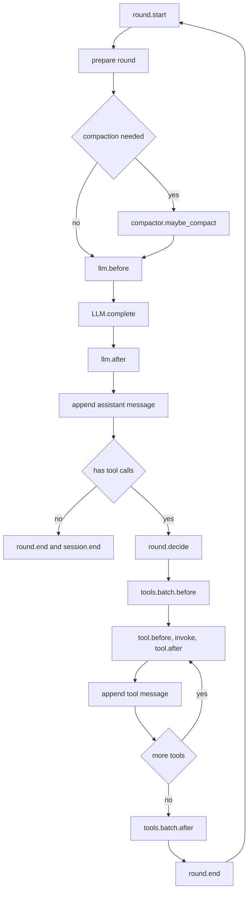
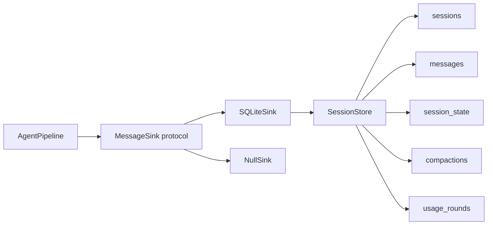
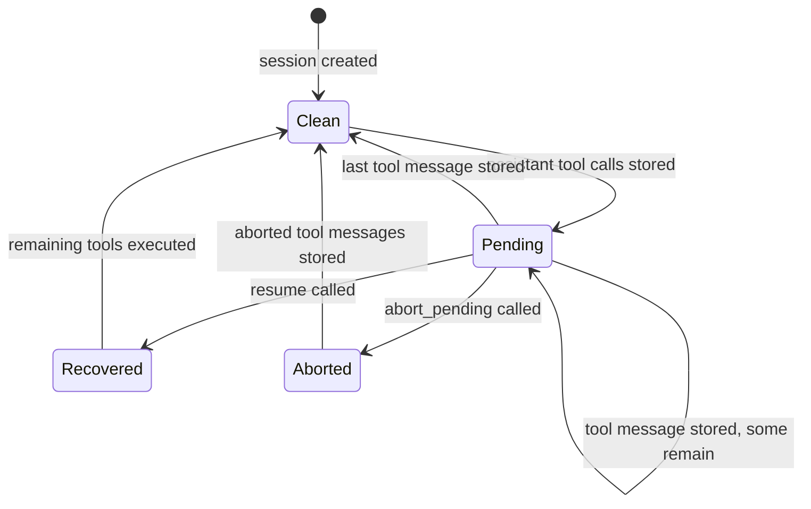
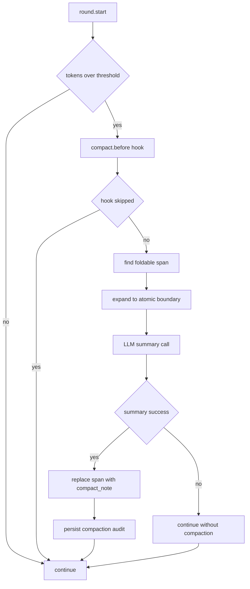
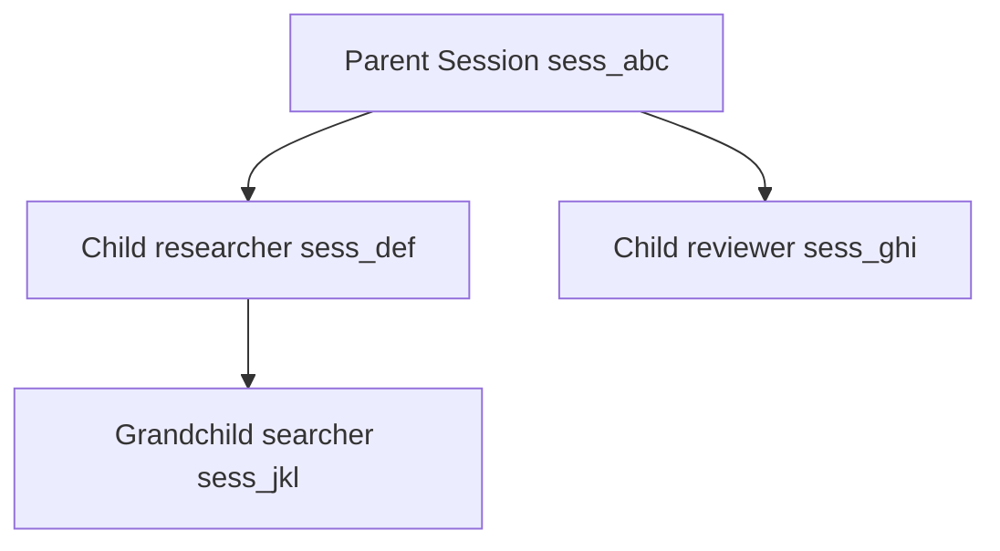
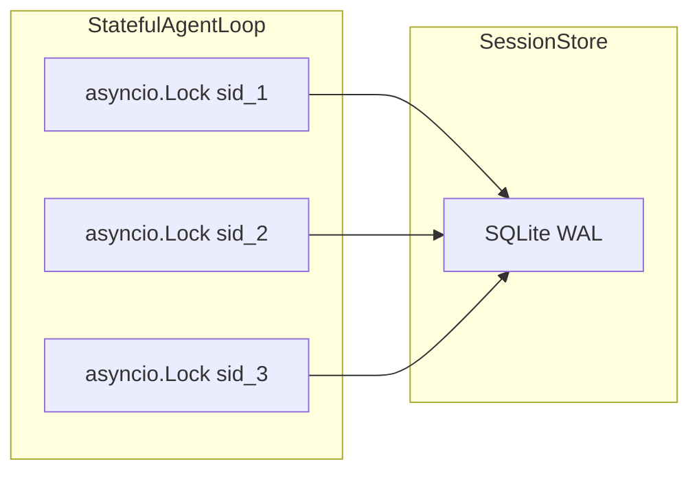

# 架构总览

[English](en/architecture.md) | [回到文档站](README.md)

本文概览 power-loop 的内部协作：模块边界、`send()` 全链路、pipeline 阶段、pending 状态机、压缩、子代理、并发隔离和关键不变量。

> 这些图使用保守 Mermaid 语法，适合 GitHub 原生渲染。

## 1. 模块边界



业务方主要依赖 `StatefulAgentLoop`、`AgentLoopConfig`、`SessionStore`、工具、hooks 和 events。`core` 与大部分 `runtime` 模块是内部实现细节。

## 2. send 全链路

```mermaid
sequenceDiagram
    participant Caller
    participant Loop as StatefulAgentLoop
    participant Store as SessionStore
    participant Pipeline as AgentPipeline
    participant LLM
    participant Tools as ToolRegistry

    Caller->>Loop: new_session()
    Loop->>Store: create_session()
    Store-->>Loop: sid
    Caller->>Loop: send(user_input, session_id=sid)
    Loop->>Store: append user message
    Loop->>Store: load active messages
    Loop->>Pipeline: run(history)
    Pipeline->>Pipeline: session.start hook
    loop each round
        Pipeline->>Pipeline: round.start hook
        Pipeline->>Pipeline: maybe compact and recall memory
        Pipeline->>LLM: complete(messages, tools)
        LLM-->>Pipeline: response
        Pipeline->>Store: append assistant message
        alt response has tool calls
            Pipeline->>Tools: invoke_async(name, args)
            Tools-->>Pipeline: result
            Pipeline->>Store: append tool message
        else final answer
            Pipeline->>Pipeline: session.end hook
            Pipeline-->>Loop: AgentLoopResult
        end
    end
    Loop-->>Caller: StatefulResult
```

## 3. Pipeline 单轮



## 4. Sink 和 Store



`SQLiteSink` 把 pipeline 的内存 history 映射回 SQLite seq，保证消息追加、pending 清理和 compaction 审计都落在同一个 `SessionStore`。

## 5. Pending 状态机



如果进程在 assistant tool calls 已落库、tool 消息未全部落库时退出，下次 `send()` 会抛 `SessionPendingError`。调用方可以 `resume()` 跑完剩余工具，或 `abort_pending()` 合成中止 tool 消息。

## 6. 压缩流程



压缩不切开 `assistant(tool_calls)` 和对应 `tool` 消息，失败时软降级为未压缩 history。

## 7. 子代理

```mermaid
sequenceDiagram
    participant Parent as Parent Pipeline
    participant Loop as StatefulAgentLoop
    participant Store as SessionStore
    participant Child as Child Pipeline

    Parent->>Loop: spawn_agent(task, preset)
    Loop->>Store: create child session
    Store-->>Loop: child_sid
    Loop->>Child: run(child_history)
    Child-->>Loop: child result
    Loop->>Store: close or keep child session
    Loop-->>Parent: subagent result text
```



所有子代理共享父代理的 `SessionStore`。`close_session(parent_sid, cascade=True)` 会级联删除 `LINKED` 子树。

## 8. 并发与隔离



一个 `StatefulAgentLoop` 可以并发驱动多个 session；每个 session 有独立 `asyncio.Lock`，底层 SQLite 连接由 `threading.RLock` 串行化写入。

## 9. 关键不变量

| 不变量 | 执行位置 |
|---|---|
| `assistant(tool_calls)` 落库后立即设置 pending | `SQLiteSink.on_assistant_tool_calls` |
| 最后一个 `tool` 消息落库后清 pending | `SQLiteSink.on_message_appended` |
| `(session_id, seq)` 单调唯一 | `SessionStore.append_message` |
| compaction 不切开工具调用原子对 | `DefaultCompactor` |
| compaction 失败软降级 | `DefaultCompactor.maybe_compact` |
| 子代理深度不超过 `MAX_SPAWN_DEPTH` | `SessionStore.create_session` |
| `SQLiteSink._history_seqs` 与 pipeline history 一一对应 | `SQLiteSink` |
| 子代理共享父代理的 `SessionStore` | `run_agent_spec` |

更多细节见 [Hooks](hooks.md)、[Events](events.md) 和对应单元测试。
