# 架构总览

[English](en/architecture.md) | [回到文档站](README.md)

本文用图示和代码地标讲清楚 power-loop 的内部协作：`StatefulAgentLoop` /
`AgentPipeline` / `MessageSink` / `SessionStore` / `Compactor` /
Subagent 链路。

> 想看 hook 表 → [`hooks.md`](hooks.md)。想看 event 表 → [`events.md`](events.md)。
> 这里只讲**它们怎么连起来**。

## 目录

- [1. 模块边界](#1-模块边界)
- [2. send 全链路](#2-send-全链路)
- [3. Pipeline 单轮](#3-pipeline-单轮)
- [4. Sink ↔ Store 的持久化协议](#4-sink--store-的持久化协议)
- [5. Pending 状态机](#5-pending-状态机)
- [6. 压缩流程](#6-压缩流程)
- [7. Subagent 与会话树](#7-subagent-与会话树)
- [8. 并发与隔离](#8-并发与隔离)
- [9. 关键不变量速查](#9-关键不变量速查)

---

## 1. 模块边界

整个库分四层。**业务方只看到最上层** `StatefulAgentLoop`，其余都是为它服务的内部组件。

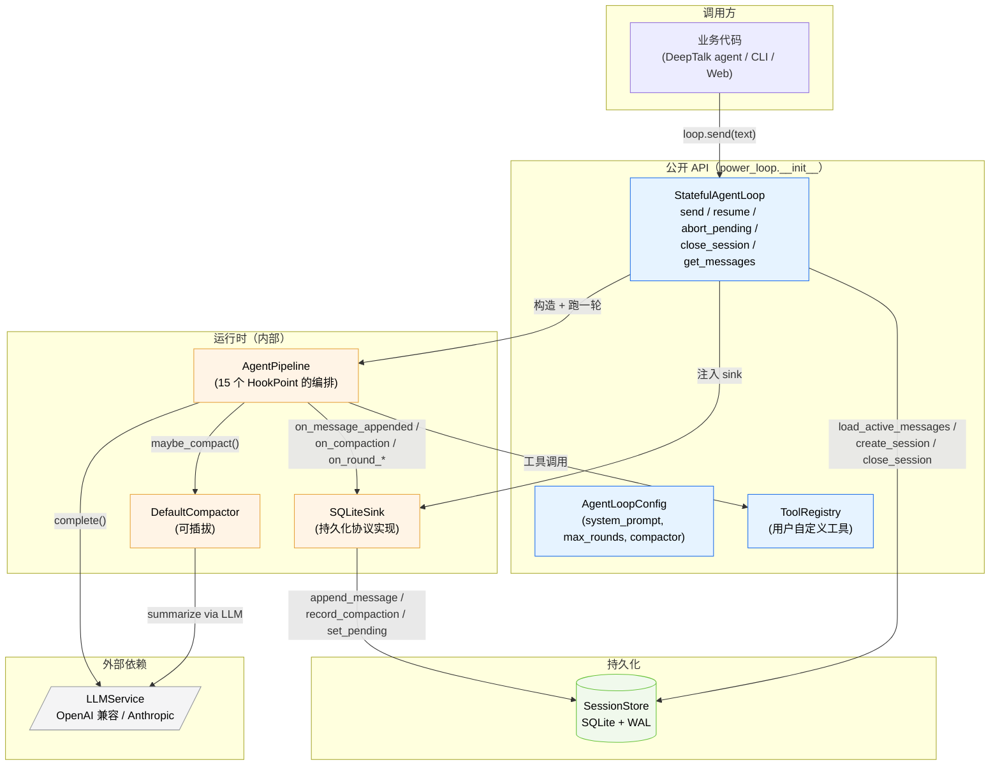

| 层 | 谁会改它 | 稳定性 |
|---|---|---|
| 公开 API | 业务方依赖 | STABLE — 破坏性变更走 minor + CHANGELOG |
| 运行时 | 库内部演进 | INTERNAL — 可以随时重构 |
| 持久化 schema | 库内部演进 | INTERNAL — 但 migration 会 ship |
| LLMService | 业务方注入 | 由 `llm_client/` 维护 |

---

## 2. `send` 全链路

`await loop.send(user_input, session_id=None)` 是整个库的主入口。下面是它在内
部走过的所有步骤。

```mermaid
sequenceDiagram
    autonumber
    participant Caller as 业务代码
    participant Loop as StatefulAgentLoop
    participant Store as SessionStore
    participant Sink as SQLiteSink
    participant Pipe as AgentPipeline
    participant LLM as LLMService

    Caller->>Loop: send("hello", session_id=None)
    Loop->>Loop: 获取/新建 asyncio.Lock(sid)

    alt 无 session_id
        Loop->>Store: create_session(system_prompt, config)
        Store-->>Loop: sid
    else 已有 session_id
        Loop->>Store: get_session(sid) + get_state(sid)
        Store-->>Loop: row, state
        alt state.pending != None
            Loop-->>Caller: raise SessionPendingError
        end
    end

    Loop->>Store: append_message(sid, role=user, content="hello")
    Loop->>Sink: new SQLiteSink(store, sid)
    Loop->>Store: load_active_messages(sid)
    Store-->>Loop: rows (incl. compact_note if any)
    Loop->>Sink: init_history_seqs([row.seq ...])

    Loop->>Pipe: AgentPipeline(llm, config, registry,<br/>hooks, bus, ctx, sink)
    Loop->>Pipe: run(initial_messages)

    loop max_rounds 次或直到完成
        Pipe->>Sink: on_round_started(round_idx)
        Pipe->>Pipe: prepare_round (compactor / todo)
        Pipe->>LLM: complete(messages, tools, ...)
        LLM-->>Pipe: LLMResponse(text, tool_calls?)
        Pipe->>Sink: on_message_appended(assistant_msg)
        Sink->>Store: append_message + (set_pending if tool_calls)
        alt 有 tool_calls
            loop 每个 tool_call
                Pipe->>Pipe: registry.invoke_async(name, args)
                Pipe->>Sink: on_message_appended(tool_msg)
                Sink->>Store: append_message + (auto-clear pending if last)
            end
        end
        Pipe->>Sink: on_round_ended(round_idx, usage)
        Sink->>Store: record_usage(...)
    end

    Pipe-->>Loop: AgentLoopResult(status, final_text, ...)
    Loop-->>Caller: StatefulResult(session_id, ...)
```

**几个关键约束**：
- 第 11 步 `append_message(user)` 在 pipeline 启动**之前**——所以即使 LLM 调用挂了，user 输入也已经在 store 里了。
- 第 15 步 `init_history_seqs` 让 sink 的 `_history_seqs` 列表与 `pipeline.history` 一一对应；这是后面压缩能把内存索引翻译回 store seq 的前提。
- 第 23/27 步 sink 是同步调用（pipeline 内部已经在 async 函数里跑），底层 SQLite 操作通过 `RLock` 串行化。

---

## 3. Pipeline 单轮

每一轮 `for round_idx in range(max_rounds)` 的内部就是一张 hook 编排图。
**只有粗体方框是真正的「业务步骤」**——其余都是 hook 点（控制流）和 event 发布（旁路）。

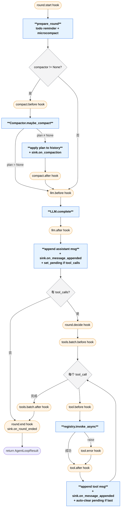

橙色框是 hook 点（控制流入口）。蓝色框是真正干活的步骤。决策菱形是分支。

**两个流出路径**：
- 「无 tool_calls」直接到 `round.end` 然后 return —— 这是 `status="completed"` 的正常出口。
- 「有 tool_calls」会跑完整批工具，把结果回灌 history，再进入下一轮 `for round_idx` 循环。直到 LLM 不再要求调用工具，或撞 `max_rounds`。

15 个 hook 都按这张图的位置实时触发，每个 hook 看到的 ctx 字段、能返回的
`HookDirective` 见 [`hooks.md`](hooks.md)。

---

## 4. Sink ↔ Store 的持久化协议

`MessageSink` 是 pipeline 与持久化层之间唯一的契约。`SQLiteSink` 是它的生产实现；`NullSink` 是测试用 no-op。

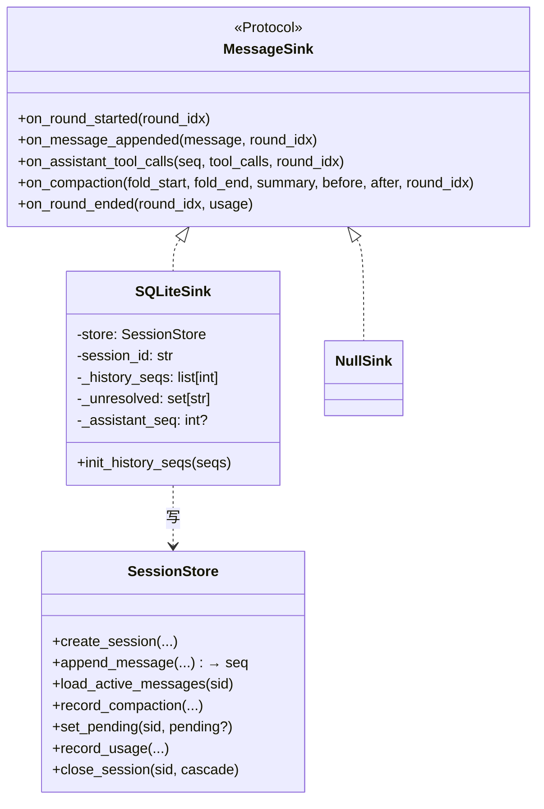

### 4.1 seq 的同步

`SQLiteSink` 在内存里维护一份 `_history_seqs: list[int]` 与
`pipeline.history` 一一对应。两种来源：

- **加载老 session**：`StatefulAgentLoop._run_loop` 调
  `init_history_seqs([row.seq for row in active_rows])` 一次性灌进。
- **新追加**：每次 `on_message_appended` 都调 `store.append_message`
  拿到新分配的 seq，append 进列表。

为什么需要这个映射？**压缩**。`Compactor.maybe_compact` 返回的
`CompactionPlan(fold_start_idx, fold_end_idx, …)` 用的是 pipeline.history
的**内存索引**；要把它翻译成 `store.record_compaction(from_seq, to_seq, …)`
就靠这份映射：

```python
from_seq = self._history_seqs[fold_start_idx]
to_seq   = self._history_seqs[fold_end_idx]
```

压缩完后 sink 还要重写 `_history_seqs`，把被折叠的区间换成 note 的新 seq：

```python
self._history_seqs = (
    self._history_seqs[:fold_start_idx]
    + [note_seq]
    + self._history_seqs[fold_end_idx + 1:]
)
```

### 4.2 持久化时机

| pipeline 阶段 | sink 调用 | store 写入 |
|---|---|---|
| user 输入到来（在 pipeline 之外） | — | `append_message(user)` |
| `round.start` | `on_round_started` | `UPDATE session_state SET round_index=?` |
| assistant 落地 | `on_message_appended(assistant)` | `INSERT messages + (set_pending if tool_calls)` |
| tool 落地 | `on_message_appended(tool)` | `INSERT messages + clear pending` |
| 压缩命中 | `on_compaction` | `record_compaction`（一个事务：UPDATE state=compacted_out + INSERT compact_note + INSERT compactions） |
| `round.end` | `on_round_ended(usage=…)` | `INSERT OR REPLACE usage_rounds` |

所有写都走 SQLite 单连接 + `threading.RLock`。SQLite 本身用 WAL 模式，跨进
程的只读 reader 不会被写者 block。

---

## 5. Pending 状态机

OpenAI / Anthropic 的消息协议要求：每条 `assistant(tool_calls=[A,B])` 之后
必须紧跟所有匹配的 `tool(tool_call_id=A)` / `tool(tool_call_id=B)` 消息，
否则下一次 LLM 调用直接报协议错。

如果进程在 assistant 落库之后、tool 落库之前挂掉，session 就停在违反协议
的中间态——这就是「悬挂态 (pending)」。

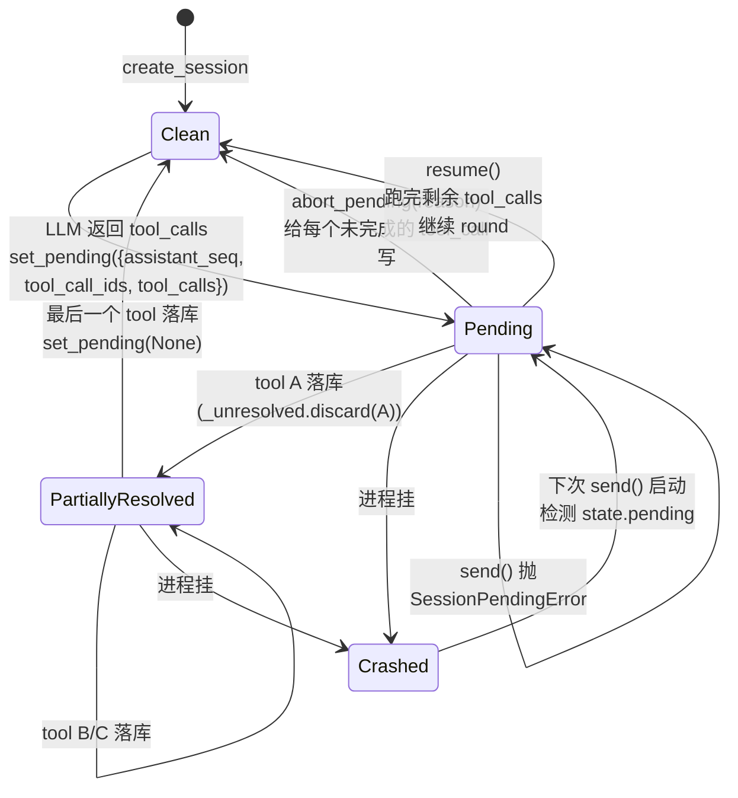

**关键设计**：
- `set_pending` / 清 pending 都在和 message append **同一个事务**里，所以
  状态机不会漂移——任何时间点的 `session_state.pending_json` 都反映
  store 里实际的消息空缺。
- 默认**不自动 resume**：业务方必须主动选 `resume` 或 `abort_pending`。
  这是 [PR-2 设计决策](../CHANGELOG.md#020--2026-06-05)——避免库
  在用户预期之外自动跑工具。

---

## 6. 压缩流程

`Compactor` 是 `Protocol`，`DefaultCompactor` 是默认实现。压缩**默认开启**
（`AgentLoopConfig.compactor = DefaultCompactor()`），传 `None` 关闭。

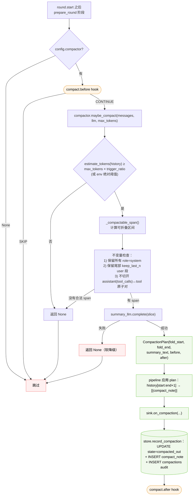

**软降级**：摘要 LLM 调用可能因 rate-limit / network / 上下文太长本身失败。
DefaultCompactor 抛错时**返回 None**，pipeline 继续用未压缩 history 跑这一
轮。如果该轮主 LLM 因 context overflow 失败，loop 自然以
`status="hit_round_limit"` 或异常出口结束——但不会硅默吞掉数据。

---

## 7. Subagent 与会话树

`spawn_agent` 和 `run_agent` 这两个 meta-tool 都走同一份内部实现
`run_agent_spec`，差异只在「父 LLM 怎么提交输入」（kwargs vs JSON AgentSpec）。

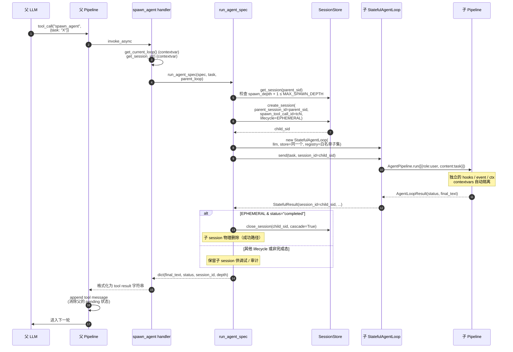

**会话树**：所有 session 共享同一个 `SessionStore`，靠 `parent_session_id`
建关系。

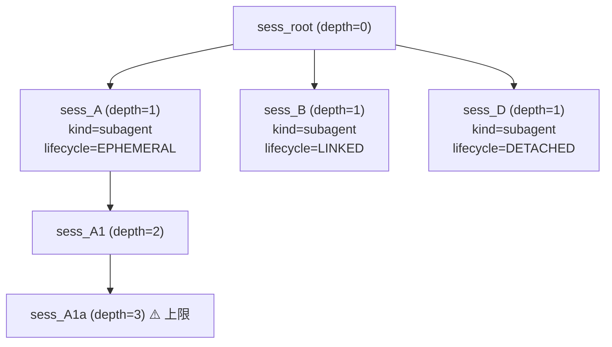

`SubagentLifecycle` 决定父 `close_session(cascade=True)` 时的行为：

| Lifecycle | 子完成时 | 父 `close_session(cascade=True)` 时 |
|---|---|---|
| `EPHEMERAL`（默认） | 成功 → 立即物理删；非完成态 → 保留 debug | （已删，无操作） |
| `LINKED` | 保留 | 级联物理删 |
| `DETACHED` | 保留 | 仅 `UPDATE parent_session_id=NULL`，子保留 |

`MAX_SPAWN_DEPTH = 3` 在 `store.create_session(parent_session_id=…)` 里强校验
，超限直接抛——LLM 上下文里也会看到 `"spawn rejected — depth N exceeds max 3"`
字符串，防止深递归爆栈。

---

## 8. 并发与隔离

一个 `StatefulAgentLoop` 实例可以并发驱动任意多个 session。

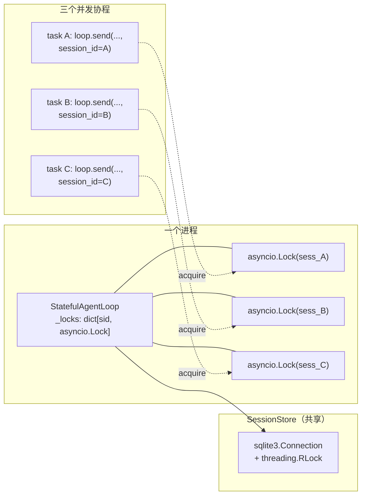

**两层锁**：
- **per-session `asyncio.Lock`**：保证同一个 session 不会被自己的两次
  `send` 并发跑（语义错乱）；不同 session 之间没有锁。
- **store-level `threading.RLock`**：包住所有 SQLite 操作。粒度粗但简单，
  压力测试到 80+ 并发 append 没有 race。

**跨进程**：SQLite WAL 允许多进程同时连。需要时业务方在每个进程开自己的
`SessionStore.open(path)`，指向同一个文件即可。但**同一个 session 不应该被
多个进程并发写**——目前没有跨进程互斥保护，业务方自己确保。

---

## 9. 关键不变量速查

跨多个 PR 沉淀下来的硬约束。**改库时请逐条审查**。

| 不变量 | 强制位置 | 破坏的代价 |
|---|---|---|
| 一条 `assistant(tool_calls)` 落库必伴随 `set_pending` | `SQLiteSink.on_message_appended` | 协议错的 LLM 调用 |
| pending 在最后一个对应的 `tool` 落库时清零 | `SQLiteSink.on_message_appended` | 永久悬挂态 |
| `next_seq` 单调，session 内唯一 | `SessionStore.append_message`（事务里 read+increment） | 消息顺序混乱 |
| `messages.state ∈ {active, compacted_out}` | schema + Sink/Store | history 加载错乱 |
| 压缩不切开 `assistant(tool_calls) ↔ tool` 原子对 | `DefaultCompactor._compactable_span / _expand_back_to_atomic` | 下次 LLM 调用协议错 |
| 压缩失败软降级返回 `None` | `DefaultCompactor.maybe_compact` 的 try/except | 长会话 hard-fail |
| `MAX_SPAWN_DEPTH = 3` | `SessionStore.create_session` | 深递归爆栈 |
| `_history_seqs` 与 `pipeline.history` 一一对应 | `SQLiteSink.init_history_seqs / on_message_appended / on_compaction` | 压缩落到错误的 seq 区间 |
| `close_session` 物理删 5 张表的对应行 | `SessionStore._delete_session_tree` | 数据泄漏 / orphan rows |
| Subagent 与父共享同一个 `SessionStore` | `run_agent_spec` 把 `parent_loop.store` 直接传子 loop | 父子关系断裂 |

详细数据流和测试覆盖见 `tests/unit/test_session_store.py`、
`tests/unit/test_stateful_loop.py`、`tests/unit/test_compact.py`、
`tests/unit/test_subagent.py`。

## 10. Retry 状态机

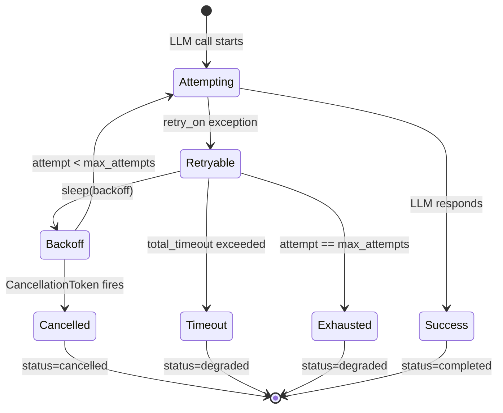

**关键路径**：
- Attempting → Success：正常完成，`status="completed"`。
- Retryable → Backoff → Attempting（循环）：指数退避，退避 sleep 是 cancel-aware 的。
- Timeout / Exhausted → `status="degraded"`：LLM 降级，pipeline 返回合成 assistant 消息。
- Cancelled → `status="cancelled"`：外部 token flip，退避 sleep 中立即响应。

## 11. Memory 生命周期

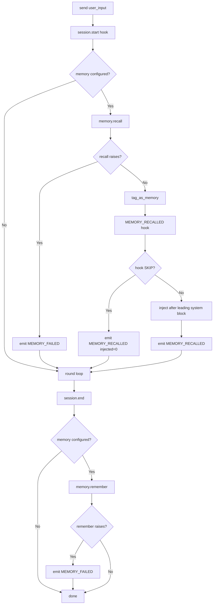

**不变**：
- recall 失败 → 返回 `[]` 视为无记忆，loop 继续，不报错。
- 注入位置：所有 leading `role=system` 消息之后，对话历史之前——与 `compact_note` 同区，受压缩器保留。
- remember 失败 → 不影响 `StatefulResult` 返回，仅发 `MEMORY_FAILED` 事件。
- `MEMORY_RECALLED` hook 可以 SKIP 整批注入（双方授权 gate 等）。

## 12. Hook 决策树

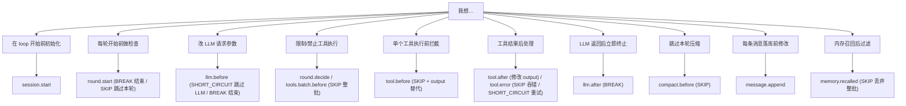

**选择规则**：Hook 在热路径同步触发，handler 越短越好。耗时操作（调外部 API、写数据库）放进 event 订阅者做旁路处理。
