# Architecture

[中文](../zh/architecture.md) | [Back to docs](../README.md)

power-loop's internal collaboration: module boundaries, the `send()` full chain, pipeline phases, pending state machine, compaction, sub-agents, and key invariants.

> **9 Mermaid diagrams** — GitHub renders them natively. No external image tooling needed.

## 1. Module Boundaries

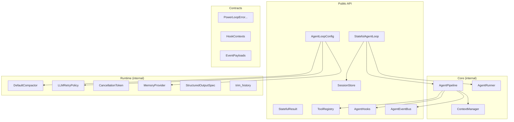

## 2. send() Full Chain

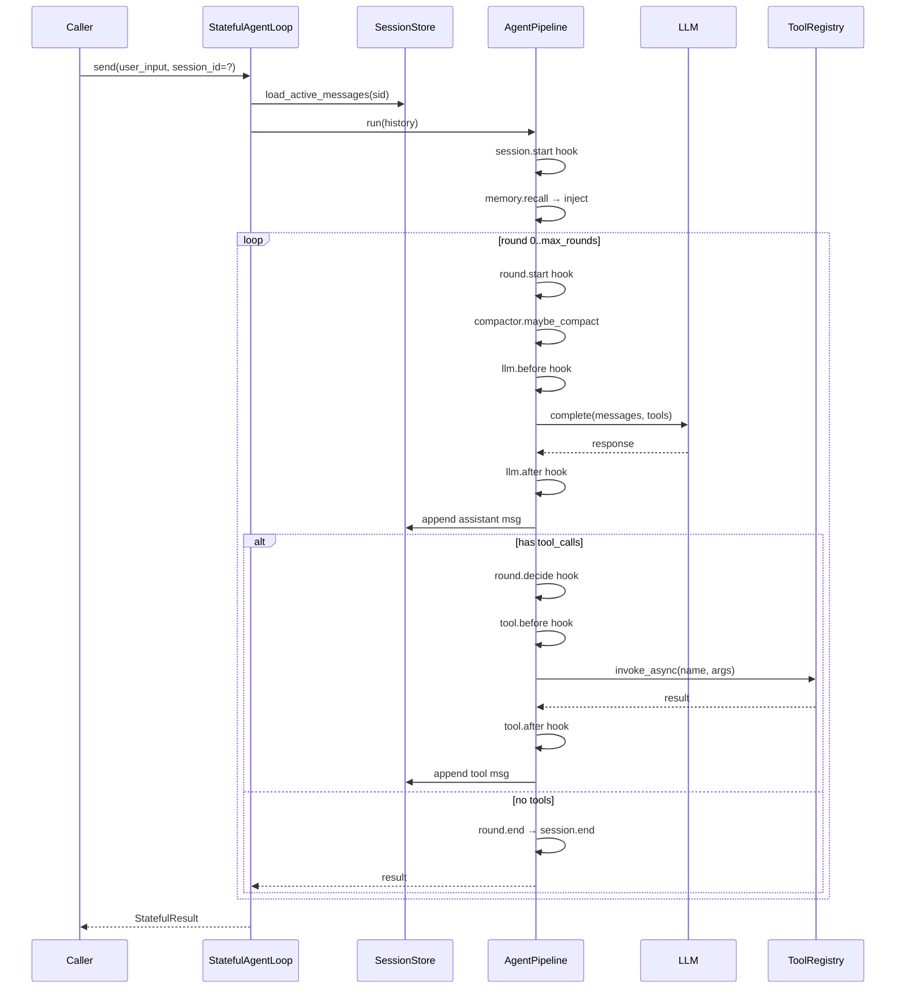

## 3. Pipeline Single Round

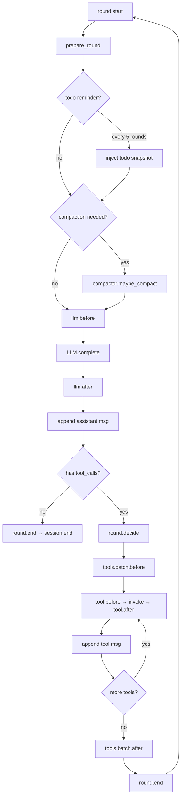

## 4. Sink-Store

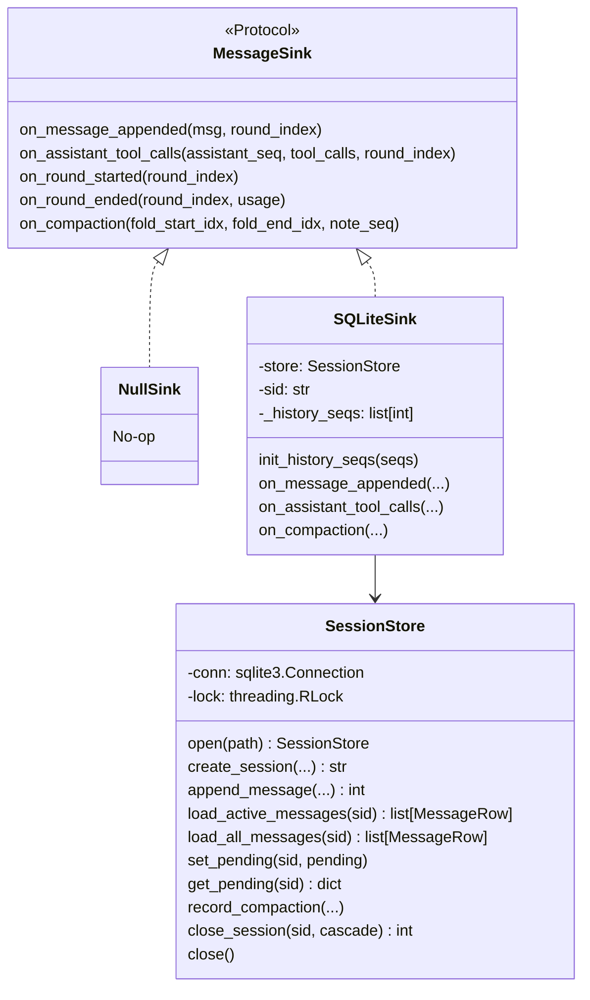

## 5. Pending State Machine

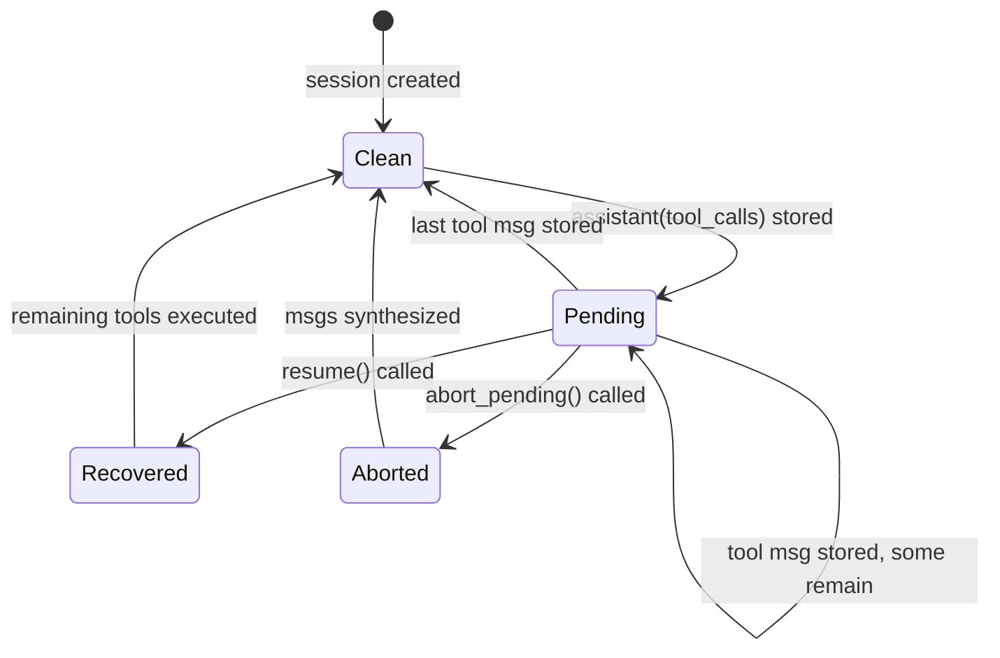

## 6. Compaction

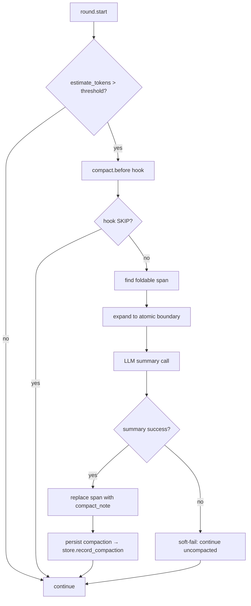

## 7. Sub-Agent Sequence

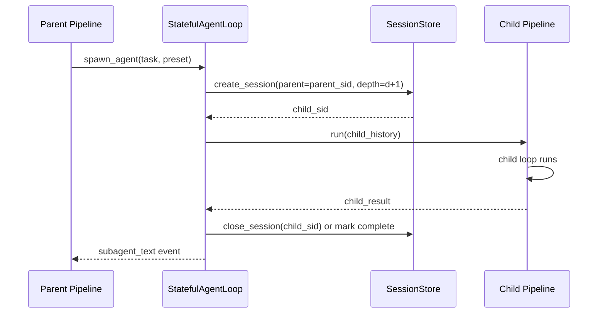

## 8. Session Tree

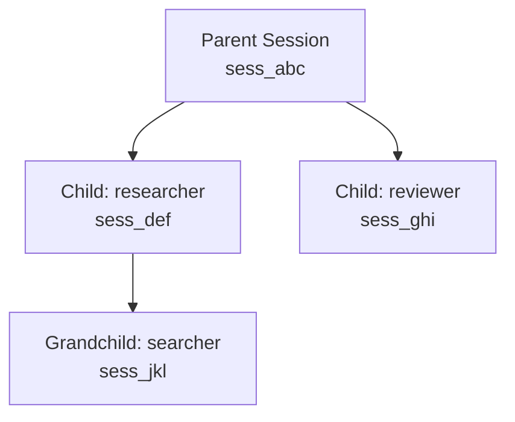

All children share the parent's `SessionStore`. `close_session(parent_sid, cascade=True)` recursively deletes the entire tree. `MAX_SPAWN_DEPTH = 3`.

## 9. Concurrency and Isolation

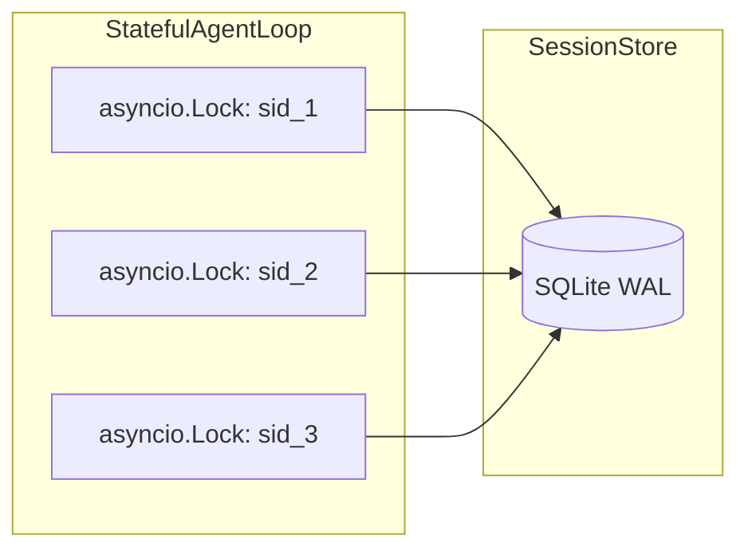

One `StatefulAgentLoop` can drive any number of sessions concurrently. Each session is protected by its own `asyncio.Lock`. The `SessionStore` uses a single connection + `threading.RLock` for write serialization.

## 10. Key Invariants

| Invariant | Enforced at | Cost of violation |
|---|---|---|
| `assistant(tool_calls)` stored → `set_pending` immediately | `SQLiteSink.on_assistant_tool_calls` | Protocol-invalid LLM request |
| Pending cleared on last `tool` msg | `SQLiteSink.on_message_appended` | Permanent pending state |
| `next_seq` monotonic, unique per session | `SessionStore.append_message` (tx read+increment) | Message order corruption |
| `messages.state ∈ {active, compacted_out}` | Schema + Sink/Store | Wrong history loaded |
| Compaction never splits `assistant(tool_calls) ↔ tool` | `DefaultCompactor._expand_back_to_atomic` | Protocol-invalid LLM request |
| Compaction fails soft → `None` | `DefaultCompactor.maybe_compact` try/except | Long session hard-fails |
| `MAX_SPAWN_DEPTH = 3` | `SessionStore.create_session` | Deep recursion stack overflow |
| `_history_seqs` 1:1 with `pipeline.history` | `SQLiteSink` methods | Compaction hits wrong seq range |
| `close_session` physically deletes 5 tables | `SessionStore._delete_session_tree` | Data leak / orphan rows |
| Sub-agent shares parent's `SessionStore` | `run_agent_spec` passes `parent_loop.store` | Broken parent-child link |

Detailed data flow and test coverage: `tests/unit/test_session_store.py`, `tests/unit/test_stateful_loop.py`, `tests/unit/test_compact.py`, `tests/unit/test_subagent.py`.

## 11. Retry State Machine

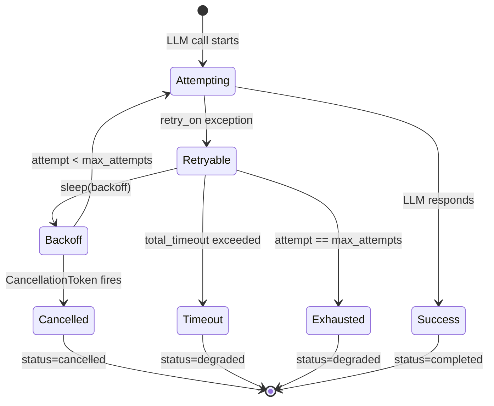

## 12. Memory Lifecycle

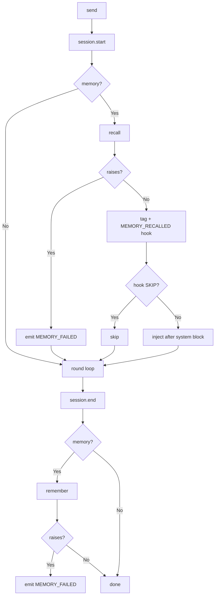

## 13. Hook Decision Tree

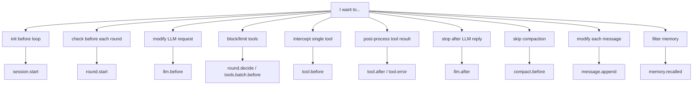