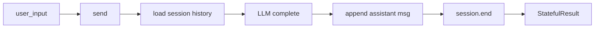

# Getting Started

[中文](../zh/getting-started.md) | [Back to docs](../README.md)

Get power-loop running in 5 minutes — from `pip install` to your first agent reply.

## 1. Install

```bash
pip install power-loop
# or, for development
pip install -e ../power-loop   # if you're in DeepTalk-style multi-repo setup
```

Python 3.10+ required.

## 2. Set up your LLM credentials

Create a `.env` file in your project root:

```bash
# Primary (recommended)
POWER_LOOP_BASE_URL=https://api.openai.com/v1
POWER_LOOP_API_KEY=sk-…
POWER_LOOP_MODEL=gpt-4o-mini

# Legacy names also work (auto-fallback)
# OPENAI_COMPAT_BASE_URL=…
# OPENAI_COMPAT_API_KEY=…
# OPENAI_COMPAT_MODEL=…
```

Any OpenAI-compatible provider works — DashScope, DeepSeek, OpenRouter, Together, Groq, local Ollama/vLLM. See [Providers](user-guide/providers.md) for more snippets.

## 3. Write your first agent

```python
import asyncio
from power_loop import (
    StatefulAgentLoop,
    AgentLoopConfig,
    create_llm_service_from_env,
)

async def main():
    llm = create_llm_service_from_env()

    loop = StatefulAgentLoop(
        llm=llm,
        config=AgentLoopConfig(
            system_prompt="You are a helpful assistant. Reply concisely.",
            max_rounds=1,
        ),
    )

    result = await loop.send("What does HTTP stand for?")
    print(result.final_text)

asyncio.run(main())
```

Run it:

```bash
$ python hello.py
HTTP stands for HyperText Transfer Protocol.
```

## 4. What just happened?



1. `send("What does HTTP stand for?")` creates a new session with that user message.
2. The pipeline sends it to the LLM (with your `system_prompt`).
3. The LLM replies — no tools were called, so the round ends.
4. `StatefulResult` carries `session_id`, `status="completed"`, `final_text`, and `rounds`.

## 5. Keep talking — multi-turn

```python
result1 = await loop.send("My name is Alan.")
print(result1.final_text)

result2 = await loop.send(
    "What is my name?",
    session_id=result1.session_id,   # continue same session
)
print(result2.final_text)   # "Your name is Alan."
```

The library loads the full history from the SQLite store automatically. You never manage `messages` by hand.

## 6. Next steps

| I want to… | Read this |
|---|---|
| Add tools (bash, search, …) | [Quickstart: Tool Calling](user-guide/quickstart.md#tool-calling) |
| Stream tokens to a UI | [Streaming](user-guide/events.md#stream-delta) |
| Understand the loop phases | [Architecture](architecture.md) |
| See everything in one place | [Examples](../../examples/) — start with `00_hello_world.py` |