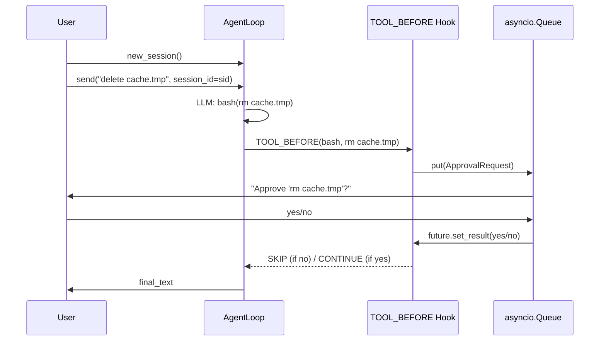

# Tutorial: Human-in-the-Loop

[中文](../../zh/tutorials/human-in-the-loop.md) | [Tutorials](../index.md)

**Goal**: Build an agent that asks the user before executing bash commands — 70 lines.

**You'll learn**: Async `TOOL_BEFORE` hook, `HookDirective.SKIP`, `asyncio.Queue` for UI integration, blocking dangerous commands.

## 1. Define the Bash Tool

```python
from power_loop import ToolRegistry, ToolDefinition

def bash(command: str) -> str:
    return f"(executed) {command}"

registry = ToolRegistry()
registry.register(
    ToolDefinition(
        name="bash",
        description="Run a shell command. Param: command (string).",
        input_schema={
            "type": "object",
            "properties": {"command": {"type": "string"}},
            "required": ["command"],
        },
    ),
    bash,
)
```

## 2. The Approval Hook

```python
from power_loop import AgentHooks, HookPoint, HookDirective
from power_loop.contracts.hook_contexts import ToolBeforeCtx

SAFE_COMMANDS = {"ls", "pwd", "echo", "cat", "head", "tail", "wc", "find"}

async def ask_before_bash(ctx: ToolBeforeCtx) -> None:
    if ctx.tool_name != "bash":
        return

    cmd = ctx.tool_args.get("command", "").strip()
    cmd_name = cmd.split()[0] if cmd else ""

    # Auto-approve safe commands
    if cmd_name in SAFE_COMMANDS:
        return  # CONTINUE — let it run

    # Ask the user
    approved = await your_ui_confirm(cmd)
    if not approved:
        ctx.output = f"[denied by user: {cmd!r}]"
        ctx.directive = HookDirective.SKIP
```

## 3. UI Integration via asyncio.Queue

```python
import asyncio
from dataclasses import dataclass, field

@dataclass
class ApprovalRequest:
    command: str
    response: asyncio.Future[bool] = field(default_factory=asyncio.Future)

queue: asyncio.Queue[ApprovalRequest] = asyncio.Queue()

async def ask_before_bash(ctx: ToolBeforeCtx) -> None:
    if ctx.tool_name != "bash":
        return
    cmd = ctx.tool_args.get("command", "")
    if cmd.split()[0] in SAFE_COMMANDS:
        print(f"  [auto-approve] {cmd}")
        return

    req = ApprovalRequest(command=cmd)
    await queue.put(req)
    approved = await req.response  # wait for UI
    if not approved:
        ctx.output = f"[denied: {cmd!r}]"
        ctx.directive = HookDirective.SKIP

# Worker: consumes queue, gets user input
async def approval_worker():
    while True:
        req = await queue.get()
        answer = input(f"  Approve '{req.command}'? [y/N]: ")
        req.response.set_result(answer.lower().startswith("y"))
```

## 4. Put It Together

```python
async def main():
    llm = create_llm_service_from_env()
    hooks = AgentHooks()
    hooks.register(HookPoint.TOOL_BEFORE, ask_before_bash)

    loop = StatefulAgentLoop(
        llm=llm, tool_registry=registry, hooks=hooks,
        config=AgentLoopConfig(
            system_prompt=(
                "You have a bash tool. For safe commands "
                "(ls, pwd, cat, echo, find), use it directly. "
                "For anything else, you'll be asked for confirmation."
            ),
            max_rounds=4,
        ),
    )

    worker = asyncio.create_task(approval_worker())
    try:
        sid = await loop.new_session()
        result = await loop.send("List files in the current directory.", session_id=sid)
        print(f"Bot: {result.final_text}")
    finally:
        worker.cancel()
        loop.close()
```

## 5. The Flow



The hook **really waits** — no polling, no timeout. The LLM is paused until the user decides.

## Next

- [Multi-Agent System](multi-agent.md) — delegate to sub-agents
- [Tools User Guide](../user-guide/tools.md) — full tool system reference
