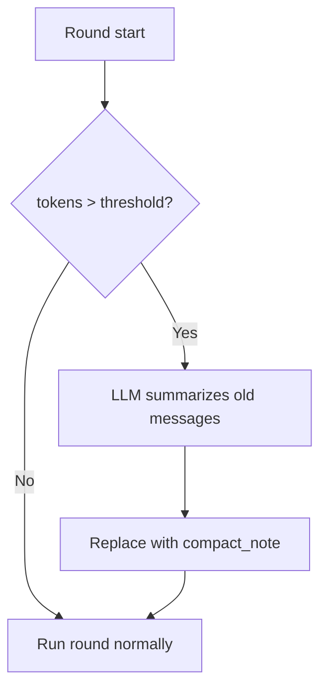

# Compaction

[中文](../../zh/user-guide/compaction.md) | [User Guide](../index.md)

Context compaction prevents long sessions from hitting the LLM's context window limit. It summarizes old messages and replaces them with a compact system note — **default-on**.

## How It Works



1. Before each round, `estimate_tokens(messages)` is compared against `max_tokens × trigger_ratio` (default 0.75).
2. If over the threshold, the compactor identifies the **oldest messages** that can be safely folded.
3. A summary LLM call produces a compact note (`role=system, name=compact_note`).
4. The old messages are marked `compacted_out` in the store; the note is inserted.

## Configuration

```python
from power_loop.runtime.compact import DefaultCompactor
from power_loop import AgentLoopConfig

compactor = DefaultCompactor(
    trigger_ratio=0.75,        # compact when > 75% of max_tokens
    keep_last_n=4,             # always keep last 4 exchanges
    summary_max_tokens=512,    # max tokens for the summary
)

config = AgentLoopConfig(compactor=compactor)

# Disable compaction
config_no_compaction = AgentLoopConfig(compactor=None)
```

### Absolute Threshold

Set `CONTEXT_COMPACT_THRESHOLD=6000` in the environment to use an absolute token count instead of `trigger_ratio`. Useful when your model has a known context window (e.g., 8192 for gpt-4o-mini).

## Invariants

The compactor enforces strict rules to keep the message protocol valid:

| Rule | Why |
|---|---|
| **System messages preserved** | `role=system` messages (including prior `compact_note`s) are never folded |
| **Last N exchanges preserved** | The most recent `keep_last_n` user-bounded exchanges are always kept |
| **Tool-call pairs atomic** | `assistant(tool_calls) ↔ tool(tool_call_id=...)` pairs are never split — the compactor walks back to keep them together |
| **At most once per round** | `round_compacted=True` flag prevents double-compaction |
| **Soft-fail** | If the summary LLM call fails, the loop continues with the original (uncompacted) history |

## Persistence & memory recall

When a `SQLiteSink` is attached (the default for a `StatefulAgentLoop` with a store), a fold also persists: the folded rows are marked `compacted_out`, a `compact_note` row is appended, and the `compactions` table gets an audit row. The sink translates the compactor's **in-memory history indices** into **store row seqs** through a parallel `index → seq` map it keeps aligned with `pipeline.history`.

This matters when [memory recall](memory.md) is also on. Recalled `memory_*` messages are spliced into the **front** of the history (the system region) but are **never persisted** — the `MemoryProvider` owns them. The sink records a placeholder for each so its `index → seq` map stays aligned; otherwise a later fold would map indices to the **wrong** rows and mark the wrong messages `compacted_out`. The two features compose cleanly: recalled facts survive folds (system region is preserved) and never leak into the store.

> **Safety net.** If that map ever drifts out of alignment — e.g. a `SESSION_START`/`ROUND_START` hook that *replaces* `ctx.messages` wholesale without the sink's knowledge — the sink **skips persisting that compaction** rather than risk marking the wrong rows. The in-memory fold still applies (the LLM call is unaffected); the un-persisted compaction simply re-triggers next round, and a resume stays correct because the active rows were left untouched. If you mutate history in a hook, prefer appending over wholesale replacement.

See [`examples/31_memory_with_compaction.py`](../../../examples/31_memory_with_compaction.py) for recall + compaction in one session.

### Retrieving folded detail on demand

Folded messages are not deleted — they remain `compacted_out` rows in the store. The optional **`recall_compacted`** tool lets the agent pull them back when the `compact_note` lacks a specific detail (an exact value, path, decision). It reads only the current session's folded rows (read-only), filtered by keyword or seq range. Add it to the agent's tools (`include=["recall_compacted", ...]` or the `full` preset). See [`examples/32_recall_compacted.py`](../../../examples/32_recall_compacted.py) and the [Tools guide](tools.md).

## Custom Compactor

Implement the `Compactor` protocol to plug in your own strategy:

```python
from power_loop.runtime.compact import Compactor, CompactionPlan

class MyCompactor:
    async def maybe_compact(
        self, messages, *, llm, max_tokens, round_index
    ) -> CompactionPlan | None:
        # Your logic here
        # Return CompactionPlan(fold_start_idx, fold_end_idx, summary_text, ...)
        # Return None to skip
        return None

config = AgentLoopConfig(compactor=MyCompactor())
```

## Events

Subscribe to compaction events for observability:

```python
bus.subscribe(AgentEventType.STATUS_CHANGED, lambda e: print(
    f"Compacted: {e.data.before_tokens} → {e.data.after_tokens} tokens"
) if getattr(e.data, "kind", None) == "auto_compact" else None)
```

## Token Estimation

The compactor uses a heuristic token estimator (~4 chars/token) defined in `power_loop/runtime/budget.py`. It's not billing-accurate but monotonic with content size — good enough for triggering decisions.

See also `trim_history()` in [budget.py](../../../power_loop/runtime/budget.py) for a pure-trim (no LLM) alternative.

## Next

- [Memory](memory.md) — cross-session recall via `MemoryProvider`
- [Sessions](sessions.md) — understand the session lifecycle
