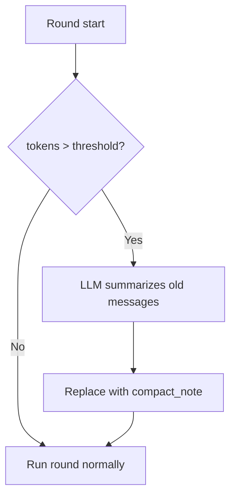

# Compaction (the fold axis)

[中文](../../zh/user-guide/compaction.md) | [User Guide](../index.md)

Context compaction prevents long sessions from hitting the LLM's context-window limit. It summarizes old history once the rendered prefix crosses the budget — **default-on**.

> **power-loop 3.0 — two orthogonal context axes.** Context handling is now two independent, config-driven axes on `AgentLoopConfig`:
> - **`representation`** — *how each finished send is recorded & rendered*: `VerbatimRepresentation` (default, full history) or `ProjectedRepresentation` (a terse per-send projection). See [Send-context projection](send-context-projection.md).
> - **`fold_strategy`** — *how older history is compacted once over budget* (this page): `LLMSummaryFold` (default) or `AgenticFold`.
>
> Any representation composes with any fold strategy. The 2.x `compactor=` / `history_projector=` kwargs still work (mapped onto the two axes with a `DeprecationWarning`); prefer `representation=` / `fold_strategy=`.

## How It Works



1. Before each round, `estimate_tokens(messages)` is compared against `max_tokens × trigger_ratio` (default 0.75).
2. If over the threshold, the compactor identifies the **oldest messages** that can be safely folded.
3. A summary LLM call produces a compact note (`role=system, name=compact_note`).
4. The old messages are marked `compacted_out` in the store; the note is inserted.

## Configuration

```python
from power_loop import AgentLoopConfig, LLMSummaryFold

config = AgentLoopConfig(
    max_tokens=8000,                       # the budget; fold trigger = max_tokens × trigger_ratio
    fold_strategy=LLMSummaryFold(
        trigger_ratio=0.75,                # fold when the rendered prefix > 75% of max_tokens
        keep_last_sends=4,                 # always keep the most recent 4 sends unfolded
        summary_max_tokens=5000,           # token budget for the summary call
        # summary_llm=cheaper_llm,         # optional: run the fold on a cheaper model
    ),
)
```

The default (`fold_strategy` unset) is `LLMSummaryFold()` — compaction is on out of the box. To run a
dedicated, memory-aware fold instead, use `AgenticFold` (see [below](#agentic-memory-aware-fold)).

> **Legacy (deprecated).** `AgentLoopConfig(compactor=DefaultCompactor(...))` and `compactor=None` (no
> compaction) still work — they map onto `fold_strategy` and emit a `DeprecationWarning`. There is no
> public "never fold" on the new axis; if you genuinely want no compaction, keep the legacy
> `compactor=None` for now (verbatim only).

### Absolute Threshold

Set `CONTEXT_COMPACT_THRESHOLD=6000` in the environment to use an absolute token count instead of `trigger_ratio`. Useful when your model has a known context window (e.g., 8192 for gpt-4o-mini).

## Invariants

The compactor enforces strict rules to keep the message protocol valid:

| Rule | Why |
|---|---|
| **System messages preserved** | `role=system` messages (including prior `compact_note`s) are never folded |
| **Last N exchanges preserved** | The most recent `keep_last_n` user-bounded exchanges are always kept |
| **Tool-call pairs atomic** | `assistant(tool_calls) ↔ tool(tool_call_id=...)` pairs are never split — the compactor walks back to keep them together |
| **At most once per round** | `round_compacted=True` flag prevents double-compaction |
| **Soft-fail** | If the summary LLM call fails, the loop continues with the original (uncompacted) history |

## Persistence & memory recall

When a `SQLiteSink` is attached (the default for a `StatefulAgentLoop` with a store), a fold also persists: the folded rows are marked `compacted_out`, a `compact_note` row is appended, and the `compactions` table gets an audit row. The sink translates the compactor's **in-memory history indices** into **store row seqs** through a parallel `index → seq` map it keeps aligned with `pipeline.history`.

This matters when [memory recall](memory.md) is also on. Recalled `memory_*` messages are spliced into the **front** of the history (the system region) but are **never persisted** — the `MemoryProvider` owns them. The sink records a placeholder for each so its `index → seq` map stays aligned; otherwise a later fold would map indices to the **wrong** rows and mark the wrong messages `compacted_out`. The two features compose cleanly: recalled facts survive folds (system region is preserved) and never leak into the store.

> **Safety net.** If that map ever drifts out of alignment — e.g. a `SESSION_START`/`ROUND_START` hook that *replaces* `ctx.messages` wholesale without the sink's knowledge — the sink **skips persisting that compaction** rather than risk marking the wrong rows. The in-memory fold still applies (the LLM call is unaffected); the un-persisted compaction simply re-triggers next round, and a resume stays correct because the active rows were left untouched. If you mutate history in a hook, prefer appending over wholesale replacement.

See [`examples/31_memory_with_compaction.py`](../../../examples/31_memory_with_compaction.py) for recall + compaction in one session.

### Retrieving folded detail on demand

Folded messages are not deleted — they remain `compacted_out` rows in the store. The optional **`recall_compacted`** tool lets the agent pull them back when the `compact_note` lacks a specific detail (an exact value, path, decision). It reads only the current session's folded rows (read-only), filtered by keyword or seq range. Add it to the agent's tools (`include=["recall_compacted", ...]` or the `full` preset). See [`examples/32_recall_compacted.py`](../../../examples/32_recall_compacted.py) and the [Tools guide](tools.md).

## Custom fold strategy

Implement the `FoldStrategy` Protocol to plug in your own compaction — it works under **either**
representation (verbatim or projection):

```python
from power_loop import AgentLoopConfig, FoldStrategy, FoldContext, FoldResult

class MyFold:
    keep_last_sends = 4          # most-recent sends kept unfolded
    trigger_ratio = 0.75         # fold when the rendered prefix > max_tokens × this
    fold_id = "my_fold"          # stamped on compact rows (lets a strategy switch be detected)

    async def fold(self, rows, *, context: FoldContext) -> FoldResult | None:
        # `rows` = the foldable span (oldest sends + an optional prior compact rolled forward).
        # Re-render to text with context.representation.render(rows); summarize via context.llm.
        # Return None to decline (soft-fail), or:
        #   FoldResult(content={"summary": ...}, folded_to_send=<last folded send_index>,
        #              note_ops=(...))   # note_ops are applied best-effort after the compact commits
        return None

config = AgentLoopConfig(fold_strategy=MyFold())
```

A fold MUST NOT touch the store directly — it returns a `FoldResult` and the loop persists the compact
(optimistic-concurrency commit) and applies any `note_ops`. `FoldContext` carries everything it needs
(`session_id`, `representation`, `llm`, optional cheaper `summary_llm`, `tool_registry`, `memory`,
`max_tokens`). Because a fold always operates on **whole sends**, it can never split a tool-call/result
pair.

> **Legacy `Compactor`.** The 2.x `Compactor` Protocol (`maybe_compact(...) -> CompactionPlan`) and its
> optional `CompactionContext` (capture-to-memory before folding) still work via the deprecated
> `compactor=` for verbatim mode — see [`examples/16_custom_compactor.py`](../../../examples/16_custom_compactor.py)
> and [`examples/33_coordinating_compactor.py`](../../../examples/33_coordinating_compactor.py). The 3.0
> `AgenticFold` (below) covers the same "remember before you forget" need natively via `note_ops`.

## Agentic memory-aware fold

`LLMSummaryFold` summarizes a slice in **one** LLM call. `AgenticFold` instead runs a **bounded,
memory-aware agent loop** at the fold: the model first uses note tools (`note_add` / `note_update`) to
**persist durable facts into the session's notes**, then writes the summary. This separates *long-term
memory* (kept as notes, surfaced on later turns) from the *working-context summary* (compressed), so the
agent forgets less across many folds. The note writes are captured as `note_ops` and applied by the loop
after the compact commits (so the strategy stays side-effect-free + testable); on any failure it falls
back to a plain single-call summary, so it never blocks a fold.

```python
from power_loop import AgentLoopConfig, AgenticFold

config = AgentLoopConfig(
    fold_strategy=AgenticFold(
        trigger_ratio=0.75, keep_last_sends=4,   # trigger + how many recent sends to keep
        summary_max_tokens=5000,
        max_rounds=4,                            # cap on the fold agent's tool rounds
        # system_prompt=...,                     # default: DEFAULT_FOLD_AGENT_PROMPT
    ),
)
```

- **Default behavior is unchanged** — this is opt-in; the default stays `LLMSummaryFold` (single call).
- **Safe**: the loop is a flat, bounded tool-use loop (not a nested `StatefulAgentLoop`), so it can never recurse into another fold. The note writes are captured as `note_ops` and applied after the compact commits. On **any** failure (no tool support, malformed output, exception) it **falls back to the single-call summary** — it never blocks a fold.
- **Cost**: it makes several LLM calls per fold (extract + summarize) instead of one — the trade for richer memory. Pass `summary_llm=` to point the fold at a cheaper model.

## Events

Subscribe to compaction events for observability:

```python
bus.subscribe(AgentEventType.STATUS_CHANGED, lambda e: print(
    f"Compacted: {e.data.before_tokens} → {e.data.after_tokens} tokens"
) if getattr(e.data, "kind", None) == "auto_compact" else None)
```

## Token Estimation

The compactor uses a heuristic token estimator (~4 chars/token) defined in `power_loop/runtime/budget.py`. It's not billing-accurate but monotonic with content size — good enough for triggering decisions.

See also `trim_history()` in [budget.py](../../../power_loop/runtime/budget.py) for a pure-trim (no LLM) alternative.

## Next

- [Send-context projection](send-context-projection.md) — the **representation** axis: render finished sends as terse plain text in a derived table. It composes *with* a fold strategy (the two axes are orthogonal), it does not replace one.
- [Memory](memory.md) — cross-session recall via `MemoryProvider`
- [Sessions](sessions.md) — understand the session lifecycle
