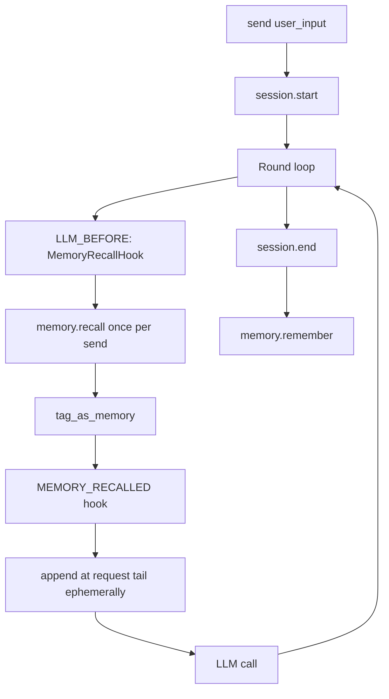

# Memory

[中文](../../zh/user-guide/memory.md) | [User Guide](../index.md)

`MemoryProvider` is a pluggable protocol for **cross-session recall**. The library does not implement a memory backend — you bring your own (SQLite facts, HTTP API diary, vector DB). The protocol tells the pipeline **when** to recall and **when** to persist.

## How It Works



1. **Recall** — runs in the built-in **`MemoryRecallHook`** at `HookPoint.LLM_BEFORE`. The recalled block is computed **once per send** (memoized on the first round / session change) and appended **ephemerally** to the per-call message list. It never enters `self.history` or the store — it is re-appended each round and gone after the run.
2. **Remember** — at `session.end`. Receives a `MemorySnapshot` with the full final history, final text, status, and round count.

The hook is **auto-registered** when `AgentLoopConfig.memory` is set. Set `builtin_memory_hook=False` to inject memory yourself instead (see [Built-in Hook & Overriding](#built-in-hook--overriding)).

## Quick Start

```python
from power_loop import MemorySnapshot, AgentLoopConfig

class MyMemory:
    async def recall(self, *, messages, session_id, budget_tokens=1500):
        # Return a list of dicts to inject as system messages
        return [{"content": "User prefers Python. Favorite color: blue."}]

    async def remember(self, *, snapshot: MemorySnapshot, session_id):
        # snapshot.messages, snapshot.final_text, snapshot.status, snapshot.rounds
        pass  # persist what you need

config = AgentLoopConfig(memory=MyMemory())
```

## MemorySnapshot

Passed to `remember()` at session end:

| Field | Type | Description |
|---|---|---|
| `session_id` | `str` | The session ID |
| `messages` | `list[dict]` | Full final history (after any compaction) |
| `final_text` | `str` | The last assistant reply |
| `rounds` | `int` | Total rounds completed |
| `status` | `str` | `"completed"` / `"cancelled"` / `"degraded"` / `"hit_round_limit"` |
| `metadata` | `dict` | Caller-provided metadata from `new_session(metadata=...)` |

## Injection Position

Recalled messages are tagged `role=system, name=memory_*` and, by default (`memory_position="tail"`), appended at the **tail** of the per-call request — after the whole prior history:

```
[system_prompt]          ← from AgentLoopConfig
[compact_note]           ← from compactor (if any)
[user msg 1]             ← conversation begins here
[assistant msg 1]
...
[memory_0]               ← from recall (ephemeral, request tail)
[memory_1]               ← from recall
```

The tail position keeps the **prior-history prefix byte-identical across sends** even as recalled memory changes, so the provider's prefix cache stays warm. Because the block is appended only to the per-call message list (never `self.history` / the store), it is invisible to compaction and reset each round — there is no system-region folding concern.

Set `memory_position="front"` to restore the legacy position (after the leading system block, before the conversation). This breaks prefix caching whenever recalled memory changes, so `"tail"` is preferred.

To keep `history + memory` inside the model window, the fold/compaction trigger reserves headroom for the tail memory via `config.effective_context_budget()` — `max_tokens − memory_budget_tokens` when `memory` is set — so folding fires early enough.

## Failure Model

Memory is **best-effort**. Failures never block the user from getting a reply:

| Failure | Behavior |
|---|---|
| `recall()` raises | Returns `[]` (no injection). Emits `MEMORY_FAILED(phase="recall")`. Loop continues. |
| `remember()` raises | Emits `MEMORY_FAILED(phase="remember")`. `StatefulResult` is returned unchanged. |

## MEMORY_RECALLED Hook

Filter or drop recalled messages before injection:

```python
hooks = AgentHooks()

async def gate_memory(ctx: MemoryRecalledCtx) -> None:
    if not user_has_consented(ctx.session_id):
        ctx.directive = HookDirective.SKIP  # drop everything
    # Or redact:
    for m in ctx.recalled:
        m["content"] = redact_pii(m.get("content", ""))

hooks.register(HookPoint.MEMORY_RECALLED, gate_memory)
```

## Built-in Hook & Overriding

Recall is implemented by the built-in `MemoryRecallHook` (an `LLM_BEFORE` hook) and registered under the stable name `MemoryRecallHook.NAME == "builtin.memory_recall"`. The `LlmBeforeCtx` passed to `LLM_BEFORE` hooks carries `session_id`.

A host can take over injection without disabling memory:

```python
from power_loop import MemoryRecallHook
from power_loop.contracts.hooks import HookPoint

# Override: replace the built-in with your own LLM_BEFORE handler
hooks.replace(HookPoint.LLM_BEFORE, my_handler, name=MemoryRecallHook.NAME)

# Disable: drop it entirely (recall won't run)
hooks.remove(MemoryRecallHook.NAME)
```

Pre-registering a handler under that name before constructing the loop also works — the loop won't clobber an entry that already exists under `MemoryRecallHook.NAME`. Alternatively set `builtin_memory_hook=False` on `AgentLoopConfig` to suppress auto-registration entirely and wire your own `LLM_BEFORE` injection.

## Session Notes: NoteMemory

`NoteMemory` is the built-in `MemoryProvider` that recalls the session's **own notes** (written by the agent's note tools). It is backend-agnostic — it reads from whatever `SessionStore` you configured (SQLite / Postgres / MySQL):

```python
from power_loop import NoteMemory, AgentLoopConfig

config = AgentLoopConfig(memory=NoteMemory(store))
```

> `NoteMemory` was previously named `SQLiteNoteMemory`; that name is kept as a back-compat alias, so existing `from power_loop import SQLiteNoteMemory` imports keep working.

## Example: SQLite Fact Memory

```python
class SqliteFactMemory:
    def __init__(self, db_path):
        self.db_path = db_path

    async def recall(self, *, messages, session_id, budget_tokens=1500):
        rows = db.execute("SELECT key, value FROM facts").fetchall()
        return [{"content": "Known facts:\n" + "\n".join(
            f"- {r['key']}: {r['value']}" for r in rows
        )}] if rows else []

    async def remember(self, *, snapshot, session_id):
        # Extract FACT: key=value lines from final_text
        for key, value in parse_facts(snapshot.final_text):
            db.execute("INSERT OR REPLACE INTO facts VALUES (?, ?)", (key, value))
```

Full runnable version at [`examples/13_memory_sqlite.py`](../../../examples/13_memory_sqlite.py).

## Next

- [Retry & Cancel](retry-cancel.md) — handle LLM failures gracefully
- [Events](events.md) — observe memory events (`memory_recalled`, `memory_failed`)
