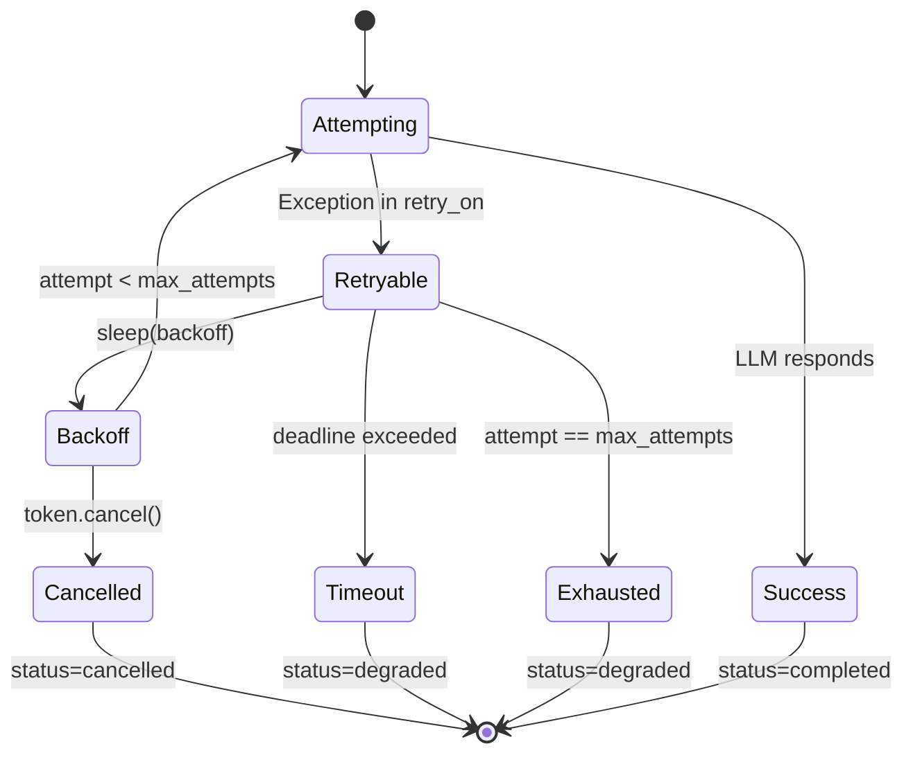

# Retry & Cancel

[中文](../../zh/user-guide/retry-cancel.md) | [User Guide](../index.md)

LLM calls can fail — rate limits, connection resets, upstream errors. `LLMRetryPolicy` retries with exponential backoff; `CancellationToken` lets users cancel mid-loop.

## LLMRetryPolicy

```python
from power_loop import LLMRetryPolicy, AgentLoopConfig

retry = LLMRetryPolicy(
    max_attempts=3,           # 1 initial + 2 retries
    backoff_initial=0.5,      # seconds before second attempt
    backoff_max=8.0,          # cap for exponential backoff
    total_timeout=60.0,       # wall-clock deadline across ALL attempts
    retry_on=(Exception,),    # default: all Exception subclasses
)

config = AgentLoopConfig(retry_policy=retry)
```

### Backoff Formula

```
attempt 0: no sleep (first call)
attempt 1: backoff_initial * 2^0 = 0.5s
attempt 2: backoff_initial * 2^1 = 1.0s
attempt 3: backoff_initial * 2^2 = 2.0s
... capped at backoff_max
```

Each sleep is cancel-aware — if the `CancellationToken` fires during the backoff sleep, the retry loop exits immediately with `CancellationRequested`.

## Retry Lifecycle



## CancellationToken

Unifies every cancel shape into one interface:

```python
from power_loop import CancellationToken

# Owned token (you control it)
token = CancellationToken()
token.cancel("user_pressed_stop")
token.is_cancelled()  # → True
token.raise_if_cancelled()  # raises CancellationRequested

# Wrap existing signals
token = CancellationToken.from_any(threading_event)
token = CancellationToken.from_any(asyncio_event)
token = CancellationToken.from_any(lambda: stop_flag)
token = CancellationToken.from_any(None)  # never cancelled
```

Pass to `send()`:

```python
result = await loop.send("do something", stop_event=token)
# or
result = await loop.send("do something", stop_event=threading.Event())
```

### Cancel in Flight

```python
import asyncio

async def cancel_soon():
    await asyncio.sleep(2)
    token.cancel("timeout")

# The send will raise CancellationRequested mid-loop
# → pipeline translates to status="cancelled"
await asyncio.gather(
    loop.send("long task", stop_event=token),
    cancel_soon(),
)
```

## Events

Subscribe to track retry/cancel activity:

```python
bus.subscribe(AgentEventType.LLM_RETRY_ATTEMPTED, lambda e: print(
    f"Retry {e.data.attempt+1}/{e.data.max_attempts}: {e.data.error_type}"
))
bus.subscribe(AgentEventType.LLM_DEGRADED, lambda e: print(
    f"Degraded after {e.data.attempts} attempts: {e.data.reason}"
))
bus.subscribe(AgentEventType.LOOP_CANCELLED, lambda e: print(
    f"Cancelled: {e.data.reason}"
))
```

## Choosing retry_on

| Policy | Use when |
|---|---|
| `retry_on=(Exception,)` (default) | Most cases — catch all transient errors |
| `retry_on=(httpx.HTTPStatusError,)` | Only retry HTTP errors |
| `retry_on=(RateLimitError, TimeoutError)` | Provider-specific errors |

Errors **not** in `retry_on` bubble up immediately and never count as a retry attempt.

## Next

- [Structured Output](structured-output.md) — force JSON with schema validation
- [Configuration](configuration.md) — all `AgentLoopConfig` fields