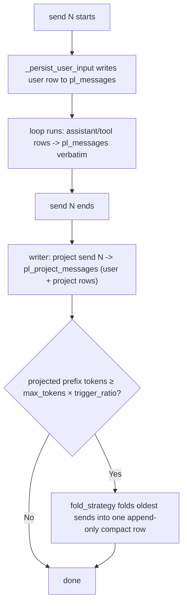

# Send-Context Projection (the representation axis)

[中文](../../zh/user-guide/send-context-projection.md) | [User Guide](../index.md)

Projection is the non-default **representation** (power-loop 3.0): instead of feeding the model the full verbatim history every send, you feed a **compact, plain-text projection of each *finished* send** plus the **in-flight send verbatim**. The durable `pl_messages` log is never rewritten — the projection lives in a separate, derived table.

> **Two orthogonal axes.** `representation` (this page — how each finished send is recorded/rendered) and [`fold_strategy`](compaction.md) (how older history is compacted once over budget) are independent. Projection composes *with* a fold strategy — it does not replace one. With no `representation` set, behavior is the verbatim default.

```python
from power_loop import AgentLoopConfig, ProjectedRepresentation, LLMSummaryFold

config = AgentLoopConfig(
    representation=ProjectedRepresentation(max_chars=300),  # axis 1: terse per-send projection
    fold_strategy=LLMSummaryFold(keep_last_sends=4),        # axis 2: how older sends compact
    max_tokens=8000,                                        # fold trigger = max_tokens × trigger_ratio
)
```

## Why

A "send" is one `loop.send()` (the user turn + the agent's whole tool loop). By default every past send stays in context **verbatim** — full OpenAI tool-call structure and untruncated tool results — and grows every send. Projection collapses each *finished* send to a short, structured-then-rendered plain-text summary:

- **`pl_messages` stays an immutable, append-only audit log** — never folded, never `compacted_out`. (Contrast: verbatim mode's in-place fold rewrites a span into a `compact_note`.)
- The projected history is **plain text with no tool-call protocol fields**, so a past send can never dangle a tool-call/result pair, and it is provider-agnostic (OpenAI *and* Anthropic).
- Each tool decides how it appears via an optional `ToolDefinition.project` hook.
- It's a **derived** layer: a bad projection never corrupts the source of truth, and the table is rebuildable from `pl_messages`.

## How it works



At the **start of send N+1**, the reader assembles the LLM history as:

```
[system prompt]
+ render(latest compact + projections of finished sends)   # plain text, each tagged with #N
+ the in-flight send N+1's rows from pl_messages           # verbatim, structured
+ runtime messages (todos/background)                       # as usual
```

The in-flight send is **always verbatim** (the model needs its own tool calls/results to continue this turn); only *finished* sends are projected.

## Two tables

| | `pl_messages` | `pl_project_messages` (schema v2) |
|---|---|---|
| Role | Loop-internal audit log | Derived per-send LLM context |
| Mutability | Append-only, never rewritten | Append-only; derived/rebuildable |
| Written | Every send, every row (user/assistant/tool) | Only under a projection representation, once per finished send |
| `kind` | role (user/assistant/tool/system) | `user` / `project` / `compact` |
| Exported | Yes | No (rebuildable) |

Every `pl_messages` row carries a monotonic `send_index` **column** (queryable; NULL on pre-v2 rows; never sent to the model) — the authoritative send boundary.

## What the LLM actually sees

Two finished sends (`列出当前目录` → `bash(ls)` → reply; `读 a.py` → `read_file` → long content → reply), now starting a third send `给 a.py 加注释`:

**Default (verbatim) — 9 messages:**
```
user        列出当前目录
assistant   tool_calls=[bash {"command":"ls"}]          ← structured tool call
tool        a.py b.py                                    (tool_call_id=c1)
assistant   有 a.py 和 b.py 两个文件
user        读 a.py
assistant   tool_calls=[read_file {"path":"a.py"}]
tool        <the entire long file, untruncated>
assistant   a.py 是个 hello world 脚本
user        给 a.py 加注释                               ← current send
```

**Projection — 5 messages (each finished send tagged `#N` for `recall_send`):**
```
user        [#1] 列出当前目录
assistant   #1 [tools] bash(result=a.py b.py)
            有 a.py 和 b.py 两个文件
user        [#2] 读 a.py
assistant   #2 [tools] read_file(result=print('hello world')\n…(truncated ~200 chars)…)
            a.py 是个 hello world 脚本
user        给 a.py 加注释                               ← current send, verbatim
```

What `pl_project_messages` actually stores for send 1 (the structured `content_json`, before rendering):
```json
user    {"human": ["列出当前目录"]}
project {"tools": [{"name":"bash","result":"a.py b.py"}], "final_text":"有 a.py 和 b.py 两个文件"}
```

Past tool calls become `[tools] name(result=…)` plain text (no `tool_calls`/`tool_call_id`); long results are truncated to `max_chars`.

## Customizing the render

How stored rows render to that text is a first-class extension point (the defaults reproduce the output above byte-for-byte). Two ways:

**Config — `ProjectionRenderConfig`.** A dataclass of pure-scalar format knobs, so the whole thing round-trips through JSON (drive it from config / an admin UI and retune the rendered context live):

```python
from power_loop import ProjectedRepresentation, ProjectionRenderConfig

cfg = ProjectionRenderConfig(
    user_tag="👤#{n} ",        # {n} = send_index; "" or a None index → no tag
    project_tag="🤖#{n} ",
    tools_header="calls: ",
    tool_sep="; ", tool_arg_sep=", ",
    include_tools=True,
    include_final_text=False,   # e.g. drop the assistant's trailing text
    empty_project="(no output)",
    fold_note="[older sends {range} folded — recall_send(send_index=N) to expand]",
)
rep = ProjectedRepresentation(render_config=cfg)
# a plain dict is coerced too (unknown keys ignored) — handy for JSON config:
rep = ProjectedRepresentation(render_config={"project_tag": ">> "})
```

**Subclass — override one shape.** `render()` delegates to `render_row` → `render_user_row` / `render_project_row` / `render_compact_row` (plus `_render_project` / `_render_tool` / `_send_tag`). Override exactly the one you want; the rest keep the built-in render:

```python
class TerseRender(ProjectedRepresentation):
    def render_project_row(self, r):
        names = ", ".join(t.get("name", "?") for t in (r.content or {}).get("tools") or [])
        return {"role": "assistant", "content": f"#{r.send_index} did: {names or '—'}"}
```

> Keep a `{n}` send_index tag in the `user_tag`/`project_tag` (or your `render_*` override): the model uses those `#N` markers to call `recall_send(send_index=N)`, so dropping them makes folded sends unrecoverable.

## Per-tool projection

Each tool can supply `project(args, result) -> dict | str` so it decides what matters in projected history; otherwise a truncating fallback (`{"name", "result": <truncated>}`) is used:

```python
from power_loop import ToolDefinition

write_file = ToolDefinition(
    name="write_file", description="…",
    project=lambda args, result: {"file": args.get("path")},   # → {"name":"write_file","file":"x.py"}
)
```

`result` is `str | None`: `None` means the call produced **no result row** (an unfinished/failed call) — distinct from a produced-but-empty `""`, so your hook can tell them apart. The default fallback renders a missing result as `tool(result=<missing>)` and an empty one as `tool(result=)`. Duplicate or empty `tool_call_id`s are paired in order (a repeated id never collapses two results onto one), and a malformed tool-call never breaks projection. The `project` callable is excluded from `ToolDefinition` equality/hash (`compare=False`).

## Folding under projection

Folding is the **fold-strategy axis**, and under projection it is **LLM-backed** like verbatim mode (3.0 removed the old deterministic concat fold). Once the rendered projected prefix reaches `max_tokens × trigger_ratio` (default `0.75`), the configured `fold_strategy` (`LLMSummaryFold` by default, or `AgenticFold`) summarizes the oldest sends into a single **append-only** `compact` row — always keeping the most-recent `keep_last_sends` individually, and rolling any prior compact forward so nothing is lost. Below the threshold the small per-send projections just accumulate. The reader then reads `latest compact + sends after its cursor`. The folded `user`/`project` rows are **kept** in `pl_project_messages` (and the originals stay in `pl_messages`), so `recall_send` always recovers them. The fold runs **outside** the DB lock, bounded by `fold_timeout_s`; on timeout/error it soft-fails (rows committed, no compact this send, retried next send).

> The **in-flight send and the `keep_last_sends` recent sends are always individual**, so a single send larger than the budget is an inherent limit (as with any context window) — lower `max_chars` / `keep_last_sends`, or use a cheaper `summary_llm=` on the fold for very long turns.

## Recovering full detail: `recall_send`

Because the projection is lossy (tool detail truncated/dropped) and older sends are folded, the model can re-expand any finished send's **original** `pl_messages` detail on demand — each rendered send is tagged with its `#N` send-index so the model knows what to ask for:

```python
create_default_tool_registry(include=["recall_send"])   # also in the "full" preset
```

`recall_send(send_index)` returns that send's original messages — assistant text, tool calls (by name), and their results. The detail always exists because `pl_messages` is the immutable source of truth. (Under verbatim mode the equivalent is `recall_compacted()`.)

## Representations

- **`VerbatimRepresentation`** (default) — full, byte-identical history; renders compact rows too.
- **`ProjectedRepresentation`** — the generic, no-application-knowledge structured summary above (`max_chars` per-field truncation). Subclass it or implement the `Representation` Protocol to customize rendering (e.g. surface only a chat tool's delivered text, list changed files, strip an injected preamble).

```python
from power_loop import Representation, ProjectedSend, ProjectedRow  # to write your own
```

A custom representation satisfies the `Representation` Protocol by declaring `kind: str` (`"verbatim"` routes to the in-place path; anything else is projection-style) and `version: int`, plus `project_send(send_rows, *, send_index, tool_registry) -> ProjectedSend` and `render(rows) -> list[LoopMessage]`. **Its `render` MUST handle `kind == "compact"`** (render the fold's summary), or folded history is silently dropped. `ProjectedRepresentation` validates its params at construction (`version ≥ 1`, `max_chars > 0`).

> The trigger + keep-recent knobs live on the **fold strategy** (`trigger_ratio`, `keep_last_sends`), not the representation — that's the orthogonality.

## Behavior notes

- **Sub-agent child sessions are not projected** — they're skipped by `parent_session_id`; a child's transcript lives in its own session.
- **Incomplete sends defer** — a send that ends `waiting_for_input` / `pending_tools` is not projected until a resume reaches a terminal status (idempotent upsert on `(session_id, send_index, kind)`).
- **Pre-projection (legacy) rows render verbatim, never dropped** — rows written before a projection representation was attached (or before v2, or restored via export→import) have `send_index = NULL`. Enabling projection on such a session does **not** erase them: they render verbatim as a prefix that precedes every projected send (temporally first). New v2 sessions never have NULL rows, so this only matters for migration/import.
- **A missing or stale projection falls back to verbatim, never dropped** — projection is best-effort at end-of-send; if its write failed/crashed, the past send has rows in `pl_messages` but none in the projection table, and the reader renders that send **verbatim from `pl_messages`** instead of omitting it. The same fallback fires for a send whose projection rows carry a **different `version`** than the configured representation.
- **A misbehaving representation degrades, never poisons the send** — if `project_send`/`render` raises, the fold is skipped but the send's per-send rows still commit; `pl_messages` stays the source of truth. The per-tool `project()` hook is likewise exception-guarded (falls back to the truncating default).
- **Atomic & concurrency-safe** — each finished send's projection rows commit under a short lock; the (LLM) fold runs outside the lock and commits with an optimistic prior-cursor check, so two loops sharing a store can't double-write a fold.
- **Tokens**: real reduction comes from `ProjectedRepresentation`'s per-field truncation and the `compact` fold; stored content is structured JSON, rendered to compact text at assembly time. **Prompt caching**: the projected prefix grows append-only (one row group per send), friendlier to a provider's implicit prefix cache than verbatim in-place compaction (which rewrites a span on each fold).

## Switching modes on an existing session

The mode (a projection `representation` vs the verbatim default) is chosen **per loop**. The **original** mode + config is recorded in the **session metadata** (`SessionRow.metadata`) the first time it runs, for inspection and switch-detection — but reopening a session in a *different* mode **never throws**: it degrades to a best-effort verbatim render and logs a warning. `send_index` is allocated on every send regardless of mode.

| From → To | What happens |
|---|---|
| **verbatim → projection**, *no fold had fired yet* | **Migrated (default).** On the first projection send, prior history is folded into the projection table **once** — a `compact` covering the old sends plus the most-recent `keep_last_sends` as project rows. With `migrate_history_on_switch=False`, the prior sends instead render **verbatim from `pl_messages`** (never folded). |
| **verbatim → projection**, *an in-place fold had fired* | **Migrated (default).** The in-place `compact_note` **seeds** the projection compact and the active tail is projected. With migration off it **degrades** to verbatim rendering — compressed but coherent — and skips projecting this send. Never throws. If the migration fold soft-fails, the would-be-folded sends are preserved as individual project rows (no data loss). |
| **resume()/submit_input() before any send()** | **Degrades, never throws.** No `send_index` is allocated to partition by, so it renders verbatim and runs best-effort, with a warning. |
| **projection → verbatim** | **Safe.** Projection never marks `pl_messages` rows inactive, so verbatim mode sees the full history; the now-stale projection rows are ignored. |
| **change representation `version` / implementation** | Rows written by a *different* `version` fall back to verbatim per send (see Behavior notes). **Bump `version`** whenever you change the implementation/content shape so old rows fall back cleanly. |

**Migration** (`migrate_history_on_switch`, default `True`) runs **once** per session — best-effort (on failure it falls back to verbatim and retries next send), idempotent (recorded as `projection_migrated` in the session metadata), and only when the projection table is empty. It folds via the configured `fold_strategy`.

**Recommendation:** pick the mode at session creation. A switch is always survivable (best-effort + warning, never an exception), but for clean, fully-foldable projection start a **fresh session**.

## Robustness: self-healing a malformed history

A corrupt row in `pl_messages` (a crash between an assistant tool-call row and its result, a bad import, a manual edit, a projection mismatch) would otherwise make the provider reject the whole prompt — and repeat on every load, **bricking the session forever**. To prevent that, the assembled prompt is run through a tool-call/result aligner (`align_tool_calls`) before **every** LLM call:

- an **orphan tool result** (no matching assistant call) is **dropped**;
- a **mid-history assistant call left unanswered** before the next message gets a **synthesized placeholder** result, so the pairing is valid;
- a **trailing** pending call (the in-flight send's tools, which the loop is about to run on a resume) is **left untouched**.

It is always-on, mode-agnostic, and a **no-op on a healthy history**; each repair logs a warning. By default the audit log is unchanged (the prompt is just sanitized each load). Set **`AgentLoopConfig.repair_corrupt_history=True`** to additionally deactivate the dropped orphan rows durably (`state="dropped"`) — still kept in the full audit, just excluded from the active history so they aren't re-sanitized every time.

## Legacy (deprecated) API

The 2.x `history_projector=` / `compactor=` kwargs still work — a legacy `DefaultDeterministicProjector` / `IdentityProjector` (now deep-import-only, not in `power_loop.__all__`) is mapped onto the new axes with a `DeprecationWarning`. Prefer `representation=` / `fold_strategy=`. Note the old deterministic-concat fold and its `max_compact_chars` cap are gone: projection folding is now LLM-backed via the fold strategy.

## See also

- [Compaction](compaction.md) — the fold-strategy axis (works under both representations).
- [Example 40](../../../examples/40_send_context_projection.py) — end-to-end (`ProjectedRepresentation` × `LLMSummaryFold` + `recall_send`).
