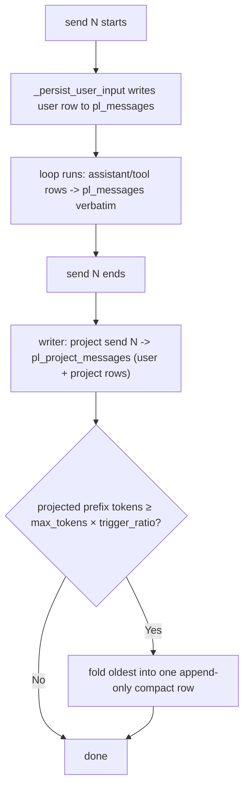

# Send-Context Projection

[中文](../../zh/user-guide/send-context-projection.md) | [User Guide](../index.md)

Send-context projection is an **opt-in** alternative to in-place [compaction](compaction.md): instead of feeding the model the full verbatim history every send, you feed a **compact, plain-text projection of each *finished* send** plus the **in-flight send verbatim**. The durable `pl_messages` log is never rewritten — the projection lives in a separate, derived table.

**Default-off.** With no projector configured, behavior is byte-for-byte identical to today (verbatim history + the default compactor). You turn it on per loop.

## Why

A "send" is one `loop.send()` (the user turn + the agent's whole tool loop). By default every past send stays in context **verbatim** — full OpenAI tool-call structure and untruncated tool results — and grows every send. Projection collapses each *finished* send to a short, structured-then-rendered plain-text summary:

- **`pl_messages` stays an immutable, append-only audit log** — never folded, never `compacted_out`. (Contrast: the in-place compactor rewrites it.)
- The projected history is **plain text with no tool-call protocol fields**, so a past send can never dangle a tool-call/result pair, and it is provider-agnostic (OpenAI *and* Anthropic).
- Each tool decides how it appears via an optional `ToolDefinition.project` hook.
- It's a **derived** layer: a bad projection never corrupts the source of truth, and the table is rebuildable from `pl_messages`.

## How it works



At the **start of send N+1**, the reader assembles the LLM history as:

```
[system prompt]
+ render(latest compact + projections of finished sends)   # plain text
+ the in-flight send N+1's rows from pl_messages           # verbatim, structured
+ runtime messages (todos/background)                       # as usual
```

The in-flight send is **always verbatim** (the model needs its own tool calls/results to continue this turn); only *finished* sends are projected.

## Two tables

| | `pl_messages` | `pl_project_messages` (new, schema v2) |
|---|---|---|
| Role | Loop-internal audit log | Derived per-send LLM context |
| Mutability | Append-only, never rewritten | Append-only; derived/rebuildable |
| Written | Every send, every row (user/assistant/tool) | Only with a projector, once per finished send |
| `kind` | role (user/assistant/tool/system) | `user` / `project` / `compact` |
| Exported | Yes | No (rebuildable) |

Every `pl_messages` row carries a monotonic `send_index` **column** (queryable; NULL on pre-v2 rows; never sent to the model) — the authoritative send boundary.

## Quick start

```python
from power_loop import (
    AgentLoopConfig, StatefulAgentLoop, SessionStore, DefaultDeterministicProjector,
)

loop = StatefulAgentLoop(
    llm=my_llm,
    store=await SessionStore.open("app.db"),
    config=AgentLoopConfig(
        compactor=None,                                  # REQUIRED with a projector
        max_tokens=8000,          # fold threshold = max_tokens × trigger_ratio
        history_projector=DefaultDeterministicProjector(
            max_chars=200,        # per-field truncation of tool args/results
            keep_last_sends=4,    # most-recent sends ALWAYS kept individually
            trigger_ratio=0.75,   # fold older sends once the prefix reaches 75% of max_tokens
        ),
    ),
)
```

`history_projector` and `compactor` are **mutually exclusive** — the projection layer replaces in-place compaction. Setting both raises `ValueError` (the projection reader assumes `pl_messages` stays in `seq` order, which the compactor's `compact_note` reordering would break).

## What the LLM actually sees

Two finished sends (`列出当前目录` → `bash(ls)` → reply; `读 a.py` → `read_file` → long content → reply), now starting a third send `给 a.py 加注释`:

**Default (no projector) — verbatim, 9 messages:**
```
user        列出当前目录
assistant   tool_calls=[bash {"command":"ls"}]          ← structured tool call
tool        a.py b.py                                    (tool_call_id=c1)
assistant   有 a.py 和 b.py 两个文件
user        读 a.py
assistant   tool_calls=[read_file {"path":"a.py"}]
tool        <the entire long file, untruncated>
assistant   a.py 是个 hello world 脚本
user        给 a.py 加注释                               ← current send
```

**Projection — 5 messages:**
```
user        列出当前目录
assistant   [tools] bash(result=a.py b.py)
            有 a.py 和 b.py 两个文件
user        读 a.py
assistant   [tools] read_file(result=print('hello world')\n…(truncated ~200 chars)…)
            a.py 是个 hello world 脚本
user        给 a.py 加注释                               ← current send, verbatim
```

What `pl_project_messages` actually stores for send 1 (the structured `content_json`, before rendering):
```json
user    {"human": ["列出当前目录"]}
project {"tools": [{"name":"bash","result":"a.py b.py"}], "final_text":"有 a.py 和 b.py 两个文件"}
```

Note: past tool calls become `[tools] name(result=…)` plain text (no `tool_calls`/`tool_call_id`), and long results are truncated to `max_chars`.

## Per-tool projection

Each tool can supply `project(args, result) -> dict | str` so it decides what matters in projected history; otherwise a truncating fallback (`{"name", "result": <truncated>}`) is used:

```python
from power_loop import ToolDefinition

write_file = ToolDefinition(
    name="write_file", description="…",
    project=lambda args, result: {"file": args.get("path")},   # → {"name":"write_file","file":"x.py"}
)
```

The `project` callable is excluded from `ToolDefinition` equality/hash (`compare=False`).

## Compaction inside the projection layer

Folding is **token-driven**, mirroring `DefaultCompactor`'s policy: once the rendered projected prefix reaches `max_tokens × trigger_ratio` (default `0.75`), the oldest sends fold into a single **append-only** `compact` row — always keeping the most-recent `keep_last_sends` individually, and rolling any prior compact forward so nothing is lost. Below the threshold, the small per-send projections just accumulate. The reader then reads `latest compact + sends after its cursor`. The folded `user`/`project` rows are **kept** (recoverable). Folding is deterministic (no LLM call) by default; `pl_messages` is never touched.

## Recovering full detail: `recall_send`

Because the projection is lossy (tool detail truncated/dropped), the model can re-expand any finished send's **original** `pl_messages` detail on demand:

```python
create_default_tool_registry(include=["recall_send"])   # also in the "full" preset
```

`recall_send(send_index)` returns that send's original messages — assistant text, tool calls (by name), and their results. The detail always exists because `pl_messages` is the immutable source of truth.

## The projectors

- **`IdentityProjector`** — stores and renders each send verbatim; the LLM history is identical to the no-projector default. Useful to confirm the projection seam itself changes nothing. Never compacts.
- **`DefaultDeterministicProjector`** — the generic, no-LLM structured summary above. Neither carries application knowledge; subclass / implement `HistoryProjector` to customize rendering (e.g. surface only a chat tool's delivered text, list changed files, strip injected preamble).

```python
from power_loop import HistoryProjector, ProjectedSend, ProjectedRow  # to write your own
```

## Behavior notes

- **Sub-agent child sessions are not projected** — they're skipped by `parent_session_id`; a child's transcript lives in its own session.
- **Incomplete sends defer** — a send that ends `waiting_for_input` / `pending_tools` is not projected until a resume reaches a terminal status (idempotent upsert on `(session_id, send_index, kind)`).
- **Tokens**: a verbatim projection (Identity) does not reduce tokens; real reduction comes from `DefaultDeterministicProjector`'s per-field truncation and the `compact` fold. Stored content is structured JSON, rendered to compact text at assembly time.
- **Prompt caching**: the projected prefix grows append-only (one row group per send), so it's friendlier to a provider's implicit prefix cache than the in-place compactor (which rewrites a span on each fold).

## See also

- [Compaction](compaction.md) — the default in-place alternative.
- [Example 40](../../../examples/40_send_context_projection.py) — end-to-end (projection + compaction + `recall_send`).
