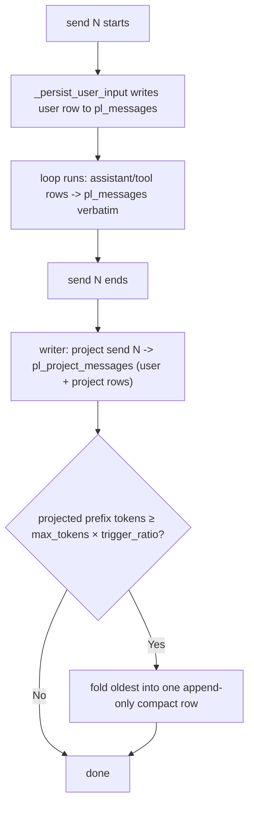

# Send-Context Projection

[中文](../../zh/user-guide/send-context-projection.md) | [User Guide](../index.md)

Send-context projection is an **opt-in** alternative to in-place [compaction](compaction.md): instead of feeding the model the full verbatim history every send, you feed a **compact, plain-text projection of each *finished* send** plus the **in-flight send verbatim**. The durable `pl_messages` log is never rewritten — the projection lives in a separate, derived table.

**Default-off.** With no projector configured, behavior is byte-for-byte identical to today (verbatim history + the default compactor). You turn it on per loop.

## Why

A "send" is one `loop.send()` (the user turn + the agent's whole tool loop). By default every past send stays in context **verbatim** — full OpenAI tool-call structure and untruncated tool results — and grows every send. Projection collapses each *finished* send to a short, structured-then-rendered plain-text summary:

- **`pl_messages` stays an immutable, append-only audit log** — never folded, never `compacted_out`. (Contrast: the in-place compactor rewrites it.)
- The projected history is **plain text with no tool-call protocol fields**, so a past send can never dangle a tool-call/result pair, and it is provider-agnostic (OpenAI *and* Anthropic).
- Each tool decides how it appears via an optional `ToolDefinition.project` hook.
- It's a **derived** layer: a bad projection never corrupts the source of truth, and the table is rebuildable from `pl_messages`.

## How it works



At the **start of send N+1**, the reader assembles the LLM history as:

```
[system prompt]
+ render(latest compact + projections of finished sends)   # plain text
+ the in-flight send N+1's rows from pl_messages           # verbatim, structured
+ runtime messages (todos/background)                       # as usual
```

The in-flight send is **always verbatim** (the model needs its own tool calls/results to continue this turn); only *finished* sends are projected.

## Two tables

| | `pl_messages` | `pl_project_messages` (new, schema v2) |
|---|---|---|
| Role | Loop-internal audit log | Derived per-send LLM context |
| Mutability | Append-only, never rewritten | Append-only; derived/rebuildable |
| Written | Every send, every row (user/assistant/tool) | Only with a projector, once per finished send |
| `kind` | role (user/assistant/tool/system) | `user` / `project` / `compact` |
| Exported | Yes | No (rebuildable) |

Every `pl_messages` row carries a monotonic `send_index` **column** (queryable; NULL on pre-v2 rows; never sent to the model) — the authoritative send boundary.

## Quick start

```python
from power_loop import (
    AgentLoopConfig, StatefulAgentLoop, SessionStore, DefaultDeterministicProjector,
)

loop = StatefulAgentLoop(
    llm=my_llm,
    store=await SessionStore.open("app.db"),
    config=AgentLoopConfig(
        compactor=None,                                  # REQUIRED with a projector
        max_tokens=8000,          # fold threshold = max_tokens × trigger_ratio
        history_projector=DefaultDeterministicProjector(
            max_chars=300,          # per-field truncation of tool args/results
            keep_last_sends=4,      # most-recent sends ALWAYS kept individually
            trigger_ratio=0.75,     # fold older sends once the prefix reaches 75% of max_tokens
            max_compact_chars=4000, # hard cap on the folded compact row (0 = unbounded)
        ),
    ),
)
```

`history_projector` and `compactor` are **mutually exclusive** — the projection layer replaces in-place compaction. Setting both raises `ValueError` (the projection reader assumes `pl_messages` stays in `seq` order, which the compactor's `compact_note` reordering would break).

## What the LLM actually sees

Two finished sends (`列出当前目录` → `bash(ls)` → reply; `读 a.py` → `read_file` → long content → reply), now starting a third send `给 a.py 加注释`:

**Default (no projector) — verbatim, 9 messages:**
```
user        列出当前目录
assistant   tool_calls=[bash {"command":"ls"}]          ← structured tool call
tool        a.py b.py                                    (tool_call_id=c1)
assistant   有 a.py 和 b.py 两个文件
user        读 a.py
assistant   tool_calls=[read_file {"path":"a.py"}]
tool        <the entire long file, untruncated>
assistant   a.py 是个 hello world 脚本
user        给 a.py 加注释                               ← current send
```

**Projection — 5 messages:**
```
user        列出当前目录
assistant   [tools] bash(result=a.py b.py)
            有 a.py 和 b.py 两个文件
user        读 a.py
assistant   [tools] read_file(result=print('hello world')\n…(truncated ~200 chars)…)
            a.py 是个 hello world 脚本
user        给 a.py 加注释                               ← current send, verbatim
```

What `pl_project_messages` actually stores for send 1 (the structured `content_json`, before rendering):
```json
user    {"human": ["列出当前目录"]}
project {"tools": [{"name":"bash","result":"a.py b.py"}], "final_text":"有 a.py 和 b.py 两个文件"}
```

Note: past tool calls become `[tools] name(result=…)` plain text (no `tool_calls`/`tool_call_id`), and long results are truncated to `max_chars`.

## Per-tool projection

Each tool can supply `project(args, result) -> dict | str` so it decides what matters in projected history; otherwise a truncating fallback (`{"name", "result": <truncated>}`) is used:

```python
from power_loop import ToolDefinition

write_file = ToolDefinition(
    name="write_file", description="…",
    project=lambda args, result: {"file": args.get("path")},   # → {"name":"write_file","file":"x.py"}
)
```

`result` is `str | None`: `None` means the call produced **no result row** (an unfinished/failed call) — distinct from a produced-but-empty `""`, so your hook can tell them apart. The default fallback renders a missing result as `tool(result=<missing>)` and an empty one as `tool(result=)`. Duplicate or empty `tool_call_id`s are paired in order (a repeated id never collapses two results onto one), and a malformed tool-call never breaks projection. The `project` callable is excluded from `ToolDefinition` equality/hash (`compare=False`).

## Compaction inside the projection layer

Folding is **token-driven**, mirroring `DefaultCompactor`'s policy: once the rendered projected prefix reaches `max_tokens × trigger_ratio` (default `0.75`), the oldest sends fold into a single **append-only** `compact` row — always keeping the most-recent `keep_last_sends` individually, and rolling any prior compact forward so nothing is lost. Below the threshold, the small per-send projections just accumulate. The reader then reads `latest compact + sends after its cursor`. The folded `user`/`project` rows are **kept** (recoverable). Folding is deterministic (no LLM call) by default; `pl_messages` is never touched.

Because the default projector **concatenates** (it has no LLM to summarize-to-shrink), the rolled-forward compact would otherwise grow without bound over a long session — defeating the token fold. `max_compact_chars` (default `4000`; `0` = unbounded) caps it: when the compact exceeds the cap, the **oldest** folded lines are dropped and a marker is left (`…[older folded sends omitted — use recall_send(#N) for full detail]`). The dropped sends remain in `pl_messages`, so `recall_send` always recovers them. Note the **in-flight send and the `keep_last_sends` recent sends are always verbatim/individual**, so a single send larger than the budget is an inherent limit (as with any context window) — lower `max_chars`/`keep_last_sends` or supply an LLM-summarizing projector for very long turns.

## Recovering full detail: `recall_send`

Because the projection is lossy (tool detail truncated/dropped), the model can re-expand any finished send's **original** `pl_messages` detail on demand:

```python
create_default_tool_registry(include=["recall_send"])   # also in the "full" preset
```

`recall_send(send_index)` returns that send's original messages — assistant text, tool calls (by name), and their results. The detail always exists because `pl_messages` is the immutable source of truth.

## The projectors

- **`IdentityProjector`** — stores and renders each send verbatim; the LLM history is identical to the no-projector default. Useful to confirm the projection seam itself changes nothing. Never compacts.
- **`DefaultDeterministicProjector`** — the generic, no-LLM structured summary above. Neither carries application knowledge; subclass / implement `HistoryProjector` to customize rendering (e.g. surface only a chat tool's delivered text, list changed files, strip injected preamble).

```python
from power_loop import HistoryProjector, ProjectedSend, ProjectedRow  # to write your own
```

A custom projector satisfies the `HistoryProjector` Protocol by declaring `version: int`, `keep_last_sends: int`, and `trigger_ratio: float` (the token-fold fraction) plus the `project_send` / `render` / `compact` methods. `keep_last_sends == 0` disables folding entirely (what `IdentityProjector` does). The shipped projectors validate their params at construction (`trigger_ratio ∈ (0, 1]` — `NaN` rejected; `keep_last_sends ≥ 0`; `version ≥ 1`; `max_chars > 0`; `max_compact_chars ≥ 0`), and `AgentLoopConfig` rejects `max_tokens ≤ 0` when a projector is set.

## Behavior notes

- **Sub-agent child sessions are not projected** — they're skipped by `parent_session_id`; a child's transcript lives in its own session.
- **Incomplete sends defer** — a send that ends `waiting_for_input` / `pending_tools` is not projected until a resume reaches a terminal status (idempotent upsert on `(session_id, send_index, kind)`).
- **Pre-projection (legacy) rows render verbatim, never dropped** — rows written before a projector was attached (or before v2, or restored via export→import) have `send_index = NULL`. Enabling projection on such a session does **not** erase them: they render verbatim as a prefix that precedes every projected send (temporally first). New v2 sessions never have NULL rows, so this only matters for migration/import.
- **A missing or stale projection falls back to verbatim, never dropped** — projection is best-effort at end-of-send; if its write failed/crashed, the past send has rows in `pl_messages` but none in the projection table, and the reader renders that send **verbatim from `pl_messages`** instead of omitting it. The same fallback fires for a send whose projection rows carry a **different `version`** than the configured projector. This is also why a restored/imported session (projection excluded from export) renders correctly and re-folds on its next send.
- **A misbehaving projector degrades, never poisons the send** — if `project_send`/`render`/`compact` raises, the fold is skipped but the send's per-send rows still commit; `pl_messages` stays the source of truth. The per-tool `project()` hook is likewise exception-guarded (falls back to the truncating default).
- **Atomic & concurrency-safe** — each finished send's projection rows and any fold commit in one transaction under the session lock, so a crash can't leave a half-projected send, and two loops sharing a store can't double-write a fold.

- **Tokens**: a verbatim projection (Identity) does not reduce tokens; real reduction comes from `DefaultDeterministicProjector`'s per-field truncation and the `compact` fold. Stored content is structured JSON, rendered to compact text at assembly time.
- **Prompt caching**: the projected prefix grows append-only (one row group per send), so it's friendlier to a provider's implicit prefix cache than the in-place compactor (which rewrites a span on each fold).

## Switching modes on an existing session

The mode (a `history_projector` vs the default in-place compactor) is chosen **per loop**. The **original** mode + projector config (`history_mode`, `projector_version`, `projector_trigger_ratio`, `projector_keep_last_sends`) is recorded in the **session metadata** (`SessionRow.metadata`) the first time it runs, for inspection and switch-detection — but reopening a session in a *different* mode **never throws**: it degrades to a best-effort verbatim render and logs a warning. `send_index` is allocated on every send regardless of mode, so a default-mode session already carries send boundaries.

| From → To | What happens |
|---|---|
| **default → projection**, *no compaction had fired yet* | **Migrated (default).** On the first projection send, the prior history is folded into the projection table **once** — a `compact` covering the old sends plus the most-recent `keep_last_sends` as project rows — so the session becomes projection-native. With `migrate_history_on_projection_switch=False`, the prior sends instead render **verbatim from `pl_messages`** (never folded). |
| **default → projection**, *compaction had already fired* | **Migrated (default).** The in-place `compact_note` **seeds** the projection compact and the active tail is projected, so the session becomes projection-native without losing the note. With migration off, it **degrades** to verbatim (default-style) rendering — compressed but coherent — and skips projecting this send. Never throws. |
| **resume()/submit_input() before any send()** | **Degrades, never throws.** No `send_index` is allocated to partition by, so it renders verbatim and runs best-effort, with a warning. |
| **projection → default** | **Safe.** Projection never marks `pl_messages` rows inactive, so default mode sees the full verbatim history; the now-stale projection rows are ignored. |
| **change `projector.version` / implementation** | Rows written by a *different* `version` fall back to verbatim per send (see Behavior notes). **Bump `version`** whenever you change the implementation/content shape so old rows fall back cleanly. |

**Migration** (`migrate_history_on_projection_switch`, default `True`) runs **once** per session — best-effort (on failure it falls back to verbatim and retries next send), idempotent (recorded as `projection_migrated` in the session metadata), and only when the projection table is empty (a genuine switch / in-place-compacted session; an incidental missing row on an already-projected session is left to the per-send verbatim fallback). It folds via `projector.compact()`, so it uses whatever projector is configured.

**Recommendation:** pick the mode at session creation. A switch is always survivable (best-effort + warning, never an exception), but for clean, fully-foldable projection start a **fresh session**.

## Robustness: self-healing a malformed history

A corrupt row in `pl_messages` (a crash between an assistant tool-call row and its result, a bad import, a manual edit, a projection mismatch) would otherwise make the provider reject the whole prompt — and repeat on every load, **bricking the session forever**. To prevent that, the assembled prompt is run through a tool-call/result aligner (`align_tool_calls`) before **every** LLM call:

- an **orphan tool result** (no matching assistant call) is **dropped**;
- a **mid-history assistant call left unanswered** before the next message gets a **synthesized placeholder** result, so the pairing is valid;
- a **trailing** pending call (the in-flight send's tools, which the loop is about to run on a resume) is **left untouched**.

It is always-on, mode-agnostic, and a **no-op on a healthy history**; each repair logs a warning. By default the audit log is unchanged (the prompt is just sanitized each load). Set **`AgentLoopConfig.repair_corrupt_history=True`** to additionally deactivate the dropped orphan rows durably (`state="dropped"`) — still kept in the full audit, just excluded from the active history so they aren't re-sanitized every time.

## See also

- [Compaction](compaction.md) — the default in-place alternative.
- [Example 40](../../../examples/40_send_context_projection.py) — end-to-end (projection + compaction + `recall_send`).
