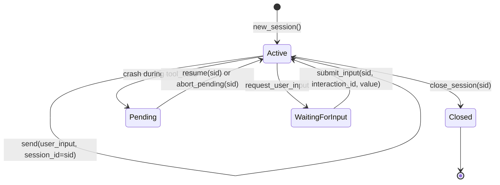

# Sessions

[中文](../../zh/user-guide/sessions.md) | [User Guide](../index.md)

Sessions are the unit of conversation in power-loop. Create one explicitly with `new_session()`, then pass its `session_id` to every `send()` call. The library manages history, persistence, and recovery for that id.

## Session Lifecycle



1. **Created** when you call `new_session()`.
2. **Continued** when you pass that `session_id` to `send()`.
3. **Pending** if the process crashes between `assistant(tool_calls)` and the last `tool` message.
4. **Waiting for input** if the `request_user_input` tool asks the caller/UI to collect external input.
5. **Closed** explicitly via `close_session(sid, cascade=True)`.

## Basic Usage

```python
loop = StatefulAgentLoop(llm=llm, config=config)

# New session
sid = loop.new_session()  # → "sess_abc123..."
r1 = await loop.send("Hello, my name is Alan.", session_id=sid)

# Continue
r2 = await loop.send("What is my name?", session_id=sid)
print(r2.final_text)  # → "Your name is Alan."

# Inspect history
messages = loop.get_messages(sid)
for m in messages:
    print(m["role"], m.get("content", "")[:60])
```

**Key**: You never build `messages` lists. The library loads history from SQLite by `session_id`.

## SessionStore

`SessionStore` is the SQLite-backed persistence layer. You typically don't interact with it directly — `StatefulAgentLoop` manages it. But you can access it for inspection or advanced use.

```python
from power_loop import SessionStore

store = SessionStore.open("./my_sessions.db")

# List all sessions
sessions = store.list_sessions()  # list of SessionRow

# Read a specific session
session = store.get_session(sid)
print(session.status)     # "active" | "closed"
print(session.created_at)

# Read messages
active = store.load_active_messages(sid)     # non-compacted
all_msgs = store.load_all_messages(sid)       # including compacted-out

# Close
store.close()
```

### Tables

`SessionStore` manages 5 tables:

| Table | Purpose |
|---|---|
| `sessions` | One row per session: `session_id`, `status`, `kind`, `parent_session_id`, timestamps |
| `messages` | Ordered `(session_id, seq)` message log with `state` (`active` / `compacted_out`) |
| `compactions` | Log of every compaction: `(session_id, compact_seq)`, what was folded |
| `usage_rounds` | Per-round token usage: `(session_id, round_index)`, prompt/completion tokens |
| `session_state` | Mutable state blob: current `pending` tool_calls, `context_compact_count` |

### SQLite Settings

- **WAL mode** — concurrent reads are safe.
- **`busy_timeout=5000`** — 5-second timeout on write contention.
- **Single connection + `threading.RLock`** — writes are serialized; multiple `StatefulAgentLoop` instances on the same file are safe as long as they don't concurrently write the same session.

## Cross-Process Resume

The db file is the persistence anchor. Open it in a new process and continue:

```python
# Process 1
loop = StatefulAgentLoop(llm=llm, db_path="./chat.db", config=config)
sid = loop.new_session()
r1 = await loop.send("Remember: my favorite color is blue.", session_id=sid)
loop.close()

# Process 2 — hours later, different Python process
loop2 = StatefulAgentLoop(llm=llm, db_path="./chat.db", config=config)
r2 = await loop2.send("What is my favorite color?", session_id=sid)
print(r2.final_text)  # → "Your favorite color is blue."
```

> **Warning**: Do not concurrently write the same session from multiple processes. The `asyncio.Lock` only protects within one `StatefulAgentLoop` instance. For multi-process, use one writer per session.

## Pending Recovery

If the process crashes while executing tool calls, the session enters a "pending" state. The next `send()` raises `SessionPendingError`:

```python
try:
    result = await loop.send("do something", session_id=sid)
except SessionPendingError as exc:
    print(f"Unresolved tool calls: {exc.pending_tool_calls}")
    # Option A: finish executing the pending tools
    result = await loop.resume(sid)
    # Option B: abort and move on
    loop.abort_pending(sid, reason="user_cancelled")
    result = await loop.send("new input", session_id=sid)
```

## Resumable User Input

`request_user_input` intentionally pauses a session without blocking the Python process:

```python
waiting = await loop.send("needs confirmation", session_id=sid)
interaction = waiting.pending_interactions[0]

# Show interaction["prompt"] and interaction["options"] in your product UI.
result = await loop.submit_input(sid, interaction["interaction_id"], {"choice": "yes"})
```

The pending interaction is stored in SQLite, so another process can reopen the same database and call `submit_input()` later.

## In-Flight Steering (`follow_up`)

When a session is already running (`send`, `resume`, or `submit_input` holds the per-session lock), a second `send()` on the same session would block until the current run finishes. Use `follow_up()` instead to inject steering text without waiting:

```python
send_task = asyncio.create_task(loop.send("long task", session_id=sid))

# Wait until the session lock is held (same process).
while not loop._lock_for(sid).locked():
    await asyncio.sleep(0.01)

queued = await loop.follow_up("Also mention the budget constraint", sid)
assert isinstance(queued, FollowUpQueued)
assert queued.queue_depth == 1

result = await send_task
```

At each **round boundary** (after `ROUND_START`, before `prepare_round`), the pipeline drains the per-session queue, merges multiple follow-ups into one user message, and appends:

```xml
<follow_up>
Also mention the budget constraint
</follow_up>
```

When the session is idle (lock not held), `follow_up()` degrades to `send()`.

| API | Use when |
|---|---|
| `submit_input()` | The loop paused on `request_user_input`; you have an `interaction_id` and may resume from another process later. |
| `follow_up()` | The loop is still running in the same process; you want to steer the **next** LLM round without blocking on the current run. |

See [Example 22](../../../examples/22_follow_up_steering.py) and [Examples Guide §22](../tutorials/examples-guide.md#22--follow-up-steering).

## Closing Sessions

```python
# Close one session (and all its child sub-agent sessions if cascade=True)
loop.close_session(sid, cascade=True)

# Close the entire store (all sessions)
loop.close()
```

Closed sessions are **physically deleted** from SQLite — all messages, compactions, and usage records are removed.

## Next

- [Tools](tools.md) — register tools and give your agent abilities
- [Sub-agents](subagents.md) — spawn child agents with `spawn_agent` and `AgentSpec`
