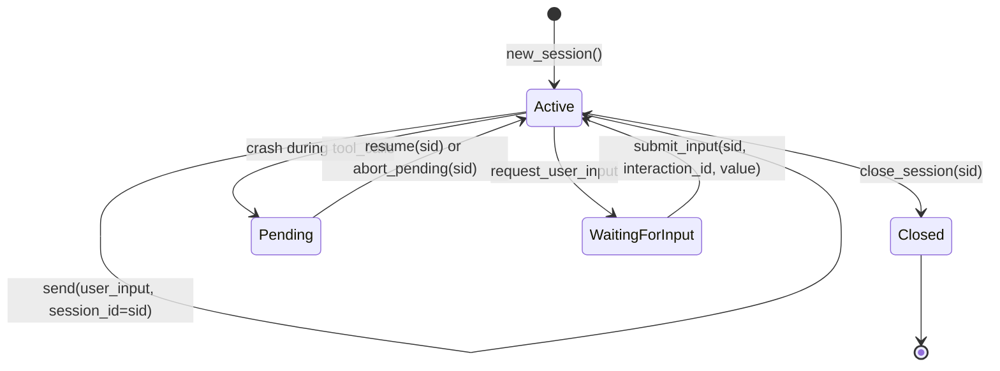

# Sessions

[中文](../../zh/user-guide/sessions.md) | [User Guide](../index.md)

Sessions are the unit of conversation in power-loop. Create one explicitly with `new_session()`, then pass its `session_id` to every `send()` call. The library manages history, persistence, and recovery for that id.

## Session Lifecycle



1. **Created** when you call `new_session()`.
2. **Continued** when you pass that `session_id` to `send()`.
3. **Pending** if the process crashes between `assistant(tool_calls)` and the last `tool` message.
4. **Waiting for input** if the `request_user_input` tool asks the caller/UI to collect external input.
5. **Closed** explicitly via `close_session(sid, cascade=True)`.

## Basic Usage

```python
loop = StatefulAgentLoop(llm=llm, config=config)

# New session
sid = await loop.new_session()  # → "sess_abc123..."
r1 = await loop.send("Hello, my name is Alan.", session_id=sid)

# Continue
r2 = await loop.send("What is my name?", session_id=sid)
print(r2.final_text)  # → "Your name is Alan."

# Inspect history
messages = await loop.get_messages(sid)
for m in messages:
    print(m["role"], m.get("content", "")[:60])
```

**Key**: You never build `messages` lists. The library loads history from the store by `session_id`.

## SessionStore

`SessionStore` is the backend-neutral persistence layer. You typically don't interact with it directly — `StatefulAgentLoop` manages it. But you can open one yourself for inspection, sharing across loops, or advanced use. The backend is chosen by DSN: a bare path or `sqlite://…` is SQLite (the zero-infra default), `postgresql://…` / `mysql://…` are real multi-writer servers behind optional driver extras. Every store method is a coroutine.

```python
from power_loop import SessionStore, open_store

# SQLite (default backend): open by path.
store = await SessionStore.open("./my_sessions.db")
# Or pick any backend by DSN (e.g. to share one store across loops):
# store = await open_store("postgresql://u:p@host/app", table_prefix="pl_")

# Read a specific session
session = await store.get_session(sid)
print(session.status)     # "active" | "closed"
print(session.created_at)

# Read messages
active = await store.load_active_messages(sid)     # non-compacted
all_msgs = await store.load_all_messages(sid)       # including compacted-out

# Read a session's direct sub-agent children
children = await store.list_children(sid)           # list of SessionRow

# Close
await store.close()
```

See [Storage backends](storage-backends.md) for picking SQLite vs PostgreSQL/MySQL, the per-backend DDL, and schema provisioning (`SchemaPolicy`).

### Tables

The store keeps everything in 12 tables plus a version table, all under the `table_prefix` (default `pl_`). The core ones:

| Table | Purpose |
|---|---|
| `pl_sessions` | One row per session: `session_id`, `status`, `kind`, `parent_session_id`, timestamps |
| `pl_messages` | Ordered `(session_id, seq)` message log with `state` (`active` / `compacted_out`) |
| `pl_compactions` | Log of every compaction: `(session_id, compact_seq)`, what was folded |
| `pl_usage_rounds` | Per-round token usage: `(session_id, round_index)`, prompt/completion tokens |
| `pl_session_state` | Mutable state: `next_seq`, `round_index`, current `pending` tool_calls |
| `pl_timers` / `pl_notes` / `pl_session_stats` / … | Durable timers, notes, per-session stats, runtime/shared state, background tasks |
| `pl_schema_migrations` | Portable version table — works identically on every backend and refuses a newer-than-code database |

The exact DDL for each backend is in [Storage backends](storage-backends.md#the-ddl-per-backend).

### Storage settings

- **Backend-neutral.** The same store runs on SQLite (default), PostgreSQL, or MySQL — picked by DSN. PostgreSQL/MySQL are natively async; their drivers are optional extras.
- **SQLite: WAL + `busy_timeout`** — WAL mode is on so reads don't block the writer; a busy timeout absorbs brief write contention.
- **One writer per session.** The async store offloads blocking SQLite I/O to a worker thread under a single writer lock that keeps `next_seq` collision-free; PostgreSQL/MySQL allocate per-session sequences with a `SELECT … FOR UPDATE` row lock. Multiple `StatefulAgentLoop` instances on the same store are safe as long as a given session is driven by one writer at a time. See [Scaling](scaling.md).

## Cross-Process Resume

The store is the persistence anchor; the loop holds **no authoritative state**. Reconstruct a loop from the same `dsn` + `session_id` in any process and continue — a fresh, cold loop resumes from nothing else:

```python
# Process 1
loop = StatefulAgentLoop(llm=llm, dsn="./chat.db", config=config)
sid = await loop.new_session()
r1 = await loop.send("Remember: my favorite color is blue.", session_id=sid)
loop.close()

# Process 2 — hours later, different Python process
loop2 = StatefulAgentLoop(llm=llm, dsn="./chat.db", config=config)
await loop2.prewarm(sid)  # optional: pre-load the active window
r2 = await loop2.send("What is my favorite color?", session_id=sid)
print(r2.final_text)  # → "Your favorite color is blue."
```

The same applies with a server backend — point both processes at `postgresql://…` / `mysql://…` (see [Storage backends](storage-backends.md)).

> **Warning**: A given session must be driven by one writer at a time. The per-session `asyncio.Lock` covers the whole **process** (since 3.19.0 it is keyed on `session_id` in a process-wide registry, so several `StatefulAgentLoop` objects over one store still serialize correctly) — but it cannot see other processes. When many processes share a store, either serialize a session's sends in your dispatcher/queue layer, or set `distributed_sessions=True` to have power-loop coordinate them with a DB lease. With SQLite, run one writer process per file (shard sessions across files); see [Scaling](scaling.md).

## Pending Recovery

If the process crashes while executing tool calls, the session enters a "pending" state. The next `send()` raises `SessionPendingError`:

```python
try:
    result = await loop.send("do something", session_id=sid)
except SessionPendingError as exc:
    print(f"Unresolved tool calls: {exc.pending_tool_calls}")
    # Option A: finish executing the pending tools
    result = await loop.resume(sid)
    # Option B: abort and move on
    await loop.abort_pending(sid, reason="user_cancelled")
    result = await loop.send("new input", session_id=sid)
```

## Resumable User Input

`request_user_input` intentionally pauses a session without blocking the Python process:

```python
waiting = await loop.send("needs confirmation", session_id=sid)
interaction = waiting.pending_interactions[0]

# Show interaction["prompt"] and interaction["options"] in your product UI.
result = await loop.submit_input(sid, interaction["interaction_id"], {"choice": "yes"})
```

The pending interaction is persisted in the store, so another process can reconstruct the loop from the same `dsn` and call `submit_input()` later.

## Per-Call Overrides

`send()` and `send_sync()` accept `tools=` and `system_prompt=` without
mutating the loop or stored session:

```python
result = await loop.send(
    "Summarize the repository",
    session_id=sid,
    tools=["read_file", "glob", "grep"],
    system_prompt="Be concise and cite file paths.",
)
```

Prompt precedence is per-call override, then session prompt, then loop config.
The model only sees the selected tool definitions. Idle `follow_up()` and
`follow_up_sync()` forward the same options when they degrade to a new send.

## In-Flight Steering (`follow_up`)

When a session is already running (`send`, `resume`, or `submit_input` holds the per-session lock), a second `send()` on the same session would block until the current run finishes. Use `follow_up()` instead to inject steering text without waiting:

```python
send_task = asyncio.create_task(loop.send("long task", session_id=sid))

# Wait until the session lock is held (same process).
while not loop._lock_for(sid).locked():
    await asyncio.sleep(0.01)

queued = await loop.follow_up("Also mention the budget constraint", sid)
assert isinstance(queued, FollowUpQueued)
assert queued.queue_depth == 1

result = await send_task
```

At each **round boundary** (after `ROUND_START`, before `prepare_round`), the pipeline drains the per-session queue, merges multiple follow-ups into one user message, and appends:

```xml
<follow_up>
Also mention the budget constraint
</follow_up>
```

When the session is idle (lock not held), `follow_up()` degrades to `send()`.
When it queues into an already active run, that run keeps the `tools` and
`system_prompt` policy selected by the call that started it; follow-up text
steers the next round but does not replace the active security boundary.

| API | Use when |
|---|---|
| `submit_input()` | The loop paused on `request_user_input`; you have an `interaction_id` and may resume from another process later. |
| `follow_up()` | The loop is still running in the same process; you want to steer the **next** LLM round without blocking on the current run. |

See [Example 22](../../../examples/22_follow_up_steering.py) and [Examples Guide §22](../tutorials/examples-guide.md#22--follow-up-steering).

## Closing Sessions

```python
# Close one session (and all its child sub-agent sessions if cascade=True)
await loop.close_session(sid, cascade=True)

# Close the entire store (all sessions)
loop.close()
```

Closed sessions are **physically deleted** from the store — all messages, compactions, and usage records are removed.

## Next

- [Tools](tools.md) — register tools and give your agent abilities
- [Sub-agents](subagents.md) — spawn child agents with `spawn_agent` and `AgentSpec`
