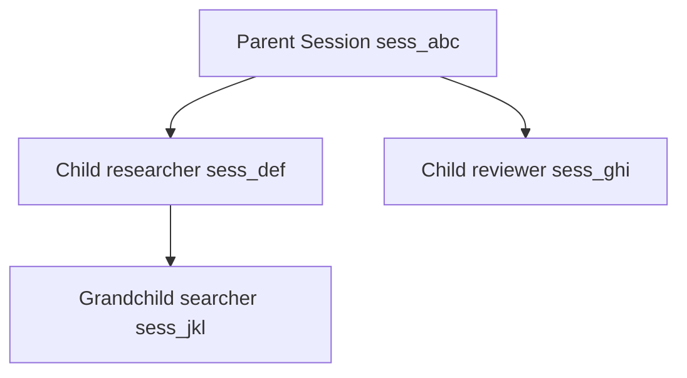

# Sub-Agents

[中文](../../zh/user-guide/subagents.md) | [User Guide](../index.md)

Sub-agents let the parent agent delegate tasks to specialized child agents. Each child gets its own `StatefulAgentLoop` with a custom system prompt and tool whitelist.

## Two Paths

| Path | Trigger | Control |
|---|---|---|
| **LLM-facing** (`spawn_agent`) | LLM calls the `spawn_agent` tool (optional `system_prompt` / `tools` / `max_rounds` overrides) | LLM decides what to delegate |
| **Declarative** (`run_agent_spec` / `AgentSpec`) | Host code calls the Python API directly | You control system prompt, tools, model, max_rounds |

> Since 4.0 the former `run_agent` meta-tool is merged into `spawn_agent`: the LLM sees a single meta-tool, and hosts that need a fully declarative `AgentSpec` call `run_agent_spec()` from code.

## Imperative: spawn_agent

```python
from power_loop import register_spawn_agent

register_spawn_agent(registry)

loop = StatefulAgentLoop(
    llm=llm,
    tool_registry=registry,
    config=AgentLoopConfig(
        system_prompt=(
            "You can delegate research tasks using spawn_agent. "
            "Use the tools whitelist to scope the child's capabilities."
        ),
        max_rounds=6,
    ),
)

sid = await loop.new_session()
result = await loop.send("Find where authentication logic is defined in this project.", session_id=sid)
# LLM: spawn_agent(task="search for auth code", tools=["grep", "read_file", "glob"])
# → child runs its own loop → parent gets the result
```

### Structured results: `output_schema`

When the parent needs data rather than prose, it can pass `output_schema` — `{"name"?, "schema", "strict"?}`,
a bare JSON Schema, or either one as a JSON string. The root must be `{"type": "object", ...}`.

- The schema goes to the child as `AgentSpec.output_schema`: natively (`response_format: json_schema`) when the
  model declares `supports_json_schema`, otherwise written into that request's system prompt.
- `strict` defaults to **false** here: schemas an LLM writes rarely follow strict-mode rules (every key required,
  no extra keys at any level), and a native provider rejects those with 400. Pass `"strict": true` for schemas
  that do follow them.
- On completion the tool returns `结构化结果：{compact JSON}` when the reply parses (fences, trailing commas and
  surrounding prose are tolerated), or `结构化结果解析失败（reason），原文：…` with up to 4000 characters of the
  reply. The child session is deleted afterwards, so there is no repair round; the parent decides what to do.
- A child that did not complete (round limit, stopped) is reported as before, without parsing.

## Declarative: AgentSpec

```python
from power_loop import AgentSpec

spec = AgentSpec(
    name="researcher",
    system_prompt="You are a code researcher. Use grep, read, and glob to find answers.",
    tools=["grep", "read", "glob"],   # whitelist — only these tools
    max_rounds=5,
    max_tokens=2000,
    temperature=0.0,
    lifecycle="ephemeral",            # deleted on success, kept on failure for debug
)

# Direct call (no LLM involved)
from power_loop import run_agent_spec
result = await run_agent_spec(spec, "Find all SQL injection vulnerabilities", parent_loop=loop)
```

### AgentSpec Fields

| Field | Type | Default | Description |
|---|---|---|---|
| `name` | `str` | required | Unique name. Non-empty string. |
| `system_prompt` | `str` | required | The child's system prompt. |
| `tools` | `list[str] \| None` | `None` | Whitelist of tool names from the parent registry. `None` = all tools. |
| `max_rounds` | `int` | `5` | Max LLM + tool rounds. Range: [1, 50]. |
| `max_tokens` | `int` | `2000` | Per-request token cap. |
| `temperature` | `float` | `0.0` | LLM temperature. |
| `model` | `str \| None` | `None` | Override model. `None` = use parent's. |
| `output_schema` | `dict \| None` | `None` | `{name, schema, strict?}` — the child must return one JSON object. `strict` defaults to `true`; set `false` for schemas that don't follow strict-mode rules. Helpers: `normalize_output_schema()`, `output_response_format()`. |
| `lifecycle` | `str` | `"ephemeral"` | `"ephemeral"` / `"linked"` / `"detached"` |
| `metadata` | `dict` | `{}` | Free-form metadata for audit. |

### Validation

`AgentSpec` has **strict validation**. Unknown fields, invalid lifecycle values, or out-of-range `max_rounds` raise `AgentSpecError` (a `SpecValidationError` → `PowerLoopError`):

```python
try:
    spec = AgentSpec.from_dict({"name": "", "system_prompt": ""})
except AgentSpecError as exc:
    print(exc)  # "AgentSpec.name must be a non-empty string"
```

## Lifecycle

| Lifecycle | Behavior |
|---|---|
| `EPHEMERAL` (default) | Deleted on success. Preserved on failure for debugging. |
| `LINKED` | Cascade-deleted when the parent session is closed. |
| `DETACHED` | Independent of the parent. Survives parent close. |

## Depth Limit

`MAX_SPAWN_DEPTH = 3` is the default — sub-agents may nest up to this many levels below the root (depths 1, 2, 3 are allowed; a session at depth 4 raises). Enforced at `SessionStore.create_session()`. Override per store with `SessionStore.open(max_spawn_depth=N)` or `StatefulAgentLoop(..., max_spawn_depth=N)`.

## Session Tree



All children share the same `SessionStore` as the parent. `close_session(parent_sid, cascade=True)` recursively deletes the entire tree.

## Next

- [Hooks](hooks.md) — intercept tool execution
- [Compaction](compaction.md) — auto-summarize long sessions
