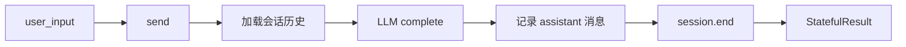

# 快速上手

[English](../en/getting-started.md) | [回到文档站](../README.md)

5 分钟跑通 power-loop — 从 `pip install` 到第一条 Agent 回复。

## 1. 安装

```bash
pip install power-loop
# 或开发模式
pip install -e ../power-loop   # DeepTalk 风格多仓库
```

需要 Python 3.10+。

## 2. 配置 LLM 凭证

在项目根创建 `.env` 文件：

```bash
# 推荐
POWER_LOOP_BASE_URL=https://api.openai.com/v1
POWER_LOOP_API_KEY=sk-…
POWER_LOOP_MODEL=gpt-4o-mini

# 旧名字也兼容（自动回退）
# OPENAI_COMPAT_BASE_URL=…
# OPENAI_COMPAT_API_KEY=…
# OPENAI_COMPAT_MODEL=…
```

任何 OpenAI 兼容的 provider 都能用 — DashScope、DeepSeek、OpenRouter、Together、Groq、本地 Ollama/vLLM。更多 snippet 见 [Providers](../en/user-guide/providers.md)。

## 3. 第一个 Agent

```python
import asyncio
from power_loop import (
    StatefulAgentLoop,
    AgentLoopConfig,
    create_llm_service_from_env,
)

async def main():
    llm = create_llm_service_from_env()

    loop = StatefulAgentLoop(
        llm=llm,
        config=AgentLoopConfig(
            system_prompt="你是一个有帮助的助手。简洁回复。",
            max_rounds=1,
        ),
    )

    result = await loop.send("HTTP 是什么的缩写？")
    print(result.final_text)

asyncio.run(main())
```

运行：

```bash
$ python hello.py
HTTP 是 HyperText Transfer Protocol（超文本传输协议）的缩写。
```

## 4. 发生了什么？



1. `send(...)` 创建新 session，附上用户消息。
2. Pipeline 把消息发给 LLM（附带你的 `system_prompt`）。
3. LLM 回复了——没有工具调用，这一轮结束。
4. `StatefulResult` 包含 `session_id`、`status="completed"`、`final_text`、`rounds`。

## 5. 继续聊——多轮对话

```python
result1 = await loop.send("我叫阿岚。")
print(result1.final_text)

result2 = await loop.send(
    "我叫什么？",
    session_id=result1.session_id,   # 继续同一个 session
)
print(result2.final_text)   # "你叫阿岚。"
```

库自动从 SQLite 加载完整历史。你永远不需要手动管理 `messages` 列表。

## 6. 下一步

| 我想… | 看这里 |
|---|---|
| 加工具（bash、搜索…） | [快速入门：工具调用](user-guide/quickstart.md#工具调用) |
| 流式输出 | [事件：流式](user-guide/events.md#stream-delta) |
| 理解循环内部 | [架构设计](architecture.md) |
| 查看完整示例 | [Examples](../../examples/) — 从 `00_hello_world.py` 开始 |