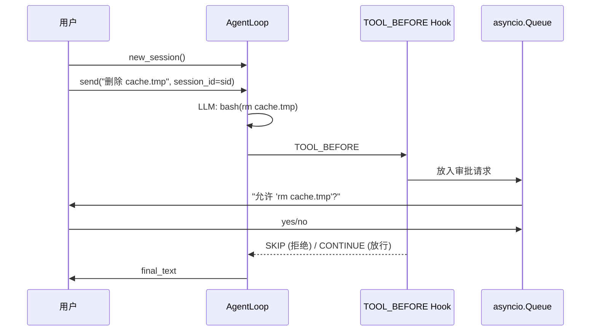

# 教程：人在回路

[English](../../en/tutorials/human-in-the-loop.md) | [教程](../index.md)

**目标**：构建一个在执行 bash 命令前请求用户确认的 Agent——70 行。

**你会学到**：Async `TOOL_BEFORE` hook、`HookDirective.SKIP`、`asyncio.Queue` 集成 UI。

## 核心——审批 Hook

```python
from power_loop import AgentHooks, HookPoint, HookDirective
from power_loop.contracts.hook_contexts import ToolBeforeCtx

SAFE = {"ls", "pwd", "echo", "cat", "head", "tail", "find"}

async def ask_before_bash(ctx: ToolBeforeCtx) -> None:
    if ctx.tool_name != "bash":
        return
    cmd = ctx.tool_args.get("command", "").strip()
    if cmd.split()[0] in SAFE:
        return  # 自动放行
    approved = await your_ui_confirm(cmd)
    if not approved:
        ctx.output = f"[用户拒绝: {cmd!r}]"
        ctx.directive = HookDirective.SKIP
```

## 流程



Hook **真的在等**——没有轮询，没有超时。用户决定前 LLM 暂停。

## 完整代码

```python
import asyncio
from dataclasses import dataclass, field
from power_loop import (
    StatefulAgentLoop, AgentLoopConfig, ToolRegistry, ToolDefinition,
    AgentHooks, HookPoint, HookDirective,
    create_llm_service_from_env,
)
from power_loop.contracts.hook_contexts import ToolBeforeCtx

SAFE = {"ls", "pwd", "echo", "cat", "head", "tail", "find"}

@dataclass
class ApprovalRequest:
    command: str
    response: asyncio.Future[bool] = field(default_factory=asyncio.Future)

queue: asyncio.Queue[ApprovalRequest] = asyncio.Queue()

async def ask_before_bash(ctx: ToolBeforeCtx) -> None:
    if ctx.tool_name != "bash": return
    cmd = ctx.tool_args.get("command", "")
    if cmd.split()[0] in SAFE:
        print(f"  [自动放行] {cmd}"); return
    req = ApprovalRequest(command=cmd)
    await queue.put(req)
    if not await req.response:
        ctx.output = f"[被拒绝: {cmd!r}]"; ctx.directive = HookDirective.SKIP

async def approval_worker():
    while True:
        req = await queue.get()
        ans = input(f"  允许 '{req.command}'? [y/N]: ")
        req.response.set_result(ans.lower().startswith("y"))

async def main():
    registry = ToolRegistry()
    registry.register(
        ToolDefinition(name="bash", description="执行 shell 命令。参数: command。",
            input_schema={"type":"object","properties":{"command":{"type":"string"}},"required":["command"]}),
        lambda command: f"(已执行) {command}",
    )
    hooks = AgentHooks()
    hooks.register(HookPoint.TOOL_BEFORE, ask_before_bash)
    llm = create_llm_service_from_env()
    loop = StatefulAgentLoop(
        llm=llm, tool_registry=registry, hooks=hooks,
        config=AgentLoopConfig(system_prompt="你有 bash 工具。安全命令自动执行，其他需确认。", max_rounds=4),
    )
    worker = asyncio.create_task(approval_worker())
    try:
        sid = await loop.new_session()
        r = await loop.send("列出当前目录文件。", session_id=sid)
        print(f"Bot: {r.final_text}")
    finally:
        worker.cancel(); loop.close()

asyncio.run(main())
```

## 下一步

- [多 Agent 系统](multi-agent.md) — 委托给子代理
- [工具用户手册](../user-guide/tools.md) — 完整工具系统参考
