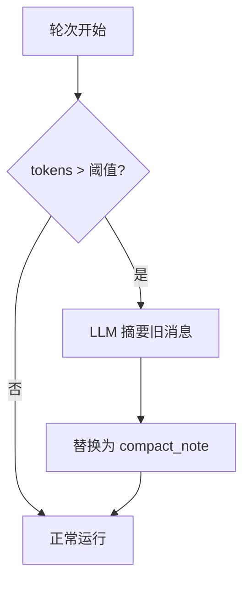

# 压缩（fold 轴）

[English](../../en/user-guide/compaction.md) | [用户手册](../index.md)

上下文压缩防止长会话超出 LLM 上下文窗口限制。它在渲染后的前缀超出预算时，把旧历史摘要一次——**默认开启**。

> **power-loop 3.0 —— 两条正交的上下文轴。** 上下文处理现在是 `AgentLoopConfig` 上两条相互独立、由配置驱动的轴：
> - **`representation`** —— *每个已结束的 send 如何被记录与渲染*：`VerbatimRepresentation`（默认，完整历史）或 `ProjectedRepresentation`（每个 send 的简短投影）。见[Send 上下文投影](send-context-projection.md)。
> - **`fold_strategy`** —— *超预算后旧历史如何被压缩*（本页）：`LLMSummaryFold`（默认）或 `AgenticFold`。
>
> 任意 representation 都能与任意 fold strategy 组合。2.x 的 `compactor=` / `history_projector=` 参数仍然可用（映射到这两条轴上，并带一个 `DeprecationWarning`）；请优先使用 `representation=` / `fold_strategy=`。

## 工作原理



1. 每轮开始前，`estimate_tokens(messages)` 与 `max_tokens × trigger_ratio`（默认 0.75）比较。
2. 超阈值时，fold strategy 识别出可安全折叠的**最旧消息**。
3. 一次摘要 LLM 调用生成一条压缩注释（`role=system, name=compact_note`）。
4. 旧消息在 store 里标记 `compacted_out`；注释被插入。

## 配置

```python
from power_loop import AgentLoopConfig, LLMSummaryFold

config = AgentLoopConfig(
    max_tokens=8000,                       # 预算；折叠触发点 = max_tokens × trigger_ratio
    fold_strategy=LLMSummaryFold(
        trigger_ratio=0.75,                # 渲染前缀 > max_tokens 的 75% 时折叠
        keep_last_sends=4,                 # 始终保留最近 4 个 send 不折叠
        summary_max_tokens=5000,           # 摘要调用的 token 预算
        # summary_llm=cheaper_llm,         # 可选：用更便宜的模型跑折叠
    ),
)
```

默认值（不设 `fold_strategy`）即 `LLMSummaryFold()` —— 压缩开箱即开。若想改用一个专门的、记忆感知的折叠，请用 `AgenticFold`（见[下文](#记忆感知的-agentic-折叠)）。

> **为尾部记忆预留余量。** 开了[记忆召回](memory.md)时，召回块会被*瞬态地*注入到每次请求的**尾部**，且**不**在 `self.history` 里，因此折叠触发判定看不到它。为把 `history + memory` 控制在模型窗口内，折叠阈值瞄准 `config.effective_context_budget()`——即设了 `memory` 时的 `max_tokens − memory_budget_tokens`——好让折叠提前触发，给尾部块留出空间。

> **遗留（已弃用）。** `AgentLoopConfig(compactor=DefaultCompactor(...))` 和 `compactor=None`（不压缩）仍然可用 —— 它们会映射到 `fold_strategy` 并发出 `DeprecationWarning`。新轴上没有公开的「永不折叠」开关；若你确实想要不压缩，暂时保留遗留的 `compactor=None`（仅逐字）。

### 绝对阈值

环境变量 `CONTEXT_COMPACT_THRESHOLD=6000` 可用绝对 token 数代替 `trigger_ratio`。当模型有已知上下文窗口（如 gpt-4o-mini 的 8192）时有用。

## 不变量

fold strategy 强制一组严格规则，以保持消息协议合法：

| 规则 | 原因 |
|---|---|
| **系统消息保留** | `role=system` 消息（含先前的 `compact_note`）永不折叠 |
| **最后 N 轮保留** | 最近的 `keep_last_n` 个以 user 为界的交互始终保留 |
| **工具调用对原子性** | `assistant(tool_calls) ↔ tool(tool_call_id=...)` 对永不拆分 —— 折叠会回溯以保持其完整 |
| **每轮最多一次** | `round_compacted=True` 标志防重复压缩 |
| **软失败** | 摘要 LLM 调用失败 → 用原（未压缩）历史继续 |

## 持久化与记忆召回

挂了 `SQLiteSink`（带 store 的 `StatefulAgentLoop` 默认如此）时，折叠会同时落库：被折叠行标 `compacted_out`，追加一条 `compact_note` 行，`compactions` 表加一条审计行。sink 通过一张与 `pipeline.history` 对齐的「内存历史索引 → store 行 seq」映射，把折叠给出的**内存历史索引**翻译成**store 行 seq**。

开了[记忆召回](memory.md)时这点尤其关键：召回的 `memory_*` 消息被插到历史**最前端**（system 区），但**永不落库**——它们归 `MemoryProvider` 所有。sink 为每条召回消息记一个占位，保持映射对齐；否则后续折叠会把索引映射到**错误的行**，把不该压的消息标成 `compacted_out`。两者干净共存：召回的事实躲过折叠（system 区天然保留），也不会泄漏进 store。

> **安全网**：一旦该映射失准——例如某个 `SESSION_START`/`ROUND_START` hook 在 sink 不知情的情况下**整体替换** `ctx.messages`——sink 会**跳过本次压缩的持久化**，而不是冒险标错行。内存折叠照常生效（不影响 LLM 调用）；未持久化的压缩下一轮会重新触发，且因为 active 行未被动过，resume 仍然正确。若要在 hook 里改历史，优先**追加**而非整体替换。

参见 [`examples/31_memory_with_compaction.py`](../../../examples/31_memory_with_compaction.py)：同一会话里召回 + 压缩共存。

### 按需取回被折叠的细节

被折叠的消息没有删——它们仍是 store 里 `compacted_out` 的行。可选的 **`recall_compacted`** 工具让 agent 在 `compact_note` 缺某个具体细节（精确数值/路径/决策）时把原文捞回来。它只读**当前会话**被折叠的行，可按关键词或 seq 区间过滤。把它加进 agent 的工具集（`include=["recall_compacted", ...]` 或 `full` preset）。参见 [`examples/32_recall_compacted.py`](../../../examples/32_recall_compacted.py) 与[工具指南](tools.md)。

## 自定义 fold strategy

实现 `FoldStrategy` 协议即可接入你自己的压缩——它在**任一** representation（逐字或投影）下都能工作：

```python
from power_loop import AgentLoopConfig, FoldStrategy, FoldContext, FoldResult

class MyFold:
    keep_last_sends = 4          # 最近这些 send 保持不折叠
    trigger_ratio = 0.75         # 渲染前缀 > max_tokens × 此值时折叠
    fold_id = "my_fold"          # 盖在 compact 行上（用于检测策略切换）

    async def fold(self, rows, *, context: FoldContext) -> FoldResult | None:
        # `rows` = 可折叠的区段（最老的若干 send + 一条可选的、滚动并入的先前 compact）。
        # 用 context.representation.render(rows) 重渲染成文本；用 context.llm 摘要。
        # 返回 None 表示放弃（软失败），或：
        #   FoldResult(content={"summary": ...}, folded_to_send=<最后被折叠的 send_index>,
        #              note_ops=(...))   # note_ops 在 compact 提交后尽力应用
        return None

config = AgentLoopConfig(fold_strategy=MyFold())
```

折叠**绝不能**直接动 store —— 它返回一个 `FoldResult`，由 loop 持久化 compact（乐观并发提交）并应用任何 `note_ops`。`FoldContext` 携带它所需的一切（`session_id`、`representation`、`llm`、可选的更便宜的 `summary_llm`、`tool_registry`、`memory`、`max_tokens`）。因为折叠永远以**整个 send** 为单位操作，它绝不会拆开一个工具调用/结果对。

> **遗留 `Compactor`。** 2.x 的 `Compactor` 协议（`maybe_compact(...) -> CompactionPlan`）及其可选的 `CompactionContext`（折叠前先 capture-to-memory）在逐字模式下仍可通过弃用的 `compactor=` 使用 —— 见 [`examples/16_custom_compactor.py`](../../../examples/16_custom_compactor.py) 与 [`examples/33_coordinating_compactor.py`](../../../examples/33_coordinating_compactor.py)。3.0 的 `AgenticFold`（下文）通过 `note_ops` 原生覆盖了同样的「遗忘之前先记住」需求。

## 记忆感知的 agentic 折叠

`LLMSummaryFold` 用**一次** LLM 调用摘要一段切片。`AgenticFold` 改为在折叠时跑一个**有界、记忆感知的 agent 循环**：模型先用统一的 `note` 工具（`action=add|update`）把**持久事实写入会话笔记**，再写摘要。这把*长期记忆*（留作笔记、后续轮次浮现）和*工作上下文摘要*（压缩掉）分开，多次折叠后更不易遗忘。这些 note 写入被捕获为 `note_ops`，由 loop 在 compact 提交后应用（让策略保持无副作用、可测试）；任何失败都回退到普通的单次摘要，所以它绝不阻塞折叠。

```python
from power_loop import AgentLoopConfig, AgenticFold

config = AgentLoopConfig(
    fold_strategy=AgenticFold(
        trigger_ratio=0.75, keep_last_sends=4,   # 触发 + 保留多少最近 send
        summary_max_tokens=5000,
        max_rounds=4,                            # 折叠 agent 的工具轮数上限
        # system_prompt=...,                     # 默认：DEFAULT_FOLD_AGENT_PROMPT
    ),
)
```

- **默认行为不变** —— 这是可选项；默认仍是 `LLMSummaryFold`（单次调用）。
- **安全**：该循环是扁平、有界的工具循环（不是嵌套的 `StatefulAgentLoop`），绝不会递归进另一次折叠。note 写入被捕获为 `note_ops`，在 compact 提交后应用。**任何**失败（无工具支持、输出畸形、异常）都**回退到单次摘要**——绝不阻塞折叠。
- **成本**：每次折叠会做多次 LLM 调用（抽取 + 摘要）而非一次，这是换取更丰富记忆的代价。用 `summary_llm=` 可让折叠走更便宜的模型。

## Microcompact（把旧的大体积工具输出溢写到磁盘）

**Microcompact** 是一种独立、廉价、**无 LLM** 的机制，与上文的折叠不同。它每轮把**旧的、超大体积的工具输出**（早于热尾的部分）替换成一个简短的磁盘指针——文件写到磁盘，消息内容变为 `[tool output saved to <路径>, <工具>, <n> chars]`。它**逐字**裁剪工作上下文 token（不摘要），且只适用于**逐字模式**（投影模式从投影 store 渲染已结束的 send）。

**自 3.1.0 起它是可选项 —— 默认关闭。** 它只在那些旧输出再也不会被用到时才有帮助；否则这个指针只是换来后续的一次重读。投影模式、折叠、以及厂商的前缀缓存已覆盖大部分上下文预算需求。对于读了很多大文件、却极少回看旧文件的长逐字会话，可以开启它。

它通过 `AgentLoopConfig` 配置（此前仅环境变量 —— 下面的环境变量仍作为兜底默认值，但配置字段优先）：

```python
config = AgentLoopConfig(
    microcompact_enabled=True,    # 默认 False —— 显式开启
    microcompact_size_limit=1000, # 溢写超过此长度（字符）的工具输出；环境变量 CONTEXT_MICRO_SIZE_LIMIT
    microcompact_hot_tail=10,     # 保留最近 N 个大体积工具输出为热；环境变量 CONTEXT_MICRO_HOT_TAIL
    microcompact_spill_dir=None,  # 指针对应的文件写到哪里；None → 运行时 home 的 .cache
)
```

## 事件

订阅压缩事件以做观测：

```python
bus.subscribe(AgentEventType.STATUS_CHANGED, lambda e: print(
    f"Compacted: {e.data.before_tokens} → {e.data.after_tokens} tokens"
) if getattr(e.data, "kind", None) == "auto_compact" else None)
```

## Token 估算

折叠使用一个启发式 token 估算器（约 4 字符/token），定义在 `power_loop/runtime/budget.py`。它不是计费级精确，但与内容大小单调相关——对触发判定足够好。

另见 [budget.py](../../../power_loop/runtime/budget.py) 里的 `trim_history()`，一个纯裁剪（不调 LLM）的替代方案。

## 下一步

- [Send 上下文投影](send-context-projection.md) —— **representation** 轴：把已结束的 send 渲染成派生表里的简短纯文本。它与 fold strategy *组合*使用（两条轴正交），而非取代它。
- [记忆](memory.md) —— 通过 `MemoryProvider` 跨会话召回
- [会话](sessions.md) —— 理解会话生命周期
