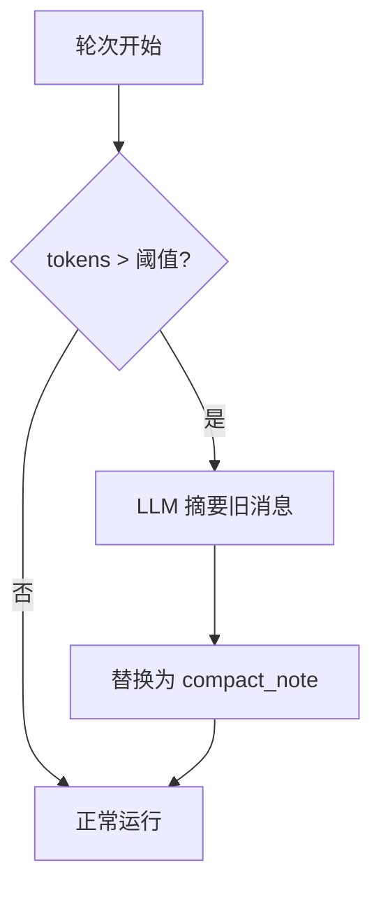

# 压缩

[English](../../en/user-guide/compaction.md) | [用户手册](../index.md)

上下文压缩防止长会话超出 LLM 上下文窗口限制。它把旧消息摘要为一条紧凑的系统注释——**默认开启**。

## 工作原理



1. 每轮开始前，`estimate_tokens(messages)` 与 `max_tokens × trigger_ratio`（默认 0.75）比较。
2. 超阈值时，压缩器识别最旧可安全折叠的消息。
3. 摘要 LLM 调用生成压缩注释（`role=system, name=compact_note`）。
4. 旧消息标记 `compacted_out`；注释插入。

## 配置

```python
from power_loop.runtime.compact import DefaultCompactor
from power_loop import AgentLoopConfig

compactor = DefaultCompactor(
    trigger_ratio=0.75,        # token > max_tokens 的 75% 时触发
    keep_last_n=4,             # 始终保留最后 4 轮
    summary_max_tokens=512,    # 摘要的最大 token 数
)

config = AgentLoopConfig(compactor=compactor)

# 关闭压缩
config_no = AgentLoopConfig(compactor=None)
```

### 绝对阈值

环境变量 `CONTEXT_COMPACT_THRESHOLD=6000` 设置绝对 token 数。当模型有已知上下文窗口时有用。

## 不变量

| 规则 | 原因 |
|---|---|
| **系统消息保留** | `role=system` 消息（含先前的 `compact_note`）永不折叠 |
| **最后 N 轮保留** | 最近的 `keep_last_n` 轮始终保留 |
| **工具调用对原子性** | `assistant(tool_calls) ↔ tool` 永不拆分 |
| **每轮最多一次** | `round_compacted=True` 防重复 |
| **软失败** | 摘要 LLM 调用失败 → 用原（未压缩）历史继续 |

## 持久化与记忆召回

挂了 `SQLiteSink`（带 store 的 `StatefulAgentLoop` 默认如此）时，折叠会同时落库：被折叠行标 `compacted_out`，追加一条 `compact_note` 行，`compactions` 表加一条审计行。sink 通过一张与 `pipeline.history` 对齐的「内存索引 → store seq」映射，把压缩器给出的**内存索引**翻译成**store 行 seq**。

开了[记忆召回](memory.md)时这点尤其关键：召回的 `memory_*` 消息被插到历史**最前端**（system 区），但**永不落库**——它们归 `MemoryProvider` 所有。sink 为每条召回消息记一个占位，保持映射对齐；否则后续折叠会把索引映射到**错误的行**，把不该压的消息标成 `compacted_out`。两者干净共存：召回的事实躲过折叠（system 区天然保留），也不会泄漏进 store。

> **安全网**：一旦该映射失准——例如某个 `SESSION_START`/`ROUND_START` hook 在 sink 不知情的情况下**整体替换** `ctx.messages`——sink 会**跳过本次压缩的持久化**，而不是冒险标错行。内存折叠照常生效（不影响 LLM 调用）；未持久化的压缩下一轮会重新触发，且因为 active 行未被动过，resume 仍然正确。若要在 hook 里改历史，优先**追加**而非整体替换。

参见 [`examples/31_memory_with_compaction.py`](../../../examples/31_memory_with_compaction.py)：同一会话里召回 + 压缩共存。

## 自定义压缩器

实现 `Compactor` 协议：

```python
from power_loop.runtime.compact import Compactor, CompactionPlan

class MyCompactor:
    async def maybe_compact(self, messages, *, llm, max_tokens, round_index) -> CompactionPlan | None:
        # 你的逻辑
        return None  # None = 跳过

config = AgentLoopConfig(compactor=MyCompactor())
```

## 下一步

- [记忆](memory.md) — 通过 `MemoryProvider` 跨会话召回
- [会话](sessions.md) — 理解会话生命周期