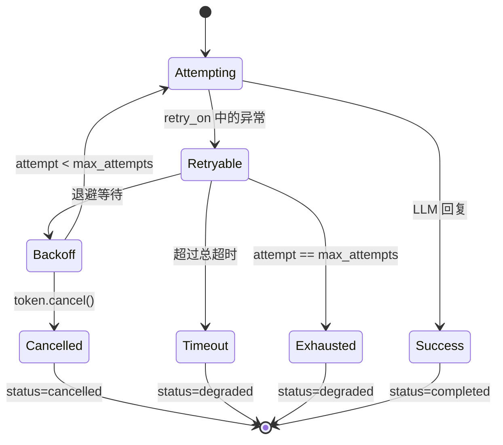

# 重试与取消

[English](../../en/user-guide/retry-cancel.md) | [用户手册](../index.md)

LLM 调用可能失败——限流、连接重置、上游错误。`LLMRetryPolicy` 带指数退避重试；`CancellationToken` 让用户中途取消。

## LLMRetryPolicy

```python
from power_loop import LLMRetryPolicy, AgentLoopConfig

retry = LLMRetryPolicy(
    max_attempts=3,           # 1 次初始 + 2 次重试
    backoff_initial=0.5,      # 第二次尝试前等待秒数
    backoff_max=8.0,          # 指数退避上限
    total_timeout=60.0,       # 跨所有尝试的 wall-clock 截止时间
    retry_on=(Exception,),    # 默认：所有 Exception 子类
)

config = AgentLoopConfig(retry_policy=retry)
```

## 重试生命周期



## CancellationToken

统一所有 cancel 形状为一个接口：

```python
from power_loop import CancellationToken

# 自主 token
token = CancellationToken()
token.cancel("用户点击停止")
token.is_cancelled()        # → True
token.raise_if_cancelled()  # 抛出 CancellationRequested

# 包装已有信号
token = CancellationToken.from_any(threading_event)
token = CancellationToken.from_any(asyncio_event)
token = CancellationToken.from_any(lambda: stop_flag)
token = CancellationToken.from_any(None)   # 永不取消
```

## 中途取消

```python
import asyncio

async def cancel_soon():
    await asyncio.sleep(2)
    token.cancel("timeout")

sid = loop.new_session()
await asyncio.gather(
    loop.send("long task", session_id=sid, stop_event=token),
    cancel_soon(),
)
# send 中抛出 CancellationRequested → pipeline 转为 status="cancelled"
```

## 事件

```python
bus.subscribe(AgentEventType.LLM_RETRY_ATTEMPTED, lambda e: print(
    f"重试 {e.data.attempt+1}/{e.data.max_attempts}: {e.data.error_type}"
))
bus.subscribe(AgentEventType.LLM_DEGRADED, lambda e: print(
    f"降级 {e.data.attempts} 次后: {e.data.reason}"
))
bus.subscribe(AgentEventType.LOOP_CANCELLED, lambda e: print(
    f"取消: {e.data.reason}"
))
```

## 下一步

- [结构化输出](structured-output.md) — schema 校验的 JSON
- [配置](configuration.md) — 所有 `AgentLoopConfig` 字段
