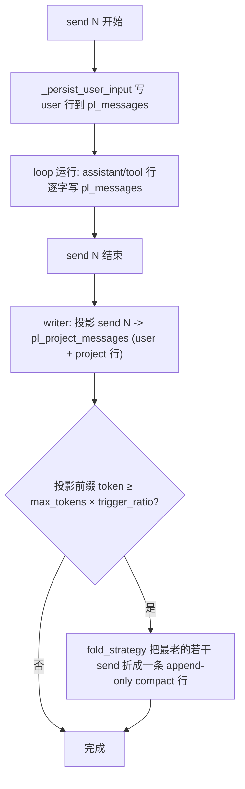

# Send 上下文投影（representation 轴）

[English](../../en/user-guide/send-context-projection.md) | [用户指南](index.md)

投影是非默认的 **representation**（power-loop 3.0）：不再每次 send 都把整段逐字历史喂给模型，而是把**每个*已结束*的 send 的紧凑纯文本投影**喂进去，再加上**当前进行中的 send 逐字**。持久的 `pl_messages` 日志**永不被改写**——投影放在一张独立的派生表里。

> **两条正交的轴。** `representation`（本页 —— 每个已结束的 send 如何被记录/渲染）与 [`fold_strategy`](compaction.md)（超预算后旧历史如何被压缩）相互独立。投影与 fold strategy *组合*使用——它不取代后者。不设 `representation` 时，行为即逐字默认。

```python
from power_loop import AgentLoopConfig, ProjectedRepresentation, LLMSummaryFold

config = AgentLoopConfig(
    representation=ProjectedRepresentation(max_chars=300),  # 轴 1：每个 send 的简短投影
    fold_strategy=LLMSummaryFold(keep_last_sends=4),        # 轴 2：更旧的 send 如何压缩
    max_tokens=8000,                                        # 折叠触发点 = max_tokens × trigger_ratio
)
```

## 为什么

一次 send = 一次 `loop.send()`（用户这一轮 + agent 的整个工具循环）。默认下每个历史 send 都**逐字**留在上下文里——完整的 OpenAI 工具调用结构 + 未截断的工具结果——而且每多一个 send 就更长。投影把每个*已结束*的 send 折成一条「结构化存储、再渲染成纯文本」的简短摘要：

- **`pl_messages` 始终是不可变、append-only 的审计日志**——永不折叠、永不 `compacted_out`。（对比：逐字模式的就地折叠会把一段区间改写成一条 `compact_note`。）
- 投影历史是**不含工具调用协议字段的纯文本**，因此历史里的某个 send 绝不会出现悬空的工具调用/结果对，且与厂商无关（OpenAI 和 Anthropic 都行）。
- 每个工具可通过可选的 `ToolDefinition.project` 钩子决定自己在投影里如何呈现。
- 它是**派生**层：坏掉的投影绝不污染事实源，且这张表可从 `pl_messages` 重建。

## 工作原理



在 **send N+1 开始时**，reader 这样拼 LLM 历史：

```
[system prompt]
+ render(最新 compact + 各已结束 send 的投影)     # 纯文本，每个带 #N 标签
+ 当前进行中 send N+1 的行（来自 pl_messages）     # 逐字、结构化
+ runtime 消息（todos/background）                  # 照旧
```

**当前进行中的 send 永远逐字**（模型这一轮要看到自己的工具调用/结果才能继续）；只有*已结束*的 send 才被投影。

## 两张表

| | `pl_messages` | `pl_project_messages`（schema v2） |
|---|---|---|
| 角色 | loop 内部审计日志 | 派生的每-send LLM 上下文 |
| 可变性 | append-only，永不改写 | append-only；派生/可重建 |
| 写入 | 每个 send、每一行（user/assistant/tool） | 仅在投影 representation 下，每个已结束 send 一次 |
| `kind` | role（user/assistant/tool/system） | `user` / `project` / `compact` |
| 是否导出 | 是 | 否（可重建） |

每个 `pl_messages` 行都带一个单调的 `send_index` **列**（可查询；v2 之前的旧行 NULL；**绝不**发给模型）——即权威的 send 边界。

## 模型实际看到什么

两个已结束的 send（`列出当前目录`→`bash(ls)`→回复；`读 a.py`→`read_file`→很长的内容→回复），现在发起第三次 `给 a.py 加注释`：

**默认（逐字）= 9 条：**
```
user        列出当前目录
assistant   tool_calls=[bash {"command":"ls"}]          ← 结构化工具调用
tool        a.py b.py                                    (tool_call_id=c1)
assistant   有 a.py 和 b.py 两个文件
user        读 a.py
assistant   tool_calls=[read_file {"path":"a.py"}]
tool        <整段长文件，未截断>
assistant   a.py 是个 hello world 脚本
user        给 a.py 加注释                               ← 当前 send
```

**投影 = 5 条（每个已结束 send 带 `#N` 标签供 `recall_send` 使用）：**
```
user        [#1] 列出当前目录
assistant   #1 [tools] bash(result=a.py b.py)
            有 a.py 和 b.py 两个文件
user        [#2] 读 a.py
assistant   #2 [tools] read_file(result=print('hello world')\n…(截到~200字符)…)
            a.py 是个 hello world 脚本
user        给 a.py 加注释                               ← 当前 send，逐字
```

send 1 在 `pl_project_messages` 实际存的（渲染前的结构化 `content_json`）：
```json
user    {"human": ["列出当前目录"]}
project {"tools": [{"name":"bash","result":"a.py b.py"}], "final_text":"有 a.py 和 b.py 两个文件"}
```

历史里的工具调用变成 `[tools] name(result=…)` 纯文本（没有 `tool_calls`/`tool_call_id`），长结果按 `max_chars` 截断。

## 自定义渲染

「存好的行 → 这段文本」这一步是一等扩展点（默认值逐字复现上面的输出）。两种方式：

**配置 —— `ProjectionRenderConfig`。** 一个纯标量字段的 dataclass，整体可经 JSON 往返（用配置 / 管理台下发，随时改了重渲染对比）：

```python
from power_loop import ProjectedRepresentation, ProjectionRenderConfig

cfg = ProjectionRenderConfig(
    user_tag="👤#{n} ",        # {n} = send_index；空串或 None index → 不加标签
    project_tag="🤖#{n} ",
    tools_header="calls: ",
    tool_sep="; ", tool_arg_sep=", ",
    include_tools=True,
    include_final_text=False,   # 例如丢掉助手的尾随文本
    empty_project="(no output)",
    fold_note="[older sends {range} folded — recall_send(send_index=N) to expand]",
)
rep = ProjectedRepresentation(render_config=cfg)
# 也可直接传 dict（未知键忽略）—— 方便从 JSON 配置传入：
rep = ProjectedRepresentation(render_config={"project_tag": ">> "})
```

**子类 —— 只重写一个形状。** `render()` 委派给 `render_row` → `render_user_row` / `render_project_row` / `render_compact_row`（外加 `_render_project` / `_render_tool` / `_send_tag`）。只重写你要的那个，其余沿用内置：

```python
class TerseRender(ProjectedRepresentation):
    def render_project_row(self, r):
        names = ", ".join(t.get("name", "?") for t in (r.content or {}).get("tools") or [])
        return {"role": "assistant", "content": f"#{r.send_index} did: {names or '—'}"}
```

> `user_tag`/`project_tag`（或你的 `render_*` 重写）里要保留 `{n}` 这个 send_index 标签：模型靠那些 `#N` 标记去调 `recall_send(send_index=N)`，去掉就找不回被折叠的 send 了。

## 工具自投影

每个工具可提供 `project(args, result) -> dict | str`，自己决定在投影历史里呈现什么重点；没提供则用截断兜底（`{"name", "result": <截断>}`）：

```python
from power_loop import ToolDefinition

write_file = ToolDefinition(
    name="write_file", description="…",
    project=lambda args, result: {"file": args.get("path")},   # → {"name":"write_file","file":"x.py"}
)
```

`result` 类型为 `str | None`：`None` 表示这次调用**没有结果行**（未完成/失败的调用）——与「产生了但为空」的 `""` 区分开，钩子因此能分辨二者。默认兜底把缺失结果渲染为 `tool(result=<missing>)`，空结果渲染为 `tool(result=)`。重复或为空的 `tool_call_id` 会按顺序配对（重复 id 绝不把两个结果折叠成一个），畸形的 tool_call 也不会让投影崩溃。`project` callable 不参与 `ToolDefinition` 的相等/哈希（`compare=False`）。

## 投影下的折叠

折叠是 **fold-strategy 轴**，在投影下它和逐字模式一样是 **LLM 驱动**的（3.0 移除了旧的确定性拼接折叠）。一旦渲染后的投影前缀达到 `max_tokens × trigger_ratio`（默认 `0.75`），配置的 `fold_strategy`（默认 `LLMSummaryFold`，或 `AgenticFold`）会把最老的若干 send 摘要成一条 **append-only** 的 `compact` 行——始终单独保留最近 `keep_last_sends` 个，并把之前的 compact 滚动并入，不丢任何东西。低于阈值时，这些小小的逐 send 投影只是累积。reader 之后读「最新 compact + 其游标之后的 send」。被折叠的 `user`/`project` 行在 `pl_project_messages` 里**保留**（原始行也仍在 `pl_messages` 里），所以 `recall_send` 永远能找回。折叠在 DB 锁**之外**运行，受 `fold_timeout_s` 限时；超时/出错则软失败（行已提交，本次 send 无 compact，下次 send 重试）。

> **当前进行中的 send 与最近 `keep_last_sends` 个 send 始终单独保留**，所以单个超过预算的 send 是固有限制（任何上下文窗口都如此）——超长这一轮请调小 `max_chars`/`keep_last_sends`，或给折叠传一个更便宜的 `summary_llm=`。

## 找回完整明细：`recall_send`

因为投影是有损的（工具明细被截断/丢弃）且更老的 send 会被折叠，模型可以按需把任意已结束 send 的**原始** `pl_messages` 明细重新展开——每个渲染出的 send 都带它的 `#N` send-index 标签，模型因此知道要请求哪一个：

```python
create_default_tool_registry(include=["recall_send"])   # 也在 "full" 预设里
```

`recall_send(send_index)` 返回该 send 的原始消息——assistant 文本、工具调用（按名）、它们的结果。明细一定在，因为 `pl_messages` 是不可变的事实源。（逐字模式下的等价物是 `recall_compacted()`。）

## Representation

- **`VerbatimRepresentation`**（默认）—— 完整、逐字节一致的历史；也渲染 compact 行。
- **`ProjectedRepresentation`** —— 上面那种通用、无业务知识的结构化摘要（按字段截断到 `max_chars`）。继承它或实现 `Representation` 协议来定制渲染（例如只露出聊天工具的发言、列出改动文件、剥掉注入的前言）。

```python
from power_loop import Representation, ProjectedSend, ProjectedRow  # 写自己的 representation
```

自定义 representation 满足 `Representation` 协议需声明 `kind: str`（`"verbatim"` 走就地路径；其它值走投影式）和 `version: int`，外加 `project_send(send_rows, *, send_index, tool_registry) -> ProjectedSend` 与 `render(rows) -> list[LoopMessage]`。**它的 `render` 必须处理 `kind == "compact"`**（渲染折叠的摘要），否则被折叠的历史会被悄悄丢弃。`ProjectedRepresentation` 在构造时校验参数（`version ≥ 1`、`max_chars > 0`）。

> 触发 + 保留最近的旋钮（`trigger_ratio`、`keep_last_sends`）在 **fold strategy** 上，不在 representation 上——这正是正交性所在。

## 行为说明

- **子 agent 子 session 不投影** —— 按 `parent_session_id` 跳过；子 session 的明细在它自己的 session 里。
- **未完成的 send 延迟投影** —— 以 `waiting_for_input` / `pending_tools` 结束的 send，等 resume 走到终态才投影（按 `(session_id, send_index, kind)` 幂等 upsert）。
- **投影前（遗留）的行逐字渲染，绝不丢弃** —— 在挂上投影 representation 之前（或 v2 之前、或经 export→import 恢复）写入的行 `send_index = NULL`。在这种 session 上开启投影**不会**抹掉它们：它们作为前缀逐字渲染，排在每个已投影 send 之前（时间上最早）。全新的 v2 session 不会有 NULL 行，所以这只对迁移/导入场景有意义。
- **缺失或过时的投影回退逐字，绝不丢弃** —— 投影在 send 结束时是 best-effort；若它写失败/崩溃，该历史 send 在 `pl_messages` 里有行、投影表里没有，reader 会**用 `pl_messages` 逐字渲染**这个 send，而不是把它漏掉。投影行的 `version` 与当前 representation 不一致时同样触发这个回退。
- **行为不当的 representation 只降级，不会污染 send** —— 若 `project_send`/`render` 抛异常，则跳过折叠，但该 send 的逐 send 行照常提交；`pl_messages` 仍是事实源。逐工具的 `project()` 钩子同样有异常保护（回退到截断默认）。
- **原子且并发安全** —— 每个已结束 send 的投影行在一把短锁内提交；（LLM）折叠在锁外运行，并以乐观的先验游标检查提交，所以两个共享 store 的 loop 不会重复写一次折叠。
- **token**：真正的削减来自 `ProjectedRepresentation` 的按字段截断 + `compact` 折叠；存的是结构化 JSON，装配时渲染成紧凑文本。**前缀缓存**：投影前缀是 append-only 增长（每 send 一组行），比逐字的就地压缩（每次折叠重写一段）对厂商的隐式前缀缓存更友好。

## 在已有会话上切换模式

模式（投影 `representation` vs 逐字默认）是**按 loop** 选的。会话**首次运行**时把**原始模式 + 配置**记到**会话元数据**（`SessionRow.metadata`，供检视与切换检测）——但用**不同模式**重开一个已有会话**绝不抛异常**：它降级为尽力的逐字渲染并打日志警告。`send_index` 无论哪种模式每次 send 都分配。

| 从 → 到 | 行为 |
|---|---|
| **逐字 → 投影**，*尚未触发任何折叠* | **迁移（默认）。** 首次投影 send 时，把旧历史**一次性**折进投影表——一条 `compact` 覆盖旧 send，加上最近 `keep_last_sends` 作为 project 行。设 `migrate_history_on_switch=False` 时，旧 send 改为用 `pl_messages` **逐字渲染**（不折叠）。 |
| **逐字 → 投影**，*已触发过就地折叠* | **迁移（默认）。** 就地 `compact_note` **种子**化投影 compact，活动尾段被投影。迁移关闭时则**降级**为逐字渲染——压缩但连贯——并跳过本次投影。绝不抛。若迁移折叠软失败，本应被折叠的 send 会保留为单独的 project 行（不丢数据）。 |
| **resume()/submit_input() 在任何 send() 之前** | **降级，不抛。** 没有可切分的 `send_index`，逐字渲染、尽力运行，打警告。 |
| **投影 → 逐字** | **安全。** 投影从不把 `pl_messages` 行标 inactive，所以逐字模式看到完整历史；过时的投影行被忽略。 |
| **改 representation 的 `version` / 实现** | 不同 `version` 写的行逐 send 回退逐字（见行为说明）。换实现/内容结构时请**升 `version`**，让旧行干净回退。 |

**迁移**（`migrate_history_on_switch`，默认 `True`）每会话只跑**一次**——尽力（失败则回退逐字、下次 send 再试）、幂等（以 `projection_migrated` 记在会话元数据）、且仅当投影表为空。它通过配置的 `fold_strategy` 折叠。

**建议**：在创建会话时定好模式。切换总是可生还的（尽力 + 警告，绝不抛异常）；但要最干净、可完全折叠的投影，请用**全新 session**。

## 鲁棒性：自愈错乱的历史

`pl_messages` 里一条错乱的行（assistant 工具调用行与其结果之间崩溃、导入坏数据、手工改坏、投影不匹配）本会让厂商拒绝整个 prompt，而且每次加载都复现，**永久毁掉这个会话**。为兜底，装配好的 prompt 在**每次** LLM 调用前都过一遍工具调用/结果对齐器（`align_tool_calls`）：

- **孤儿工具结果**（没有对应 assistant 调用）→ **丢弃**；
- **历史中段未应答的 assistant 调用**（后面还有别的消息）→ **合成占位结果**，让配对合法；
- **末尾**待执行的调用（当前进行中 send 的工具，loop 正要在 resume 里执行）→ **不动**。

它始终开启、与模式无关、对健康历史是 **no-op**；每次修复打一条警告。默认不动审计日志（仅每次净化 prompt）。设 **`AgentLoopConfig.repair_corrupt_history=True`** 可把丢弃的孤儿行**持久停用**（`state="dropped"`）——仍留在完整审计里，只是从活动历史中排除，不必每次再净化。

## 遗留（已弃用）API

2.x 的 `history_projector=` / `compactor=` 参数仍然可用 —— 遗留的 `DefaultDeterministicProjector` / `IdentityProjector`（现在仅可深导入，不在 `power_loop.__all__` 里）会被映射到新轴上，并带一个 `DeprecationWarning`。请优先用 `representation=` / `fold_strategy=`。注意旧的确定性拼接折叠及其 `max_compact_chars` 上限已移除：投影折叠现在通过 fold strategy 由 LLM 驱动。

## 参见

- [压缩](compaction.md) —— fold-strategy 轴（在两种 representation 下都可用）。
- [示例 40](../../../examples/40_send_context_projection.py) —— 端到端（`ProjectedRepresentation` × `LLMSummaryFold` + `recall_send`）。
