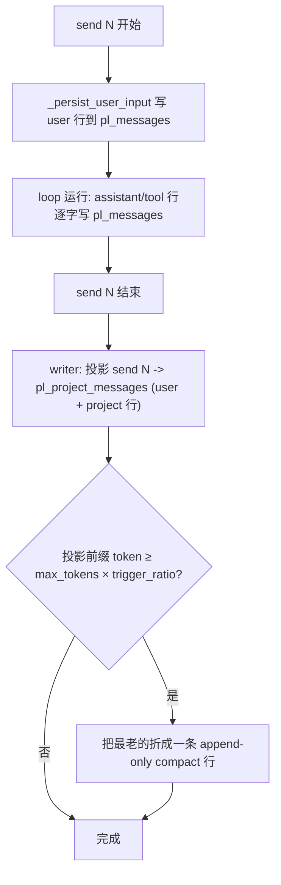

# Send 上下文投影

[English](../../en/user-guide/send-context-projection.md) | [用户指南](index.md)

Send 上下文投影是[就地压缩](compaction.md)之外的一个**可选**方案:不再每次 send 都把整段历史逐字喂给模型,而是把**每个*已结束*的 send 投影成紧凑纯文本**,再加上**当前 send 逐字**。持久的 `pl_messages` 日志**永不被改写**——投影放在一张独立的派生表里。

**默认关闭。** 不配 projector 时,行为与今天逐字节一致(逐字历史 + 默认压缩器)。按 loop 显式开启。

## 为什么

一次 send = 一次 `loop.send()`(用户这一轮 + agent 的整个工具循环)。默认下每个历史 send 都**逐字**留在上下文里——完整的 OpenAI 工具调用结构 + 未截断的工具结果——而且每多一个 send 就更长。投影把每个*已结束*的 send 折成一条"结构化存储、渲染成纯文本"的简短摘要:

- **`pl_messages` 始终是不可变、append-only 的审计日志**——永不折叠、永不 `compacted_out`(就地压缩器会改写它,这里不会)。
- 投影历史是**不含工具调用协议字段的纯文本**,因此历史里的某个 send 绝不会出现悬空的 tool 调用/结果对,且与厂商无关(OpenAI 和 Anthropic 都行)。
- 每个工具可通过可选的 `ToolDefinition.project` 钩子决定自己在投影里如何呈现。
- 它是**派生**层:坏掉的投影绝不污染事实源,且这张表可从 `pl_messages` 重建。

## 工作原理



在 **send N+1 开始时**,reader 这样拼 LLM 历史:

```
[system prompt]
+ render(最新 compact + 各已结束 send 的投影)     # 纯文本
+ 当前 send N+1 的行(来自 pl_messages)            # 逐字、结构化
+ runtime 消息(todos/background)                  # 照旧
```

**当前进行中的 send 永远逐字**(模型这一轮要看到自己的工具调用/结果才能继续);只有*已结束*的 send 才被投影。

## 两张表

| | `pl_messages` | `pl_project_messages`(新增,schema v2) |
|---|---|---|
| 角色 | loop 内部审计日志 | 派生的每-send LLM 上下文 |
| 可变性 | append-only,永不改写 | append-only;派生/可重建 |
| 写入 | 每个 send、每一行(user/assistant/tool) | 仅开 projector 时,每个已结束 send 一次 |
| `kind` | role(user/assistant/tool/system) | `user` / `project` / `compact` |
| 是否导出 | 是 | 否(可重建) |

每个 `pl_messages` 行都带一个单调的 `send_index` **列**(可查询;v2 之前的旧行 NULL;**绝不**发给模型)——即权威的 send 边界。

## 快速开始

```python
from power_loop import (
    AgentLoopConfig, StatefulAgentLoop, SessionStore, DefaultDeterministicProjector,
)

loop = StatefulAgentLoop(
    llm=my_llm,
    store=await SessionStore.open("app.db"),
    config=AgentLoopConfig(
        compactor=None,                                  # 配 projector 时必须置 None
        max_tokens=8000,          # 折叠阈值 = max_tokens × trigger_ratio
        history_projector=DefaultDeterministicProjector(
            max_chars=200,        # 工具参数/结果按字段截断
            keep_last_sends=4,    # 最近 N 个 send 始终单独保留(不折叠)
            trigger_ratio=0.75,   # 投影前缀达到 max_tokens 的 75% 时才折叠更早的 send
        ),
    ),
)
```

`history_projector` 与 `compactor` **互斥**——投影层取代就地压缩。两者同时设置会抛 `ValueError`(投影 reader 假设 `pl_messages` 保持 `seq` 顺序,而压缩器插入的 `compact_note` 会打乱它)。

## 模型实际看到什么

两个已结束的 send(`列出当前目录`→`bash(ls)`→回复;`读 a.py`→`read_file`→很长的内容→回复),现在发起第三次 `给 a.py 加注释`:

**默认(无 projector)= 逐字,9 条:**
```
user        列出当前目录
assistant   tool_calls=[bash {"command":"ls"}]          ← 结构化工具调用
tool        a.py b.py                                    (tool_call_id=c1)
assistant   有 a.py 和 b.py 两个文件
user        读 a.py
assistant   tool_calls=[read_file {"path":"a.py"}]
tool        <整段长文件,未截断>
assistant   a.py 是个 hello world 脚本
user        给 a.py 加注释                               ← 当前 send
```

**投影 = 5 条:**
```
user        列出当前目录
assistant   [tools] bash(result=a.py b.py)
            有 a.py 和 b.py 两个文件
user        读 a.py
assistant   [tools] read_file(result=print('hello world')\n…(截到~200字符)…)
            a.py 是个 hello world 脚本
user        给 a.py 加注释                               ← 当前 send,逐字
```

send 1 在 `pl_project_messages` 实际存的(渲染前 `content_json`):
```json
user    {"human": ["列出当前目录"]}
project {"tools": [{"name":"bash","result":"a.py b.py"}], "final_text":"有 a.py 和 b.py 两个文件"}
```

注意:历史里的工具调用变成 `[tools] name(result=…)` 纯文本(没有 `tool_calls`/`tool_call_id`),长结果按 `max_chars` 截断。

## 工具自投影

每个工具可提供 `project(args, result) -> dict | str`,自己决定在投影里呈现什么;没提供则用截断兜底(`{"name", "result": <截断>}`):

```python
from power_loop import ToolDefinition

write_file = ToolDefinition(
    name="write_file", description="…",
    project=lambda args, result: {"file": args.get("path")},   # → {"name":"write_file","file":"x.py"}
)
```

`result` 类型为 `str | None`:`None` 表示这次调用**没有结果行**(未完成/失败的调用)——与「产生了但为空」的 `""` 区分开,钩子因此能分辨二者。默认兜底把缺失结果渲染为 `tool(result=<missing>)`,空结果渲染为 `tool(result=)`。重复或为空的 `tool_call_id` 会按顺序配对(重复 id 绝不把两个结果折叠成一个),畸形的 tool_call 也不会让投影崩溃。`project` 不参与 `ToolDefinition` 的相等/哈希(`compare=False`)。

## 投影层内的压缩

折叠是**按 token 触发**的(复用 `DefaultCompactor` 的策略):当渲染后的投影前缀达到 `max_tokens × trigger_ratio`(默认 `0.75`)时,最老的 send 折成一条 **append-only** 的 `compact` 行——**始终**单独保留最近 `keep_last_sends` 个,并把之前的 compact 滚动并入(不丢内容)。低于阈值时,这些小小的逐 send 投影只是累积。reader 之后读"最新 compact + 其游标之后的 send"。被折叠的 `user`/`project` 行**保留**(可恢复)。默认折叠是确定性的(不调 LLM);`pl_messages` 不受影响。

## 找回完整明细:`recall_send`

因为投影是有损的(工具明细被截断/丢弃),模型可以按需把任意已结束 send 的**原始** `pl_messages` 明细取回:

```python
create_default_tool_registry(include=["recall_send"])   # 也在 "full" 预设里
```

`recall_send(send_index)` 返回该 send 的原始消息——assistant 文本、工具调用(按名)、它们的结果。明细一定在,因为 `pl_messages` 是不可变的事实源。

## 两个 projector

- **`IdentityProjector`** —— 逐字存储与渲染;LLM 历史与"不配 projector"完全一致。用于验证投影 seam 本身不改变任何东西。从不压缩。
- **`DefaultDeterministicProjector`** —— 上面那种通用、无 LLM 的结构化摘要。两者都不含业务知识;通过继承 / 实现 `HistoryProjector` 来定制渲染(例如只露出聊天工具的发言、列出改动文件、剥掉注入的前言)。

```python
from power_loop import HistoryProjector, ProjectedSend, ProjectedRow  # 写自己的 projector
```

自定义 projector 满足 `HistoryProjector` 协议需声明 `version: int`、`keep_last_sends: int`、`trigger_ratio: float`(token 折叠比例),以及 `project_send` / `render` / `compact` 方法。`keep_last_sends == 0` 完全关闭折叠(`IdentityProjector` 就是如此)。

## 行为说明

- **子 agent 子 session 不投影** —— 按 `parent_session_id` 跳过;子 session 的明细在它自己的 session 里。
- **未完成的 send 延迟投影** —— 以 `waiting_for_input` / `pending_tools` 结束的 send,等 resume 走到终态才投影(按 `(session_id, send_index, kind)` 幂等 upsert)。
- **投影前(遗留)的行逐字渲染,绝不丢弃** —— 在挂上 projector 之前(或 v2 之前、或经 export→import 恢复)写入的行 `send_index = NULL`。在这种 session 上开启投影**不会**抹掉它们:它们作为前缀逐字渲染,排在所有已投影 send 之前(时间上最早)。全新的 v2 session 不会有 NULL 行,所以这只对迁移/导入场景有意义。
- **原子且并发安全** —— 每个已结束 send 的投影行与任何折叠在**同一事务、持会话锁**内提交,所以崩溃不会留下半投影的 send,两个共享 store 的 loop 也不会重复写同一条 compact。
- **token**:逐字投影(Identity)不省 token;真正的削减来自 `DefaultDeterministicProjector` 的按字段截断 + `compact` 折叠。存的是结构化 JSON,装配时渲染成紧凑文本。
- **前缀缓存**:投影前缀是 append-only 增长(每 send 一组行),比就地压缩器(每次折叠重写一段)对厂商的隐式前缀缓存更友好。

## 参见

- [压缩](compaction.md) —— 默认的就地方案。
- [示例 40](../../../examples/40_send_context_projection.py) —— 端到端(投影 + 压缩 + `recall_send`)。
