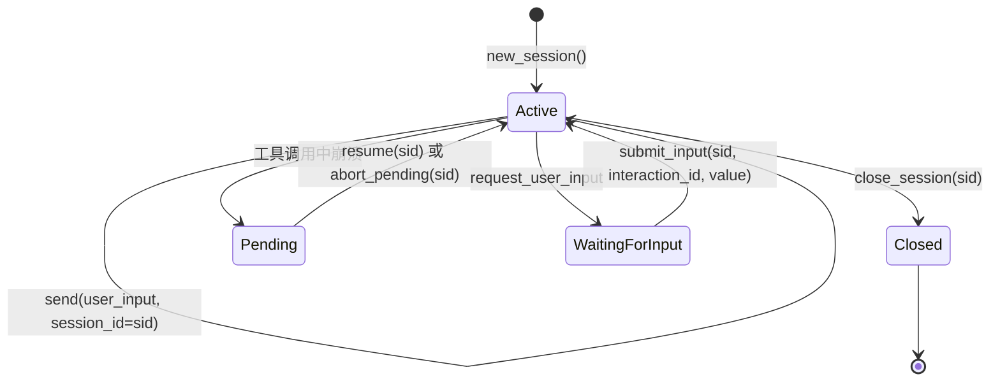

# 会话

[English](../../en/user-guide/sessions.md) | [用户手册](../index.md)

会话是 power-loop 中的对话单位。先用 `new_session()` 显式创建会话，再把返回的 `session_id` 传给每次 `send()`。库按这个 id 管理历史、持久化和恢复。

## 会话生命周期



1. **创建**——调用 `new_session()`。
2. **延续**——后续 `send()` 传入相同 `session_id`。
3. **悬挂**——进程在 `assistant(tool_calls)` 和最后一个 `tool` 消息之间崩溃。
4. **等待输入**——`request_user_input` 要求调用方/UI 收集外部输入。
5. **关闭**——显式调用 `close_session(sid, cascade=True)`。

## 基本用法

```python
loop = StatefulAgentLoop(llm=llm, config=config)

# 新会话
sid = loop.new_session()  # → "sess_abc123..."
r1 = await loop.send("你好，我叫阿岚。", session_id=sid)

# 继续
r2 = await loop.send("我叫什么？", session_id=sid)
print(r2.final_text)  # → "你叫阿岚。"

# 查看历史
messages = loop.get_messages(sid)
for m in messages:
    print(m["role"], m.get("content", "")[:60])
```

**关键**：你永远不需要手动构建 `messages` 列表。库通过 `session_id` 从 SQLite 加载历史。

## SessionStore

`SessionStore` 是 SQLite 持久化层。通常不需要直接交互——`StatefulAgentLoop` 管理它。但可以访问用于检查或高级用法。

```python
from power_loop import SessionStore

store = SessionStore.open("./my_sessions.db")

# 列出所有会话
sessions = store.list_sessions()  # SessionRow 列表

# 读取特定会话
session = store.get_session(sid)
print(session.status)     # "active" | "closed"

# 读取消息
active = store.load_active_messages(sid)     # 未压缩的
all_msgs = store.load_all_messages(sid)       # 含已压缩的

# 关闭
store.close()
```

### 表结构

`SessionStore` 管理 5 张表：

| 表 | 用途 |
|---|---|
| `sessions` | 每个会话一行：`session_id`、`status`、`kind`、`parent_session_id`、时间戳 |
| `messages` | 按 `(session_id, seq)` 排序的消息日志，含 `state`（`active` / `compacted_out`） |
| `compactions` | 每次压缩日志：`(session_id, compact_seq)`，折叠内容 |
| `usage_rounds` | 每轮 token 用量：`(session_id, round_index)`，prompt/completion tokens |
| `session_state` | 可变状态：当前 `pending` tool_calls、`context_compact_count` |

### SQLite 配置

- **WAL 模式**——并发读取安全。
- **`busy_timeout=5000`**——写入争用 5 秒超时。
- **单连接 + `threading.RLock`**——写入串行化；多个 `StatefulAgentLoop` 实例在同一文件上安全，只要不同时写同一 session。

## 跨进程恢复

db 文件是持久化锚点。在新进程中打开并继续：

```python
# 进程 1
loop = StatefulAgentLoop(llm=llm, db_path="./chat.db", config=config)
sid = loop.new_session()
r1 = await loop.send("记住：我喜欢的颜色是蓝色。", session_id=sid)
loop.close()

# 进程 2 —— 几小时后，不同的 Python 进程
loop2 = StatefulAgentLoop(llm=llm, db_path="./chat.db", config=config)
r2 = await loop2.send("我喜欢什么颜色？", session_id=sid)
print(r2.final_text)  # → "你喜欢蓝色。"
```

## 悬挂恢复

如果进程在执行工具调用时崩溃，会话进入"悬挂"状态。下次 `send()` 抛出 `SessionPendingError`：

```python
try:
    result = await loop.send("do something", session_id=sid)
except SessionPendingError as exc:
    print(f"未解决的 tool calls: {exc.pending_tool_calls}")
    # 选项 A：完成执行悬挂的工具
    result = await loop.resume(sid)
    # 选项 B：放弃并继续
    loop.abort_pending(sid, reason="user_cancelled")
    result = await loop.send("new input", session_id=sid)
```

## 可恢复用户输入

`request_user_input` 会有意暂停会话，但不会阻塞 Python 进程：

```python
waiting = await loop.send("needs confirmation", session_id=sid)
interaction = waiting.pending_interactions[0]

# 在产品 UI 里展示 interaction["prompt"] 和 interaction["options"]。
result = await loop.submit_input(sid, interaction["interaction_id"], {"choice": "yes"})
```

待输入项会存进 SQLite，因此另一个进程之后重新打开同一个数据库，也可以调用 `submit_input()` 继续。

## 每次调用覆盖

`send()` 和 `send_sync()` 接受 `tools=` 与 `system_prompt=`，且不会修改 loop 或已存储的
session：

```python
result = await loop.send(
    "Summarize the repository",
    session_id=sid,
    tools=["read_file", "glob", "grep"],
    system_prompt="Be concise and cite file paths.",
)
```

prompt 优先级为：每次调用覆盖 > session prompt > loop config。模型只能看到选中工具的
definition。当 session 空闲、`follow_up()` / `follow_up_sync()` 降级为新 send 时，也会透传这些参数。

## 运行中追加指引（`follow_up`）

当会话已在运行（`send` / `resume` / `submit_input` 持有 per-session 锁）时，对同一会话再调用 `send()` 会阻塞到当前 run 结束。若要在不等待的情况下注入补充指引，使用 `follow_up()`：

```python
send_task = asyncio.create_task(loop.send("long task", session_id=sid))

# 等待 session 锁被占用（同一进程内）。
while not loop._lock_for(sid).locked():
    await asyncio.sleep(0.01)

queued = await loop.follow_up("Also mention the budget constraint", sid)
assert isinstance(queued, FollowUpQueued)
assert queued.queue_depth == 1

result = await send_task
```

Pipeline 会在每个**轮次边界**（`ROUND_START` 之后、`prepare_round` 之前）排空 per-session 队列，将多条 follow-up 合并为一条 user 消息并写入 transcript：

```xml
<follow_up>
Also mention the budget constraint
</follow_up>
```

当会话空闲（锁未被占用）时，`follow_up()` 会降级为 `send()`。
当 follow-up 被排入正在运行的 run 时，该 run 会继续使用启动它的调用所选定的 `tools` 与
`system_prompt` 策略；follow-up 文本会引导下一轮，但不会在 run 中途替换安全边界。

| API | 适用场景 |
|---|---|
| `submit_input()` | loop 因 `request_user_input` 暂停；你有 `interaction_id`，可跨进程稍后恢复。 |
| `follow_up()` | loop 仍在同一进程内运行；你想在**下一轮** LLM 调用前注入指引，而不阻塞当前 run。 |

详见 [示例 22](../../../examples/22_follow_up_steering.py) 与 [示例指南 §22](../tutorials/examples-guide.md#22--运行中追加指引)。

## 关闭会话

```python
# 关闭一个会话（cascade=True 时间时关闭所有子代理会话）
loop.close_session(sid, cascade=True)

# 关闭整个 store（所有会话）
loop.close()
```

关闭的会话**物理删除**——所有消息、压缩和使用记录一并删除。

## 下一步

- [工具](tools.md) — 注册工具，给 Agent 能力
- [子代理](subagents.md) — 用 `spawn_agent` 和 `AgentSpec` 创建子代理
