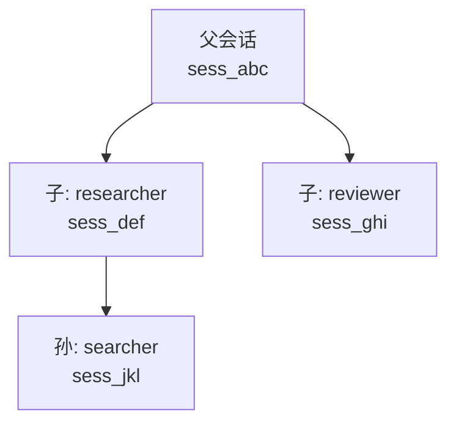

# 子代理

[English](../../en/user-guide/subagents.md) | [用户手册](../index.md)

子代理让父 Agent 将任务委托给专门的子 Agent。每个子代理拥有独立的 `StatefulAgentLoop` 和自定义 system prompt、工具白名单。

## 两种路径

| 路径 | 触发方式 | 控制程度 |
|---|---|---|
| **命令式** (`spawn_agent`) | LLM 调用 `spawn_agent` 工具 | LLM 决定委托什么 |
| **声明式** (`run_agent` / `AgentSpec`) | LLM 提交 JSON spec | 你控制 system prompt、工具、model、max_rounds |

## 命令式：spawn_agent

```python
from power_loop import register_spawn_agent

register_spawn_agent(registry)

loop = StatefulAgentLoop(
    llm=llm,
    tool_registry=registry,
    config=AgentLoopConfig(
        system_prompt=(
            "你可以用 spawn_agent 委托研究任务。"
            "使用 preset='explore' 进行文件/代码搜索。"
        ),
        max_rounds=6,
    ),
)

result = await loop.send("找到项目中的认证逻辑代码。")
# LLM: spawn_agent(task="搜索认证代码", preset="explore")
# → 子代理跑自己的循环 → 父代理拿到结果
```

## 声明式：AgentSpec

```python
from power_loop import AgentSpec, run_agent_spec

spec = AgentSpec(
    name="researcher",
    system_prompt="你是代码研究员。使用 grep、read 和 glob 查找答案。",
    tools=["grep", "read", "glob"],  # 白名单——只有这些工具
    max_rounds=5,
    max_tokens=2000,
    temperature=0.0,
    lifecycle="ephemeral",           # 成功删除，失败保留供调试
)

result = await run_agent_spec(spec, "查找所有 SQL 注入漏洞", parent_loop=loop)
```

### AgentSpec 校验

`AgentSpec` 有**严格校验**。未知字段、非法 lifecycle 值或越界的 `max_rounds` 抛出 `AgentSpecError`（`SpecValidationError` → `PowerLoopError`）。

## 生命周期

| 生命周期 | 行为 |
|---|---|
| `EPHEMERAL`（默认） | 成功时删除。失败时保留供调试。 |
| `LINKED` | 父会话关闭时级联删除。 |
| `DETACHED` | 独立于父会话。父关闭后继续存在。 |

## 深度限制

`MAX_SPAWN_DEPTH = 3` — 子代理可以 spawn 自己的子代理，但链条不超过 3 层。在 `SessionStore.create_session()` 强制执行。

## 会话树



所有子代理共享父代理的 `SessionStore`。`close_session(parent_sid, cascade=True)` 递归删除整棵树。

## 下一步

- [Hooks](hooks.md) — 拦截工具执行
- [压缩](compaction.md) — 自动摘要长会话